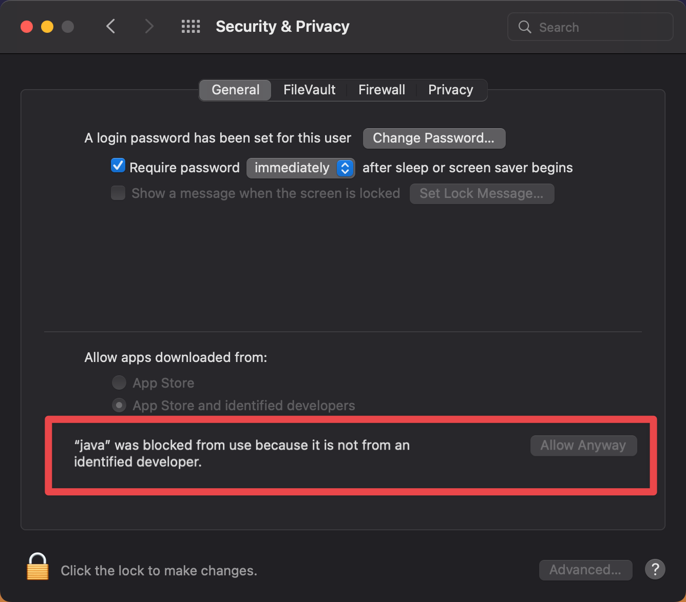
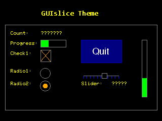
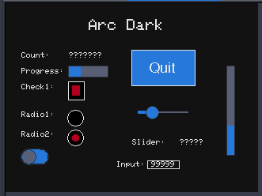
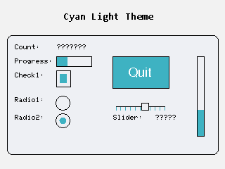
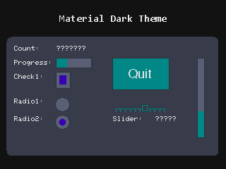
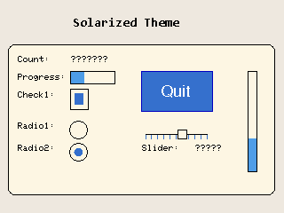

# GUIslice Builder

Please refer to the wiki page for installation and usage details:

[GUIslice Builder - Documentation](https://github.com/ImpulseAdventure/GUIslice/wiki/GUIslice-Builder)


## Brief Overview
<p>
The GUIslice Builder is a standalone desktop application that is more than a layout tool for your UI. It's designed as 
Low Code GUI Generator for User Interfaces that make use of GUIslice API. 
</p>

<p>
The cross-platform utility includes a WYSIWYG graphical editor that enables drag & drop placement of UI elements. Once a GUI has been laid out, the Builder can then generate a fully functional GUIslice Graphical UI complete with plug-in points for your custom application. 
</p>

<p>
The GUIslice API framework code can handle hardware like Arduino, ESP8266, ESP32 and more. It supports Graphic libraries like 
Adafruit's GFX, M5Stack, TFT_eSPI and LINUX with a wide variety of TFT Display Drivers and combinations of Touch support chips.
</p>

<p>
The generated output code (*.c, *.ino, *_GSLC.h) includes all of the necessary defines, UI storage elements and initialization 
in addition to the placement of the UI elements. This will greatly improve the ease in creating a new Graphical Application.
</p>

You can find Example project files inside GUIslice/examples/builder

## Disclaimer ##
<p>The Software is not designed for use in devices or situations where there may be physical injury 
if the Software has errors.</p>

## Contributing

[Contributing Guidelines](https://github.com/ImpulseAdventure/GUIslice-Builder/blob/master/docs/CONTRIBUTING.md)

## Builder Contents

Note that the Builder executables and User Guide are attached to the latest GUIslice Builder
Repository [Release Notes](https://github.com/ImpulseAdventure/GUIslice-Builder/releases)


## Builder Source Code

The Builder source code is located in this repository [ImpulseAdventure/GUIslice-Builder](https://github.com/ImpulseAdventure/GUIslice-Builder)
- Build instructions can be found in `BUILD.txt` file.

## Installation instructions

The needed version of Java is now custom built and distributed with 
GUIsliceBuilder so you no longer need to deal with its installation.

### Windows GUIsliceBuilder Install

Download the builder-win-x64-0.17.b13.zip from github
GUIslice-Builder Releases:
https://github.com/ImpulseAdventure/GUIslice-Builder/releases

Then unzip and run the resulting executable builder-win-0.17.b13.exe

This can create a desktop icon you can click on to run.  Optionally, you can use GUIsliceBuilder\GUIslice.bat file to run.

### LINUX install

Download the builder-linux-{arch}.{release}.{build}.tar.gz using 
operating system and cpu architecture (ie., linux-x64) from github
GUIslice-Builder Releases:
https://github.com/ImpulseAdventure/GUIslice-Builder/releases

untar into your home directory.

Example: Open a terminal
```
cd $HOME
tar xvzf builder-linux-x64-0.17.b13.tgz
```
Then enter the new GUIsliceBuilder folder
```
cd GUIsliceBuilder
```
To run:
```
./GUIslice.sh
```
### MACOS install

Download the builder-mac-{arch}.{release}.{build}.tar.gz using 
operating system and cpu architecture (ie., mac-aarch64) from github
GUIslice-Builder Releases:
https://github.com/ImpulseAdventure/GUIslice-Builder/releases

untar into your home directory.

Example: Open a terminal
```
cd $HOME
tar xvzf builder-mac-aarch64-0.17.b13.tgz
```
Then enter the new GUIsliceBuilder folder
```
cd GUIsliceBuilder
```
To run:
```
./GUIslice.sh
```
**WARNING** 
The first time you run the builder on MACOS you are likely to encounter the Security Alert:

You will need to select "Allow Anyway" to continue.

## Release History

### Enhancement for 0.17.b33

Drag and Drop of UI Elements from the RibbonBar is now supported.  This allows you to place your UI pieces
where you want them to appear.

### Enhancement for 0.17.b28

<p>
Thanks to the effort of etet100 Andrzej the Builder now supports resizing UI Elements using your mouse.
You simply need to click on the UI Element and then place your cursor over one of the red handles and drag
while holding down your left mouse button.
</p>

<p>
The View pull-down and View\Editor panel now has Zoom Reset and SNAP TO GRID.
</p>

<p>
For further details check out sections 2.3 Creating your UI and 3.1 Main Parts/View Band of our User Guide.
</p>

### Enhancements for 0.17.b27
Upgraded to FlatLaf 3.3 and Java 18 and added better support for MacOS.

### Bug Fixes 0.17.b27
- Bug Fix `250` MACOS (OSX) 13.2 - Fatal error when changing E_PROJECT OPTIONS

### Enhancements for 0.17.b25

Added support for Arabic fonts using TFT_eFEX library.

Arabic Fonts require using TFT_eSPI SMOOTH_FONTS (.VLW extension) and this in turn needs eFontRefType = GSLC_FONTREF_FNAME and fontRefMode = GSLC_FONTREF_MODE_1.

**WARNING**
To use Arabic or Hebrew .VLW Fonts you must currently use my forked version of GUIslice API
[pconti-arabic](https://github.com/Pconti31/GUIslice/tree/pconti-arabic)

The following fonts are shipped with the Builder inside GUIsliceBuilder/fonts/vlw/data:

 - cairobold16.vlw
 - cairobold20.vlw
 - cairolight16.vlw
 - cairolight20.vlw
 - cairomedium16.vlw
 - cairomedium20.vlw
 
Generated Code Example:
```
  // ------------------------------------------------
  // Load Fonts
  // ------------------------------------------------
//<Load_Fonts !Start!>
    if (!gslc_FontSet(&m_gui,E_CAIROBOLD16,GSLC_FONTREF_FNAME,CAIROBOLD16_VLW,16)) { return; }
    gslc_FontSetMode(&m_gui, E_CAIROBOLD16, GSLC_FONTREF_MODE_1);
//<Load_Fonts !End!>
```

### Bug Fixes 0.17.b24
- Issue `233` Using TFT_eSPI with gfx freefonts created include 'NULLFreeSans12pt7b.h'
- Bug Fix Now the Builder tests that your enums start with a capital letter A to Z to fix compile time issues.

### Enhancement for 0.17.b23

Removed edit->options tabs for Box, Text, and TextButton since now you should edit theme inside GUIsliceBuilder/templates
guislice_themes.json If you understand json syntax you can add your own theme or simply edit the GUIslice version.

### Bug Fix 0.17.b22
- Bug Fix for Flash based checkbox and radio buttons with callback enabled.

### Bug Fix 0.17.b21
- Bug Fix `232` Builder cannot be instructed not to overwrite existing files
  Enhancement has been made to not overwrite any existing platformio.ini file when doing a code generation.

### Bug Fixes 0.17.b20
- Bug Fix `230` Fix FontTtf.java to allow running directly within Eclipse IDE 

### Enhancements for 0.17.b19

The Builder has been updated to use Java 18 and FlatLaf 3.0.

<p>
The UTF8? property on text fields has been removed since GUIslice API only supports this on a RaspberryPI. 
</p"

### Bug Fixes 0.17.b19
- Issue `228` Guislice-Builder doesn't display German Umlauts using TFT_eSPI and GFX fonts.

### Bug Fixes 0.17.b18

- Bug Fix     Redefine complier error when using freefont with TFT_eSPI graphics driver.
- Bug Fix     SaveAs project also moved over the previous project's *.prg file leaving two *.prg files in the new folder
- Issue `224` Fatal error when SaveAs new empty project  
- Issue `223` Application will not start on Ubuntu 

### Enhancements for 0.17.b16
- Issue `221` Area simulates TFT panel > scroll possibility with a large number of pages
              Builder already supplies scroll bar inside tab panel but now the TreeView
							will support selecting the icons for Expand and Collapse Page Elements. 
							Inside the TreeView Pages will start out collapsed to better support
							larger projects.
- Issue `220` Tree view > Adjust Width Area. You can now drag the view larger or smaller.

### Bug Fixes 0.17.b15
- Issue `218` Builder crash in a large project

### Bug Fixes 0.17.b14
- Issue `215` Folder loop creation using SaveAs

### Bug Fixes 0.17.b13
- Issue `213` Permission problems on MacOS
- Issue `212` permission denied error when running .sh on Ubuntu 22.04

### Enhancements for 0.17.b12

<p>
Added support for PlatformIO IDE issue `#117`.  Users now select either Arduino IDE or PlatformIO IDE
either inside the Project Options Tab and/or inside User Preferences by Edit->options->General tab->"Target IDE". 
The platformio.ini file will be populated with all settings needed for common configurations. 
The resulting project folder will be structured with a src, include, lib, and test subfolders. Instead of code named
projectname.ino it will be named main.cpp. The projectname_GSLC.h file will be inside the project folder/includes.
Further details on customizing the Builder for PlatformIO is available in the 
`User Guide Chapter 6 - Configuring PlatformIO Support`.
</p>

<p>
The Code has been modified to better indicate your graphics library with the choices now being Adafruit_GFX, M5Stack, ILI9341_t3, TFT_eSPI, UTFT, or Linux.
</p>

<p>
**WARNING** If you have added your own fonts by editing your builder_fonts.json file you will need to modify the newly suplied file with your edits and
use the new format documented inside the updated User Guide. If you have any problems just post in the issue section.
</p>

<p>
Users can now choose a color theme for their Applications written using GUIslice API. You can choose from the original 
GUIslice, Arc Dark, Cyan Light, Material Dark, or Solarized.  You may modify these themes or add new ones. 
</p>







<p>
Improved Font handling. The Builder will now identify fonts that come standard with a particular graphics package 
like Adafruit_GFX and if you request one that isn't provided the Builder will copy the font to your project folder.
It will also cleanup during a new code generation any font files moved previously that are no longer in use.
</p>

Improved Code Editing for those who add custom code to Button Callbacks.  The code editing is provided by  
[RSyntaxTextArea](https://github.com/bobbylight/RSyntaxTextArea)

### Bug Fixes 0.17.b12

- Issue `GUIslice API 472` characters outside the range when I add my own font
- Issue `207` Save As causes fatal error
- Issue `205` Toggle Button switch/case user code deleted when re-generate from builder
- Issue `204` Resolution changes to 240*320 without request 
- Issue `203` Fatal Crash on Generate Code using Flash API version of Toggle Button

### Enhancements for 0.17.b11

The Builder will now support Monochrome 1 bit images that are stored inside a C Array file created by my 

[GUIslice_Image2C utility](https://github.com/Pconti31/GUIslice_Image2C) 

Note: you need version 2.00 or higher of GUIslice_Image2C for this feature.

<p>Added enhancement to SaveAs project. Previously the Builder simply created a new 'project name' folder and inside that
a `new project name`.prj file. Now the Builder will copy all files (not *.bak or the gui_backup folder) in the original
folder and scan the `old project name`.{ino,_GSLC.h} files and replace the string `old project name` with `new project name`
while also renaming these files to the new project name.
</p>

New Themes have been added to the Builder. For a full list go to:
[flatlaf-intellij-themes](https://github.com/JFormDesigner/FlatLaf/tree/main/flatlaf-intellij-themes)

#### Fix for Issue 200
<p>
When the Buider is opened for the very first time a new empty project is created with a target platform of arduino. 
Previously if a User then went to edit->options->General tab just as the User Guide recommends and changes display
screen size and platform target this new information wasn't being copied to the open project's Project Options Tab.
Causing issue 200 where users would get compile errors due to generated code for Arduino not the actual target platform 
the user requested. 
</p>

- Issue `200` ESP32 with TFT_eSPI Compile Errors 200
- Issue `158` How to copy a .prj file to a new sketch folder 

### Enhancements for 0.17.b10
<p>
Users can now avoid auto-generated code within Text and Image Button callbacks and add their own code that will be inserted 
during each code generation. The new property is called `Custom Code` and is optional. This property, if used, will then make 
the properties `Jump Page ENUM`, `Popup Page Enum`, and `Hide Popup Page?` read-only.  See the new User Guide 4.19 Text Button 
for example.
</p>

- Issue `198` Request: Add a feature for BTN to execute a custom code.

### Bug Fix 0.17.b09
Scaling was using incorrect ratio for y coordinates.

### Enhancements for 0.17.b08
Scaling now supports scaling non-builtin (glcd) fonts (The glcd fonts are too far apart to scale,8,16,24,32). The Builder will now attempt to 
find a font that can scale to the correct ratio or the closest it can find. Nevertheless, Users may still need to manually change fonts. 

### Bug Fix 0.17.b08
Testing showed that the Line Element would cause crashes if scaled.  This is now fixed.

### Enhancements for 0.17.b07
<p>
Added new scaling command in the layout tab to allow automatic updating of elements x,y,width and height due to TFT screen display change of size. 
Also, you can now change the Scrollbar width and thumb sizes for Listboxes and Textboxes.
Our User Guide has been updated accordingly.
</p>

- Issue `194` Request: Scroll bar set width and thumb size in textbox and listbox
- Issue `192` Request: Project Screen Size change with change of all existed elements

### Hot Fix 0.17.b06
- Issue `#190` Input Elements Height/Width reset to default when moved

### Enhancements for 0.17.b05
Now supports saving the current project's zoom factor inside the *.prj file so it can be restored upon opening on the project file.

- Issue `#188` Serialize zoom factor on save

### Hot Fix 0.17.b04
- Issue `#184` GUIslice Builder crash when changing Minimum Value at Ramp Gauge

### Enhancements for 0.17.b03
- Issue `#147` Allow multiline text for text button
<p>
NOTE: Sizing of a Text button using multiple lines of text is the users responsiblity. You will need to set 
the height and width manually.  Ending each line inside the Label with "\n". Example, "line1\nline2\nline3".
The Builder will remove each \n and replace with a decimal 10 (newline) when you press enter key.
</p>

### Hot Fix 0.17.b02
Yet another fix for critical Log4Shell vulnerability inside Apache Log4j. The vulnerability applies 2.0 to 2.15.0 of Apache Log4j.  

### Hot Fix 0.17.b01
Fix for critical Log4Shell vulnerability inside Apache Log4j. The vulnerability was publicly disclosed via GitHub on December 9, 2021. Versions 2.0 and 2.14.1 of Apache Log4j have been impacted.  

### Enhancements for 0.17.0
<p>
GUIslice 0.17 added improved support for external inputs such as physical buttons, encoders or pins. Users can now 
traverse and edit most widgets in the GUI using external inputs. This feature required minor changes to Builder. 
Some elements now require a slightly larger margin around them (ie. 1px) to accommodate a potential focus frame. 
For example, between a slider and the listbox.
</p>

<p>
Added support for UTFT library using Target Platform "utft". Full native font support for fonts downloaded from 
[UTFT Fonts](http://www.rinkydinkelectronics.com/r_fonts.php). Simply download and drop them into GUIsliceBuilder/fonts/utft.
The Builder ships with the UTFT DefaultFonts (SmallFont, BigFont, and SevenSegNumFont) installed.
See User Guide section 5.7 Adding Fonts for more details.
</p>

### Bug Fixes for 0.17.0
- Issue `#175` Inserting a unicode character into text field caused crash
- Issue `#174` Crash when input non-ascii chars when you first didn't change to font that supports unicode.
Note you still must select an appropiate font before enterring characters or they will appear as blanks. 
- Issue `#174` Crash when deleting a base page.
- Issue `#174` Crash if you are inside color chooser and click on blank space inside recent colors box.
- GUIslice discussion -> xTextBox - writing to a specific character position `#392`.  Setting a Grid positions minor or major to a width or height of zero caused crashes. 

### Enhancements for 0.16.0
<p>
With this release the Builder becomes a true WYSIWYG editor for most platforms. The Builder now reads and parses 
your actual Platform Font header and c files and renders them inside the Builder. This native font support will now 
be able to give you accurate sizing and positioning information for supported fonts. Plus your text will be now 
displayed exactly as it will appear on your target TFT display. 
</p>

<p>
The Native Font support includes, Adafruit's Builtin GLCD fonts, and Adafruit's GFX compatable fonts, and 
Teensy ILI9341_t3 fonts. This Native Font support includes the ability to add your own fonts to the Builder 
simply by dropping them into the proper folders. You may also tell the Builder to simulate fonts it doesn't directly support. 
</p>

<p>
See the User Guide for more information about font handling and how to add your custom fonts.
</p>

<p>
GUIslice API 0.16.0 has upgraded the Keypad support. This is a breaking change for the API so the Builder 
will now require running with GUIslice API 0.16.0 and higher. For further information on keypads 
refer to the wiki page [Custom KeyPads](https://github.com/ImpulseAdventure/GUIslice/wiki/Custom-KeyPads)
</p>

The Builder has added support for ctrl-Z for Undo and ctrl-Y for Redo.

### Bug Fixes for 0.16.b011
- Issue 169 - Textbox double quotes are not escaped in generated code
- Issue 172 - Fill enable , Disable not working with text input

### Enhancements 0.16.b010
Added support to group toggle buttons.

### Bug Fixes for 0.16.b010
- Issue 157 - Target platform linux fails to generate callback for seekbar
- Issue 167 - Fill enable , Disable not working with text input
- Issue 168 - Image Button and Toggle Button Jump page ENUM not generating code

### Enhancements 0.16.b009
Added support for Image Buttons to behave as a toggle button. Simply set Property View: Toggle? = true 
this will then use the new GUIslice API XToggleImgbtn control.

### HotFix for 0.16.b009
 - Bug Fix Character Map causes fatal crash issue `#165` 

### HotFix for 0.16.b008
 - Bug Fix for DEL button on keyboard causes crash issue `#154`  
 - Bug Fix for Copy paste of Image Button causes crash `#155`

### Enhancements 0.16.b007
Replaced Ribbon with a simplier design using JRibbonBar provided by Csekme Krisztián. 
His github project is at:
[JRibbonBar](https://github.com/csekme/JRibbonMenu)

Hopefully this will fix the crashes and burns we have been having on Apple's OSX and various odd cursor behaviors that have occurred on different Linux platforms.

Also added two additional Themes: Solarized Dark and Light themes.

Our User Guide has been updated with the new UI layout.

### Enhancements 0.16.b006
Added support for TFT_eSPI smoothfonts (*.vlw). Google's Dosis Bold and NotoSans Bold is built in. 

You may add your own vlw fonts by following the updated User Guide chapter 5.7 Adding Fonts and Appendix G Creating VLW Fonts.

### Bug Fixes 0.16.b006
 - Bug No. 205 No CallBack from Checkbox using Flash API issue `#347` 

### HotFix for 0.16.b005
 - Bug No. 204 Crash  occurs while selecting NotoLatin1 when size of font is > 28 issue `#143`
 - Bug No. 203 Box using Flash API can't do code gen for Draw callback
 - Bug No. 202 Draw function selected for Box frame the rounded property should be disabled API issue `#326`

### Enhancements for 0.16.b004
<p>
Added CharacterMap dialog to "Text" propery fields for UIElements Text, Text Button, Text Input, Spinner, and Number Input.
</p>

<p>
This feature will allow you access to graphics characters previousily hidden in Adafruit's classic (Builtin) fonts and other fonts. 
You can also access ISO8859 international characters using a newly added NotoLatin1 font.
</p>

<p>
First set your desired font then invoke CharacterMap by right clicking on the "Text" property and selecting CharacterMap. 
Select your characters one at a time and then press copy to append them to your text field.
</p>

The User Guide has been updated documenting this new feature.  

<p>
The UI Element Spinner has been upgraded to support changing the Increment and Decrement Arrow characters 
using the API call gslc_ElemXSpinnerSetChars().
</p>

### Bug Fixes 0.16.b004
 - Bug No. 201 Text button frame cannot be disabled issue `#139`

### HotFix 0.16.b003
 - Bug No. 200 New Keypad support causes input field button case-statement to be deleted and recreated
 - Bug No. 199 Sizing of rect for Text with margin doesn't include space on right-side

### HotFix 0.16.b002
GUISlice crashing after clicking generate code issue `#134`
- Bug No. 198 Assigning storage to text field gives incorrect height API issue `#292`

### HotFix 0.16.b001
 - Bug No. 197 Crash opening project with screen larger that 320x240
 - Bug No. 196 Dup gslc_ElemSetTxtCol when text not set to the default color

### Bug Fixes 0.16.0
 - Bug No. 195 Enhancement - Add Top/Bot to Text Button text alignment fields `#127`
 - Bug No. 194 gslc_GetImageFromRAM creates const pointer issue `#126` 
 - Bug No. 193 codegen fails to work for GSLCX_CHECKBOX_STYLE_ BOX or ROUND issue `#128`
 - Bug No. 191 Crash if slider min=max
 - Bug No. 189 Add shortcut ctrl+z for UnDo
 - Bug No. 187 App window not controllable with Java built-in themes issue `#112`
 - Bug No.  98 Text element "Fill Enabled=false" doesn't render with transparency

