<center>
    <H1>
        GUIslice Builder
    </H1>
    <H2>
        User Guide
    </H2>
    <H3>
        Ver: 0.14.b000
    </H3>
</center>


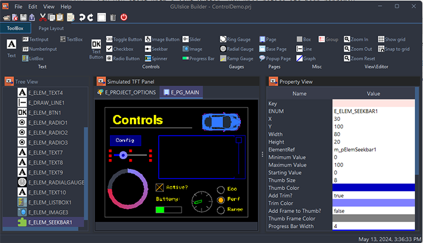


**Publication date and software version**

Published April 21, 2020. Based on GUIslice API Library 0.14.0

**Copyright**

This document is Copyright © 2018-2020 by Paul Conti. You may distribute or modify it under the terms of the MIT License.  https://opensource.org/licenses/MIT

GUIslice Copyright (c) Calvin Hass 2016-2020

Copyright Notices for third party libraries are included in Appendixes C and D.
All trademarks within this guide belong to their legitimate owners.

---------
<div style="page-break-after: always;"></div>

# 1.0  Introduction

GUIslice library is a lightweight platform-independent GUI designed for embedded displays.  While it can support other systems it started with support for  use with Raspberry Pi and Arduino.  It's written and supported by Calvin Hass.  You can download the library and example files from github.  See the wiki pages for more details.

GUIslice Wiki: <https://github.com/ImpulseAdventure/GUIslice/wiki>

It's a nice package but the embedded design choice to eliminate dynamic memory allocation does mean additional care must be taken in the user code to manage the data structures.

The GUIslice Builder creates a cross-platform desktop application that automates some of the boilerplate code generation and tracking of the UI pieces. For example, the Builder helps manage:
- Defines, enums, UI storage declarations
- Coordinates and dimensions of UI elements can be visually created
- Colors and fonts can also be modelled within the Builder

The net result is that the Builder allows users to layout their UI visually and enables boilerplate GUI code to be generated quickly with a drag-and-drop desktop application and save the user from some of the bookkeeping and potential errors that might otherwise come up.

It generate a skeleton file for the target platform, either 'project.ino' for Arduino, or 'project.c' for linux.
A 'project_GSLC.h' header file will also be created for Arduino projects but generally, you won't need to view or edit this file.

One additional target platform variation that is supported is the Arduino API with TFT_eSPI driver. This will simply replace Adafruit_GFX.h with TFT_eSPI.h.
Thus your three Target Platforms available in the General Tab of User Preferences are:
- arduino
- arduino TFT_eSPI
- linux

Within the Arduino platform some UI Elements support Flash based versions that reduce RAM requirements. See section 4.0 for details.

It should be noted that the Builder makes no attempt to support all GUIslice API calls or UI Elements. Simply a rich enough set to do useful work.  

Remember, if you need to use any unsupported API calls or UI elements just keep them outside of the tags. This would be one reason why you would need to edit the 'project_GSLC.h' file so you can increase the storage for any unsupported UI elements.

The Code Templates the Builder uses are exposed inside GUIsliceBuilder/templates.

The two files are arduino.t and linux.t.  Some documentation is included in Appendix D in case you need to make edits.

---------------
<div style="page-break-after: always;"></div>

An important design goal was to allow for incremental (round-trip) revisions between user code updates and Builder visual element adjustments.

You will notice in the generated C code various tags inserted by the builder such as:

```
//<Save_References !Start!>
//<Save_References !End!>
```

As long as you refrain from adding or modifying code between these auto-generated tags you can continue to add additional elements to your project and not lose any other edits you make.   The only exception is the button callbacks where the builder will test for existing ENUMs and not delete any code.

The code you add between Enum tags will be kept safe unless you delete the button or rename the button's ENUM. 

//<Button Enums !Start!>

//<Button Enums !End!> 

See Appendix E Case Statement Generation for detailed examples. 

---------------
<div style="page-break-after: always;"></div>

# 2.0  Getting Started

See the Builder's wiki for installation instructions:

Install: <https://github.com/ImpulseAdventure/GUIslice/wiki/GUIslice-Builder>

##  2.1 Builder Screen Layout


1. Tabs for Toolbox and Page Layout.  Toolbox is where you select the UI Elements to drop on the TFT Simulation.  Page Layout tab has icon buttons for aligning UI Elements on a page.

2. TFT Simulation is where you create your UI.

3. Treeview displays all elements you have selected in z-order of display.

4. Property List allows you to view and change various properties of the selected UI Element.

5. Status Bar will give confirmation messages, like your project has been saved.

6. Taskbar has the globally available buttons.

7. Displays the current project name.

-----------
<div style="page-break-after: always;"></div>

## 2.2 Setting Screen parameters

You must setup the builder for your target screen's width and height; if its different than the default.  

To change the high and width of your display, and maybe the Target Platform.
Select edit->options

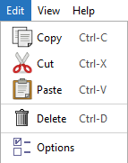

Then set your target platform, your display's width and height, and point the project directory to where you will be storing output files.   The directory must already exist. For Arduino users I suggest pointing to your sketchbook folder.

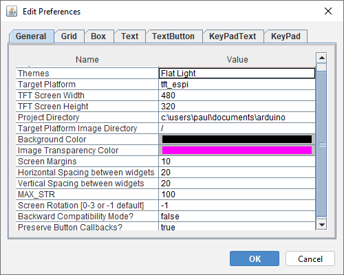

The builder is initially setup for Adafruit's TFT 2.8 Display.  It's display is 320px wide and 240px height with a DPI of about 144.   (I know the docs say 141 but I go with what works). I have tested the DPI of 144 on various screens up to 3.5 inches and my default of 144 seems to work just fine. 
See Appendex A for details on changing this value (It's setting is just below height and width on the General Tab). It's purpose is to allow the builder to show users the fonts correctly scaled in the TFT Simulation and to correctly size the text bounding rectangle.

Why may this be needed, because fonts are defined in points with 72 points per inch. DPI for TFT screens however are not a standard size. The Builder needs to simulate your TFT Display and try and show fonts as close as possible to the way they will look on your Display. So when I ask Java to create font I'll take your profile's DPI and use it to calculate a scale factor like so:
```
    /* AdaFruits's 2.8 screen is about DPI of 141. 
     * Fonts are in Points with 72 points per inch so DPI / 72 is our scaling factor.
     */
    double scaleFactor = (double)dpi / 72.0d;
    int size = (int) ((double)Integer.parseInt(logicalSize) * scaleFactor);
    scaledSize = String.valueOf(size);
    this.font = FontFactory.createFont(logicalName, scaledSize, logicalStyle);
```

-----------------------------------------------
<div style="page-break-after: always;"></div>

## 2.3 Creating your UI

Now that you have your builder setup you can start creating your UI.  

Before beginning lets go over over the mouse selecting rules for the TFT Simulation:

- A Left-click on an object deselects any existing selection and selects the object.
- A Control Left-click on an object toggles its selection without affecting the selection of any other objects.
- A Shift Left-click on an object selects it without deselecting any other objects.
- Using the Rectangle Selection Tool  on the Page Layout tab will allow you to create a rubber band by pressing down the left mouse button and keeping it down while you move the band over the a group of objects and will select them all. For Example:


Now start by picking your first UI piece on the Toolbox. I suggest you first turn on the GRID using Ctrl-L. I also suggest not starting with a box that takes up your whole screen or the grid lines will be useless.  Besides setting the background color has the same effect without interfering with UI design.  If you want a preview of the UI without grid lines simply use Cntl-L again or the Page Layout tab's Grid control to toggle the grid on/off.

Say you start with a Text Button, you will notice its been randomly placed on the canvas. Using your mouse select this Text Button by moving the mouse pointer over the Text Button and clicking the left key. It will now have a dashed red rectangle around it to indicate its been selected.  Now press and hold the mouse left key and drag the Button approximately where you want it. You can refer to section 3.4 Layout Band for using the various alignment controls for further alignment.   

-----------------------------------------------
<div style="page-break-after: always;"></div>

Off to the right of the TFT Simulation screen you will see all of the properties for this element.  
Anything with a rose color is something you can't edit.  When you were dragging your button you might have noticed the x and y coordinates changing dynamically.  Then when you released the mouse a slight jump occurred snapping  the UI Button to the grid's snapTo points.  Instead of dragging the Text Button around you could also have  simply typed in the new x and y positions within the properties table. Modifying the x or y coordinates directly will also override the Grid's SnapTo and its Margin setting.

One thing you should consider as you add UI elements is changing the ENUM names for Button and any other element.  It will make your life a lot easier if they have meaningful names.  

For example, this new Text Button might be your QUIT button.  

So change the ENUM from its default to E_ELEM_BTNQUIT, while also changing Text to Quit.  

Also, any element you plan on directly accessing at runtime should have a meaningful element reference name.  Like in example ex04_bld_ctrls where the text counter's reference is named m_pElemCount.  By the way the 'm_' signifies a global variable and the lowercase 'p' means a pointer.

-----------------------------------------------
<div style="page-break-after: always;"></div>

# 3.0 Using UI

## 3.1 Main Parts

## 3.1.1 Taskbar 

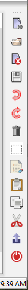

 This will open an existing project.

 Saves current project button.

 Undo will recover from any recent changes to your project.

 Redo will allow a replay of your previous undo(s).

 Delete allows removal of a element.  You can only select a page for deletion by selecting it inside the treeview or on the page tabs. You must, however, have removed all elements from the page before attempting a deletion.  Furthermore you are never allowed to delete the first or main page.

 Export the generate code skeleton for the current project.

 Exit the builder.

-----------------------------------------------
<div style="page-break-after: always;"></div>

## 3.1.2 Toolbox Tab 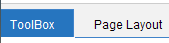

See Section 4.0 for complete details.

## 3.1.3 Page Layout Tab ]

This is broken into three bands View, Layout, and Edit.

## 3.2 View Band

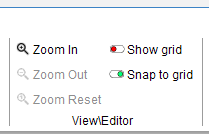

The Grid button allows you to turn on/off the grid. 

The Zoom In button will enlarge the size of the TFT Simulation.

The Zoom Out button will reduce your view of the TFT Simulation.  Note: You can't make it smaller than your Target Platform's Screen Dimensions.

## 3.3 Edit Band

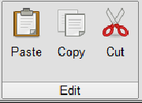

Copy will copy selected UI Elements to the clipboard.

Cut will copy selected UI Elements to the clipboard and delete them from the current page.

Paste will copy UI Elements from the clipboard to the current page.  You may use that Page tabs to move to a new page. The copied Elements will be slightly offset from the original copied positions.  This is to avoid placing them directly on top of the original Elements.

-----------------------------------------------
<div style="page-break-after: always;"></div>

## 3.4 Layout Band

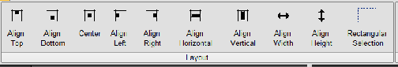

## 3.4.1 Align Top 
The easiest way I can think of to show how to use the alignment buttons is with a couple of checkboxes.  Go ahead and create two boxes it doesn't matter where they end up on the TFT Simulation.


Now click the Align Top button.


This gives you:

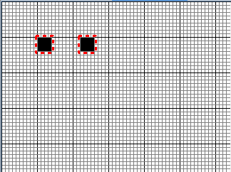

If you click it a second time the elements move to the top margin (set as a default of 5).  You can change the size of margins in the General tab. You can click the UNDO button to get back to the original position and test the other alignment buttons.

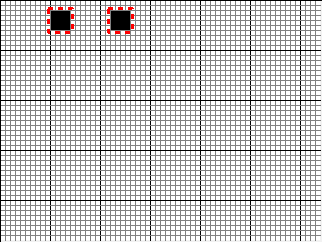

-----------------------------------------------
<div style="page-break-after: always;"></div>

## 3.4.2 Align Bottom 
Before:


Now click the Align Bottom button.


This gives you:


If you click it a second time the elements move to the bottom margin.

-----------------------------------------------
<div style="page-break-after: always;"></div>

## 3.4.3 Align Center 

You can only center one element at a time.


Now click the Align Center button.


This gives you:


-----------------------------------------------
<div style="page-break-after: always;"></div>

## 3.4.4 Align Left 

Before:


Now click the Align Left button.


This gives you:


If you click it a second time the elements move to the left margin.

-----------------------------------------------
<div style="page-break-after: always;"></div>

## 3.4.5 Align Right 

Before:


Now click the Align Right button.


This gives you:


If you click it a second time the elements move to the right margin.

-----------------------------------------------
<div style="page-break-after: always;"></div>

## 3.4.6 Align Horizontal Spacing 

Before:


Now click the Align Horizontal Spacing button.


With:


This gives you:


-----------------------------------------------
<div style="page-break-after: always;"></div>

## 3.4.7 Align Vertical Spacing 

Before:


Now click the Align Vertical Spacing button.


With:


This gives you:


-----------------------------------------------
<div style="page-break-after: always;"></div>

## 3.4.8 Align Width 

Before:


Now click the Align Width button.


This gives you:


-----------------------------------------------
<div style="page-break-after: always;"></div>

## 3.4.9 Align Height 

Before:


Now click the Align Height button.


This gives you:


-----------------------------------------------
<div style="page-break-after: always;"></div>

## 3.4.10 Rectangular Selection 

Clicking the Rectangular Selection button changes your cursor to a cross and allows you to create a rubber band that you can drag over UI elements to select them.  You start by pressing and holding the left mouse button then dragging the rubber band over yourUI Elements.  Once you release the left mouse button the transaction ends.

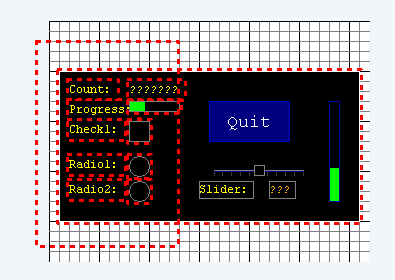

-----------------------------------------------
<div style="page-break-after: always;"></div>

## 3.4.11 Copy Properties 

Clicking the Copy Properties button after selecting a UI Element that has one or more properties that you wish to 
propagate to other UI Elements will bring up a Checklist dialog.  


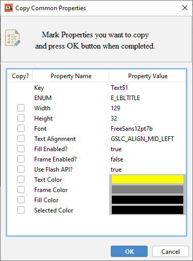

You mark the properties you wish copied and click OK. 
 
-----------------------------------------------
<div style="page-break-after: always;"></div>

Once you have done that a second dialog will come up:

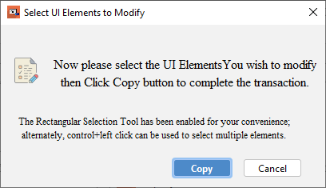

Now you to select the Target UI Elements you want to modify. After you have made your selections, click copy and the properties you marked earlier will be copied. 


-----------------------------------------------
<div style="page-break-after: always;"></div>

## 3.5 Z-Order

Images in GUIslice are placed one on top of the other.  Drawing begins from the first UI element created to the last.  This is referred to as Z-Order. This generally doesn't cause any issues but there are times you will need to change this Z-Order to avoid obstructing components.

For example, say you laid out most of you UI and then add a big box element on top of them like so:

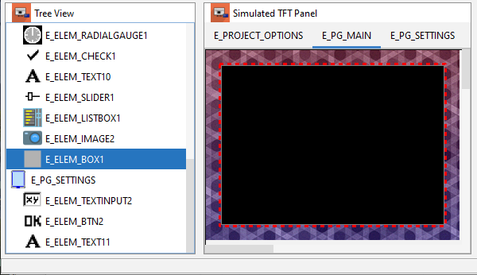

Now the solution to this issue is to select the Box element in the Treeview and drag it up to the top just under the Page element.  Now you will see this:

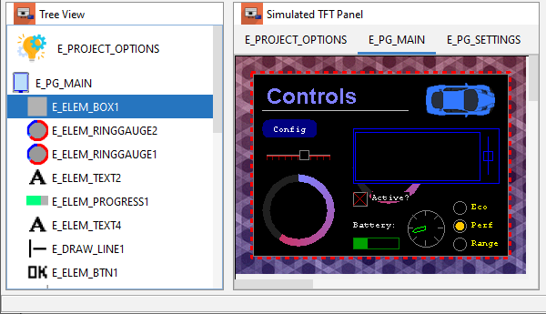

-----------------------------------------------
<div style="page-break-after: always;"></div>

# 4.0 UI Elements
This section outlines the various properties you can set and their usage for each type of element. Images are discussed in section 5.4. During run-time any properties shown in a rose color are read-only.

Most of the UI elements also support a Flash version to minimize RAM usage.  These UI Elements will have a 'Use Flash API?' property you can set equal to 'true'.  

## 4.1 Common Properties
These are the basic common properties for all elements with the exception of Page.
| NAME       | VALUE                                                     |
|------------|-----------------------------------------------------------|
| Key        | Used Internally as an index key                           |
| Enum       | Used by GUIslice API as a identifier. The Builder         |
|            | will create one for you but you should modify it to       |
|            | be meaningful for your program.                           |
| X          | element X, Y Coordinates                                  |
| Y          | You can edit X,Y in place for precise positioning.        |
| Width      | element width in pixels                                   |
| Height     | element height in pixels                                  |
| ElementRef | Allows runtime access to this element, if set,            |
|            | and like Enum should be set to something meaningful.      |

NOTE: Width and Height are system set to default values when placed on the TFT Simulation.

When you first create a UI Element you will be shown its set of Default Colors.
GUIslice API has a different set of colors for each UI Element but you can override them and set to your preferences.

-----------------------------------------------
<div style="page-break-after: always;"></div>

## 4.2 BOX 
See example ex02_bld_btn_txt for a simple example.  A more advanced example using draw and tick callbacks is ex06_bld_callback.
If 'Touch Enabled' = true a button callback will generated to detect users clicking on the box element.
```
// Common Button callback
bool CbBtnCommon(void* pvGui,void *pvElemRef,gslc_teTouch eTouch,int16_t nX,int16_t nY)
{
  gslc_tsElemRef* pElemRef = (gslc_tsElemRef*)(pvElemRef);
  gslc_tsElem* pElem = pElemRef->pElem;

  if ( eTouch == GSLC_TOUCH_UP_IN ) {
    // From the element's ID we can determine which button was pressed.
    switch (pElem->nId) {
//<Button Enums !Start!>
      case E_ELEM_BOX1:
        //TODO- Replace with button handling code
        break;
```

If the Draw Function is set to true a callback for drawing will be auto-generated for you and will look like:
```
bool CbDrawScanner(void* pvGui,void* pvElemRef,gslc_teRedrawType eRedraw)
{
  ...
  //TODO - Add your drawing graphic primitives
  ...
  return true;
}
```
 You will need to add your custom drawing code in place of the TODO statement. For a timer interrupt enable the Tick Function.  Here a Tick callback will be generated that looks like:
 ```
bool CbTickScanner(void* pvGui,void* pvScope)
{
  ...
  //TODO add your custom code here 
  ...
  return true;
}
 ```

| NAME                | VALUE                                             |
|---------------------|---------------------------------------------------|
| Key                 | Box$1                                             |
| ENUM                | E_ELEM_BOX1                                       |

-----------------------------------------------
<div style="page-break-after: always;"></div>

| NAME                | VALUE                                             |
|---------------------|---------------------------------------------------|
| X                   |                                                   |
| Y                   |                                                   |
| Width               | 300                                               |
| Height              | 150                                               |
| ElementRef          |                                                   |
| Corners Rounded?    | false                                             |
| Touch Enabled?      | false                                             |
| Draw Function       | false, Set true Creates a CbDrawScanner callback  |
| Tick Function       | false, Set true Creates a CbTickScanner callback  |
| Use Flash API?      | false       |

-----------------------------------------------
<div style="page-break-after: always;"></div>

## 4.3 Checkbox 

You may have the Builder generated a callback by setting 'Callback Enabled?=true'. Then you will be notified when users mark or unmark checkboxes.  It will look like:
```
bool CbCheckbox(void* pvGui, void* pvElemRef, int16_t nSelId, bool bState)
{
  ...
    switch (pElem->nId) {
     //<Checkbox Enums !Start!>
     case E_ELEM_CHECK1:
      //TODO- Replace with your handling code
      break;
  ...
  return 1;
}
```
See example ex04_bld_ctrls. 

| NAME                | VALUE                                             |
|---------------------|---------------------------------------------------|
| Key                 | CheckBox$1                                        |
| ENUM                | E_ELEM_CHECK1                                     |
| X                   |                                                   |
| Y                   |                                                   |
| Width               | 20                                                |
| Height              | 20                                                |
| ElementRef          |                                                   |
| Checked?            | false, Set true initial state as ‘checked’        |
| Callback Enabled?   | false                                             |
| Check Mark Color    | Color.ORANGE Determines the color of check mark   |
| Use Flash API?      | false                                             |

-----------------------------------------------
<div style="page-break-after: always;"></div>

## 4.4 Graph 

See example ex11_bld_graph.

| NAME                | VALUE                                             |
|---------------------|---------------------------------------------------|
| Key                 | Graph$1                                           |
| ENUM                | E_ELEM_GRAPH1                                     |
| X                   |                                                   |
| Y                   |                                                   |
| Width               | 180                                               |
| Height              | 120                                               |
| ElementRef          | m_pElemGraph1                                     |
| Font                | BuiltIn->5x8pt7b - Font to use for graph area     |
| Maximum Points      | 0 Maximum number of points in buffer              |
| Graph Style         | GSLCX_GRAPH_STYLE_DOT - Dot, Line or Fill.        |
| Color of Graph      | Color.ORANGE Set color of graph dots or fill.     |

-----------------------------------------------
<div style="page-break-after: always;"></div>

## 4.5 Line 

See examples ex07_bld_slider and ex24_bld_tabs for using lines as dividers.

| NAME                | VALUE                                             |
|---------------------|---------------------------------------------------|
| Key                 | Line$1                                            |
| ENUM                | E_DRAW_LINE1                                      |
| X Start Point       |                                                   |
| Y Start Point       |                                                   |
| Line Length         | 50                                                |
| Vertical?           | false                                             |
| Fill Color          | GSLC_COL_GRAY_LT2                                 |

-----------------------------------------------
<div style="page-break-after: always;"></div>

## 4.6 Image 

See example ex06_bld_callback.  Also ex32_bld_spinner for usage of a background image.

| NAME                | VALUE                                             |
|---------------------|---------------------------------------------------|
| Key                 | Image$1                                           |
| ENUM                | E_ELEM_IMAGE1                                     |
| X                   |                                                   |
| Y                   |                                                   |
| Width               |                                                   |
| Height              |                                                   |
| ElementRef          |                                                   |
| Image               | (ex: logo1_24.bmp)                                |
| Image defines       | (ex: IMG_LOGO1_24)                                |
| Image Extern        | used only for RAM based images                    |
| Image Memory        | gslc_GetImageFromSD((const char*)                 |
|                     | gslc_GetImageFromFile(                            |
|                     | gslc_GetImageFromProg((const unsigned char*)      |
|                     | gslc_GetImageFromRam((unsigned char*)             |
| Image Format        | GSLC_IMGREF_FMT_BMP24                             |
|                     | GSLC_IMGREF_FMT_BMP16                             |
|                     | GSLC_IMGREF_FMT_RAW                               |
| Transparent?        | false, if true, support transparency provided     |
| Touch Enabled?      | false, If true a button callback will be created  |
| Frame Enabled?      | false                                             |
| Frame Color         | Frame color with this color                       |

-----------------------------------------------
<div style="page-break-after: always;"></div>

## 4.7 Image Button 

See examples ex03_bld_btn_img and ex28_bld_btn_img_flash. For full details on your options see section 4.18 Text Button and Appendix E.
The button callback will look like:
```
// Common Button callback
bool CbBtnCommon(void* pvGui,void *pvElemRef,gslc_teTouch eTouch,int16_t nX,int16_t nY)
{
  gslc_tsElemRef* pElemRef = (gslc_tsElemRef*)(pvElemRef);
  gslc_tsElem* pElem = pElemRef->pElem;

  if ( eTouch == GSLC_TOUCH_UP_IN ) {
    // From the element's ID we can determine which button was pressed.
    switch (pElem->nId) {
//<Button Enums !Start!>
      case E_ELEM_IBTN1:
        //TODO- Replace with button handling code
        break;
```

| NAME                | VALUE                                             |
|---------------------|---------------------------------------------------|
| Key                 | ImageButton$1                                     |
| ENUM                | E_ELEM_IBTN1                                      |
| X                   |                                                   |
| Y                   |                                                   |
| Width               |                                                   |
| Height              |                                                   |
| ElementRef          |                                                   |
| Image               | (ex: exit_n24.bmp)                                |
| Image defines       | (ex: IMG_EXIT_N24)                                |
| Image Extern        |                                                   |
| Image Memory        | (ex: gslc_GetImageFromSD((const char*)            |

-----------------------------------------------
<div style="page-break-after: always;"></div>

| NAME                | VALUE                                             |
|---------------------|---------------------------------------------------|
| Image When Selected | (ex: exit_g24.bmp)                                |
| Image Select defines| (ex: IMG_BTN_EXIT_G24_SEL)                        |
| Image Select Extern |                                                   |
| Image Select Memory |                                                   |
| Image Format        | GSLC_IMGREF_FMT_BMP24                             |
| Transparent?        | false                                             |
| Jump Page Enum      | PAGE ENUM used for gslc_SetPageCur  call          |
| Popup Page ENUM     | PAGE ENUM used for gslc_PopupShow call            |
| Hide Popup Page?    | false, set=true->gslc_PopupHide() current page    |
| Frame Enabled?      | false                                             |
| Frame Color         | Frame color with this color                       |

-----------------------------------------------
<div style="page-break-after: always;"></div>

## 4.8 Listbox 

Displays a set of items (string values) and allows the user to select an item. See examples ex30_bld_listbox for a multi-column list and ex31_bld_listbox for a scrolling list of rows.

| NAME                |  VALUE                                            |
|---------------------|---------------------------------------------------|
| Key                 | ListBox$1                                         |
| ENUM                | E_ELEM_LISTBOX1                                   |
| X                   |                                                   |
| Y                   |                                                   |
| Width               | 200                                               |
| Height              | 100                                               |
| ElementRef          | m_pElemListbox1                                   |
| Font                | BuiltIn(1x)->5x8pt7b                              |
| List of Items       | Press button [...] to enter list.                 |
| Storage Size        | 0 Auto set to correct size using the entered list |
| Selected Item       | 0                                                 |
| Items per Row       | 1                                                 |
| Display Rows        | 5                                                 |
| Item Gap            | 0                                                 |
| Text Margin Width   | 5                                                 |
| Text Margin Height  | 0                                                 |
| Text Alignment      | GSLC_ALIGN_MID_LEFT                               |
| Add Scrollbar?      | true, false no scrollbar                          |
| Scrollbar ENUM      | E_LISTSCROLL1                                     |
| Scrollbar EREF      | m_pListSlider1                                    |
| Scrollbar Max Value | 100                                               |
| Frame Enabled?      | true                                              |
| Text Color          | Color.WHITE                                       |
-----------------------------------------------
<div style="page-break-after: always;"></div>


| NAME                |  VALUE                                            |
|---------------------|---------------------------------------------------|
| Frame Color         | Color.BLUE                                        |
| Fill Color          | Color.BLACK                                       |
| Selected Color      | Color.BLACK                                       |

-----------------------------------------------
<div style="page-break-after: always;"></div>
## 4.9 Progress Bar 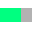

Draws a progress bar element that represents a proportion value (nVal) between nMin and nMax. See examples ex04_bld_ctrls, ex05_bld_pages, ex06_bld_callback, ex24_bld_tabs, ex25_bld_popup, and ex32_bld_spinner.

| NAME                  | VALUE                                          |
|-----------------------|------------------------------------------------|
| Key                   | ProgressBar$1                                  |
| ENUM                  | E_ELEM_PROGRESS1                               |
| X                     |                                                |
| Y                     |                                                |
| Width                 | 50                                             |
| Height                | 10                                             |
| ElementRef            | m_pElemProgress1                               |
| Vertical?             | false, true its vertical bar                   |
| Minimum Value         | 0                                              |
| Maximum Value         | 100                                            |
| Starting Value        | 0                                              |
| Gauge Indicator Color | Color.GREEN                                    |
| Use Flash API?        | false                                          |

-----------------------------------------------
<div style="page-break-after: always;"></div>

## 4.10 Radial Gauge 
 A circular gauge that can be used to show direction or other rotational values. 
  - Tick marks can be optionally drawn around the gauge.
  - Size, color and fill of the needle can be configured.
See example ex09_bld_radial.

| NAME                  | VALUE                                          |
|-----------------------|------------------------------------------------|
| Key                   | RadialGauge$1                                  |
| ENUM                  | E_ELEM_RADIALGAUGE1                            |
| X                     |                                                |
| Y                     |                                                |
| Width                 | 80                                             |
| Height                | 80                                             |
| ElementRef            | m_pElemRadial1                                 |
| Minimum Value         | 0                                              |
| Maximum Value         | 100                                            |
| Starting Value        | 0                                              |
| Rotation Clockwise?   | true                                           |
| Tick Divisions	      | Default 8                                      |
| Tick Size	            | Default 5                                      |
| Tick Color	          | Default GRAY                                   |
| Indicator Length	    | Default 20                                     |
| Indicator Tipe Size   | Default 3                                      |
| Indicator File?	      | Default false                                  |
| Gauge Indicator Color | Color.GREEN                                    |

-----------------------------------------------
<div style="page-break-after: always;"></div>

## 4.11 Radio Button 

You may have the Builder generated a callback by setting 'Callback Enabled?=true'. Then you will be notified when users mark or unmark radio buttons.  It will look like:
```
bool CbCheckbox(void* pvGui, void* pvElemRef, int16_t nSelId, bool bState)
{
  ...
    switch (pElem->nId) {
     //<Checkbox Enums !Start!>
     case E_ELEM_CHECK1:
      //TODO- Replace with your handling code
      break;
  ...
  return 1;
}
```
If you select multiple radio buttons (not checkboxes) you can use the 'Group' Control Tool  to assign a unique GROUPID. The GUIslice API will then only allow one of the buttons to be checked.
See example ex04_bld_ctrls. 

| NAME                | VALUE                                             |
|---------------------|---------------------------------------------------|
| Key                 | CheckBox$1                                        |
| ENUM                | E_ELEM_CHECK1                                     |
| X                   |                                                   |
| Y                   |                                                   |
| Width               | 20                                                |
| Height              | 20                                                |
| ElementRef          |                                                   |
| Checked?            | false, Set true initial state as ‘checked’        |
| Callback Enabled?   | false                                             |
| Check Mark Color    | Color.ORANGE Determines the color of check mark   |
| Use Flash API?      | false                                             |
| Group ID            | GSLC_GROUP_ID_NONE                                |

-----------------------------------------------
<div style="page-break-after: always;"></div>

## 4.12 Ramp Gauge 

A gradient ramp (green-yellow-red) visual control similar to certain linear tachometers. See example ex09_bld_radial. 

| NAME                  | VALUE                                          |
|-----------------------|------------------------------------------------|
| Key                   | RadialGauge$1                                  |
| ENUM                  | E_ELEM_RAMPGAUGE1                              |
| X                     |                                                |
| Y                     |                                                |
| Width                 | 100                                            |
| Height                | 80                                             |
| ElementRef            | m_pElemRamp1                                   |
| Minimum Value         | 0                                              |
| Maximum Value         | 100                                            |
| Starting Value        | 0                                              |
| Tick Divisions	      | Default 8                                      |
| Tick Size	            | Default 5                                      |
| Tick Color	          | Default GRAY                                   |
| Indicator Length	    | Default 20                                     |
| Indicator Tipe Size   | Default 3                                      |
| Indicator File?	      | Default false                                  |
| Fill Color            | Color.BLACK                                    |

-----------------------------------------------
<div style="page-break-after: always;"></div>

## 4.13 RingGauge 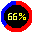

RingGauge creates display element similar to a donut-chart.
 - The element has an outer and inner radius to create a ring appearance.
 - The ring has an angular range defined by 'Angular Range°', which means 
   that the ring can be configured to cover a full circle or just a portion 
   of a circle.
 - 'Starting Angle°' defines the starting angle and direction of fill.
 - When drawing the ring within the angular range, it is composed of
   an active region (the angular region from the start to the current
   position value) and an inactive region (from the current value to the
   end of the angular range). The inactive region can be hidden (by
   setting it to the fill color).
 - A text value can be drawn in the center of the ring, typically to
   show the current value. 
See example ex42_bld_ring.

| NAME                 | VALUE                                           |
|----------------------|-------------------------------------------------|
| Key                  | RingGauge$1                                     |
| ENUM                 | E_ELEM_RINGGAUGE1                               |
| X                    |                                                 |
| Y                    |                                                 |
| Width                | 100                                             |
| Height               | 100                                             |
| ElementRef           | m_pElemXRingGauge1                              |
| Font                 | BuiltIn(1x)->5x8pt7b                            |
| Field Size           | 10                                              |
| Starting Angle°      | 0                                               |
| Angular Range°       | 360                                             |
| Clockwise Direction? | true                                            |
-----------------------------------------------
<div style="page-break-after: always;"></div>

| NAME                 | VALUE                                           |
|----------------------|-------------------------------------------------|
| Minimum Value        | 0                                               |
| Maximum Value        | 100                                             |
| Starting Value       | 0                                               |
| Number of Segments   | 72                                              |
| Line Thickness       | 10                                              |
| Use Gradient Colors? | false                                           |
| Flat Color           | Color.RED                                       |
| Gradient Start Color | Color.RED                                       |
| Gradient End Color   | Color.BLUE                                      |
| Inactive Color       | GSLC_COL_GRAY_DK2                               |
| Text Color           | Color.YELLOW                                    |
| Fill Color           | Color.BLACK                                     |

-----------------------------------------------
<div style="page-break-after: always;"></div>

## 4.14 Slider 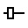

The Slider allows the user to select a value by sliding the knob within the bounded value. The slider can show tick marks. When the Slider's callback is tied to a Listbox or Textbox it provides a scrollable view of the contents of these elements.
See examples ex04_bld_ctrls, ex07_bld_slider, ex09_bld_radial, ex10_bld_textbox, ex31_bld_listbox, and ex42_bld_ring.

The Builder will generate a callback for when users move the thumb control. This will allow you to retrieve its position. It looks like:
```
bool CbSlidePos(void* pvGui,void* pvElemRef,int16_t nPos)
{
  ...
  switch (pElem->nId) {
//<Slider Enums !Start!>
    case E_SLIDER_R:
      // Fetch the slider position
      m_nPosR = gslc_ElemXSliderGetPos(pGui,m_pElemSlider1);
      //TODO- Replace with slider handling code
      break;
   ...
  return 1;
}
```

Again substitute your custom handling code for the TODO. 

| NAME           | VALUE                                                 |
|----------------|-------------------------------------------------------|
| Key            | Slider$1                                              |
| ENUM           | E_ELEM_SLIDER1                                        |
| X              |                                                       |
| Y              |                                                       |
| Width          | 80                                                    |
| Height         | 20                                                    |
| ElementRef     | m_pElemSlider1                                        |
| Minimum Value  | 0                                                     |
| Maximum Value  | 100                                                   |
| Starting Value | 0                                                     |
| Thumb Size     | 5                                                     |
| Vertical?      | false                                                 |
-----------------------------------------------
<div style="page-break-after: always;"></div>


| NAME                |  VALUE                                            |
|---------------------|---------------------------------------------------|
| Tick Divisions | 10                                                    |
| Tick Size      | 5                                                     |
| Tick Color     | Color.BLUE                                            |
| Trim Style?    | false                                                 |
| Trim Color     | Color.BLUE                                            |
| Frame Color    | Color.GRAY                                            |
| Fill Color     | Color.BLACK                                           |
| Selected Color | Color.BLACK                                           |

-----------------------------------------------
<div style="page-break-after: always;"></div>

## 4.15 Spinner 
A Spinner consists of
 - a numeric counter text field
 - increment and decrement button.
See example ex32_bld_spinner.  A callback will be generated so you can retrieve the counter value when it changes. The callback looks like:
```
bool CbSpinner(void* pvGui, void *pvElemRef, int16_t nState, void* pvData)
{
  ...
  if (nState == XSPINNER_CB_STATE_UPDATE) {
    // From the element's ID we can determine which input field is ready.
    switch (pElem->nId) {
//<Spinner Enums !Start!>
      case E_ELEM_COMP1:
        //TODO- Add Spinner handling code
        // using gslc_ElemXSpinnerGetCounter(&m_gui, &m_sXSpinner1);
        gslc_ElemSetTxtStr(&m_gui,m_pElemComp1,acTxtNum);
        break;
  ...
}
```

So you can plug in your custom handling code in place of the TODO comment.

| NAME           | VALUE                                                 |
|----------------|-------------------------------------------------------|
| Key            | Spinner$1                                             |
| ENUM           | E_ELEM_SPINNER1                                       |
| X              |                                                       |
| Y              |                                                       |
| Width          | 64                                                    |
| Height         | 17                                                    |
| ElementRef     | m_pElemSpinner1                                       |
| Font           | BuiltIn(1x)->5x8pt7b                                  |
| Minimum Value  | 0                                                     |
| Maximum Value  | 99                                                    |
| Starting Value | 0                                                     |
-----------------------------------------------
<div style="page-break-after: always;"></div>


| NAME           | VALUE                                                 |
|----------------|-------------------------------------------------------|
| Increment by   | 1                                                     |
| Button Size    | 20                                                    |

You must have the following set inside your GUIslice/config/ard_xxxx.h file to use this control.
```
#define GSLC_FEATURE_COMPOUND    1
```

-----------------------------------------------
<div style="page-break-after: always;"></div>

## 4.16 Text 

Most of the builder examples use text fields as labels while some use them to display runtime counts.  See ex04_bld_ctrls for display of a runtime counter example.

| NAME                  | VALUE                                          |
|-----------------------|------------------------------------------------|
| Key                   | Text$1 unique key assigned for internal use    |
| ENUM                  | E_ELEM_TEXT1 system assigned enum.             |
| Width                 | 60 Width and Height will adjust themselves     |                                        |
| Height                | 12 based upon the text entered                 |
| ElementRef            | Allows runtime access to this element if set   |
| Font                  | Name of your chosen font                       |
| Text                  | The text to display                            |
| UTF-8?                | Only 7 bit ascii characters unless checked.    |
|                       | NOTE: AdaFruit's GFX does not support UTF-8    |
| External Storage Size | 0 unless runtime access needed                 |
| Text Alignment        | GSLC_ALIGN_MID_LEFT (can be RIGHT or CENTERED) |                          |
| Fill Enabled?         | true                                           |
| Frame Enabled?        | false                                          |
| Use Flash API?        | false set to true if you need to save ram      |

-----------------------------------------------
<div style="page-break-after: always;"></div>

## 4.17 Text Box 

A Textbox is a multi-line area that displays scrolling text. It can be tied to a Slider Element to allow a user to control scrolling.
Optionally, it can handle embedded color codes for text. 
See example ex10_bld_textbox.

| NAME               | VALUE                                             |
|--------------------|---------------------------------------------------|
| Key                | TextBox$1                                         |
| ENUM               | E_ELEM_TEXTBOX1                                   |
| X                  |                                                   |
| Y                  |                                                   |
| Width              | 201                                               |
| Height             | 63                                                |
| ElementRef         | m_pElemTextbox1                                   |
| Font               | BuiltIn(1x)->5x8pt7b                              |
| Wrap Text          | false, Set=true, if text is to wrap across lines  |                                             |
| Display Rows       | 6                                                 |
| Characters per Row | 28                                                |
| Add Scrollbar?     | true                                              |
| Scrollbar ENUM     | E_TEXTSCROLL1                                     |
| Scrollbar EREF     | m_pTextSlider1                                    |
| Scrollbar Max Valu | 100                                               |
| Text Color         | Color.YELLOW                                      |
| Frame Color        | Color.GRAY                                        |
| Fill Color         | Color.BLACK                                       |
| Selected Color     | Color.BLACK                                       |

NOTE: Text rows and columns are only an approximation.  Embedding colors will require extra space. See the GUIslice API for further details.

You must have the following set inside your GUIslice_config_<ard,linux>.h file to use embed colors:
```
#define GSLC_FEATURE_XTEXTBOX_EMBED    1
```

-----------------------------------------------
<div style="page-break-after: always;"></div>

## 4.18 Text Button 

Most of the Builder examples use Text Buttons even if only for the Quit button. 
The Builder will generate most of the code for some of the more simple cases.

Options available

 - If you just want the button to jump to a new page set the 'Jump Page ENUM' equal to the target Page ENUM, eex05_bld_pages.
 - To start a Popup Dialog Page set 'Popup Page ENUM' to the Page ENUM that you desire, ex25_bld_popup.
 - To return from a Popup Dialog set 'Hide Popup Page?' = true.
 - To save SRAM on an Arduino you can use the flash version by setting 'Use Flash?' = true.

The normal button callback will look like:
```
// Common Button callback
bool CbBtnCommon(void* pvGui,void *pvElemRef,gslc_teTouch eTouch,int16_t nX,int16_t nY)
{
  gslc_tsElemRef* pElemRef = (gslc_tsElemRef*)(pvElemRef);
  gslc_tsElem* pElem = pElemRef->pElem;

  if ( eTouch == GSLC_TOUCH_UP_IN ) {
    // From the element's ID we can determine which button was pressed.
    switch (pElem->nId) {
//<Button Enums !Start!>
      case E_ELEM_BTN1:
        //TODO- Replace with button handling code
        break;
```

While the Jump to Page callback will look like:
```
//<Button Enums !Start!>
      case E_ELEM_BTN1:
        //TODO- Check the code to see what else you may need to add
        gslc_SetPageCur(&m_gui,E_PG_EXTRA);
        break;
```
 The Popup Dialog:
```
//<Button Enums !Start!>
      case E_ELEM_BTN1:
        //TODO- Check the code to see what else you may need to add
        gslc_PopupShow(&m_gui, E_PG_POPUP, true);
        break;
```

-----------------------------------------------
<div style="page-break-after: always;"></div>


And the return from a Popup
```
//<Button Enums !Start!>
      case E_ELEM_BTN1:
        //TODO- Check the code to see what else you may need to add
        gslc_PopupHide(&m_gui);
        break;
```
A fuller explanation of when the Builder will create, delete or modify a case statement will be found in Appendix E.


| NAME                  | VALUE                                          |
|-----------------------|------------------------------------------------|
| Key                   | TextButton$1                                   |
| ENUM                  | E_ELEM_BTN1                                    |
| X                     |                                                |
| Y                     |                                                |
| Width                 | 80                                             |
| Height                | 40                                             |
| ElementRef            |                                                |
| Font                  | BuiltIn(1x)->5x8pt7b                           |
| Label                 |                                                |
| UTF-8?                | false                                          |
| Corners Rounded?      | false                                          |
| Fill Enabled?         | false                                          |
| Frame Enabled?        | false                                          |
| External Storage Size | 0                                              |
| Text Alignment        | GSLC_ALIGN_MID_MID                             |
-----------------------------------------------
<div style="page-break-after: always;"></div>

| NAME                  | VALUE                                          |
|-----------------------|------------------------------------------------|
| Jump Page ENUM        | PAGE ENUM used for gslc_SetPageCur  call       |
| Popup Page ENUM       | PAGE ENUM used for gslc_PopupShow call         |
| Hide Popup Page?      | false, set=true->gslc_PopupHide() current page |
| Use Flash API?        | false                                          |
| Text Color            | Color.WHITE                                    |
| Frame Color           | GSLC_COL_BLUE_DK2                              |
| Fill Color            | GSLC_COL_BLUE_DK4                              |
| Selected Color        | GSLC_COL_BLUE_DK1                              |

-----------------------------------------------
<div style="page-break-after: always;"></div>

## 4.19 Numeric Input 

When a user presses on this UI Element a Popup Numeric Keypad will appear to take input.
A callback is generated by the Builder for this field and will look like:
```
bool CbKeypad(void* pvGui, void *pvElemRef, int16_t nState, void* pvData)
{
  gslc_tsElemRef* pElemRef = (gslc_tsElemRef*)(pvElemRef);
  gslc_tsElem* pElem = pElemRef->pElem;
  gslc_tsGui* pGui = (gslc_tsGui*)pvGui;

  // From the element's ID we can determine which element is ready.
  if (pElem->nId == E_ELEM_KEYPAD) {
    int16_t nTargetElemId = gslc_ElemXKeyPadDataTargetIdGet(pGui, pvData);
    if (nState == XKEYPAD_CB_STATE_DONE) {
      // User clicked on Enter to leave popup
      // - If we have a popup active, pass the return value directly to
      //   the corresponding value field
      switch (nTargetElemId) {
//<Keypad Enums !Start!>
        case E_ELEM_NUMINPUT1:
          //TODO- Update input handling code
          // using gslc_ElemXKeyPadDataValGet(pGui, pvData)
          gslc_PopupHide(&m_gui);
        break;
```
See ex26_bld_calc for an example of usage.

| NAME                  | VALUE                                            |
|-----------------------|--------------------------------------------------|
| Key                   | NumberInput$1                                    |
| ENUM                  | E_ELEM_NUMINPUT1                                 |
| X                     |                                                  |
| Y                     |                                                  |
| Width                 | 40                                               |
| Height                | 12                                               |
| ElementRef            | m_pElemVal1                                      |
| Font                  | BuiltIn(1x)->5x8pt7b                             |
| UTF-8?                | false                                            |
| Field Size            | 6                                                |
| Text Alignment        | GSLC_ALIGN_MID_LEFT                              |
-----------------------------------------------
<div style="page-break-after: always;"></div>

| NAME                  | VALUE                                            |
|-----------------------|--------------------------------------------------|
| Fill Enabled?         | true                                             |
| Use Flash API?        | false set to true if you need to save ram        |
| Text Color            | Color.YELLOW                                     |
| Frame Color           | Color.GRAY                                       |
| Fill Color            | Color.BLACK                                      |
| Selected Color        | Color.BLACK                                      |

-----------------------------------------------
<div style="page-break-after: always;"></div>

## 4.20 Text Input 

When a user presses on this UI Element a Popup Text-Only Keypad will appear to take input.
A callback is generated by the Builder for this field and will look like:
```
bool CbKeypad(void* pvGui, void *pvElemRef, int16_t nState, void* pvData)
{
  gslc_tsElemRef* pElemRef = (gslc_tsElemRef*)(pvElemRef);
  gslc_tsElem* pElem = pElemRef->pElem;
  gslc_tsGui* pGui = (gslc_tsGui*)pvGui;

  // From the element's ID we can determine which element is ready.
  if (pElem->nId == E_ELEM_KEYPAD) {
    int16_t nTargetElemId = gslc_ElemXKeyPadDataTargetIdGet(pGui, pvData);
    if (nState == XKEYPAD_CB_STATE_DONE) {
      // User clicked on Enter to leave popup
      // - If we have a popup active, pass the return value directly to
      //   the corresponding value field
      switch (nTargetElemId) {
//<Keypad Enums !Start!>
        case E_ELEM_TEXTINPUT1:
          //TODO- Update input handling code
          // using gslc_ElemXKeyPadDataValGet(pGui, pvData)
          gslc_ElemSetTxtStr(pGui, m_pElemInTxt1, gslc_ElemXKeyPadDataValGet(pGui, pvData));
          gslc_PopupHide(&m_gui);
        break;
```
See ex26_bld_alpha for an example.

| NAME                  | VALUE                                            |
|-----------------------|--------------------------------------------------|
| Key                   | TextInput$1                                      |
| ENUM                  | E_ELEM_TEXTINPUT1                                |
| X                     |                                                  |
| Y                     |                                                  |
| Width                 | 65                                               |
| Height                | 10                                               |
| ElementRef            | m_pElemInTxt1                                    |
| Font                  | BuiltIn(1x)->5x8pt7b                             |
| UTF-8?                | false                                            |
-----------------------------------------------
<div style="page-break-after: always;"></div>

| NAME                  | VALUE                                            |
|-----------------------|--------------------------------------------------|
| Field Size            | 10                                               |
| Text Alignment        | GSLC_ALIGN_MID_LEFT                              |
| Fill Enabled?         | true                                             |
| Use Flash API?        | false set to true if you need to save ram        |
| Text Color            | Color.YELLOW                                     |
| Frame Color           | Color.GRAY                                       |
| Fill Color            | Color.BLACK                                      |
| Selected Color        | Color.BLACK                                      |

-----------------------------------------------
<div style="page-break-after: always;"></div>

## 4.21 Page 

Add a new Page layer. This is the container for elements.  You create one page per display screen. 

## 4.22 Base Page 

Add a page for the base layer in the page stack. This is an optional container for global elements. You create one base page per application. 

## 4.23 Popup Page 

Add a new Popup Page for the overlay layer in the page stack. This is the container for elements you want on a popup dialog. Use as many popup pages as needed. 

-----------------------------------------------
<div style="page-break-after: always;"></div>

# 5.0 Customizing

There are a few ways of customizing your experience with the builder.   

You can modify your UI preferences by the editing your Project Options Property View.  
This is the available as "Project" tab in your TFT Simulation Display or the Top Level object in your TreeView 
with the ENUM `E_PROJECT_OPTIONS`. 

Some of the UI Elements also have a tab in the Options dialog allowing you to set size, color, font, and some other options depending upon the element in question.

## 5.1 Project Options 
When you first create a new project these values are filled in with values from the General Preferences tab (Section 5.2) available by edit->options menu item.

| NAME                               | VALUE                                                     |
|------------------------------------|-----------------------------------------------------------|
| Target Platform                    | arduino,arduino minimum, linux                            |
| TFT Screen Width                   | 320                                                       |
| TFT Screen Height                  | 240                                                       |
| Project Directory                  | Your top-level Arduino Sketch Folder                      |
| Target's Image Directory           | Directory on target platform where you have stored images |
| Background Color                   | Black is default                                          |
| Image Transparency Color           | For transparent images GSLC_COL_MAGENTA (r=255,g=0,b=255) |
| Screen Margins                     | 10 pixels top, bottom, right and left                     |
| Horizontal Spacing between elements| Used by alignment commands as the default value           |
| Vertical Spacing between elements  | Used by alignment commands as the default value           |
| MAX_STR                            | Used inside C program for maximum storage of strings      |
| Screen Rotation [0-3]              | -1 is default. If needed, forces gslc_GuiRotate() call.   |

-----------------------------------------------
<div style="page-break-after: always;"></div>

## 5.2 General Preferences
| NAME                               | VALUE                                                     |
|------------------------------------|-----------------------------------------------------------|
| Themes                             | FlatLaf or Java Built-In Themes like: Windows or Metal    |
| Target Platform                    | arduino,arduino minimum, linux                            |
| TFT Screen Width                   | 320                                                       |
| TFT Screen Height                  | 240                                                       |
| TFT Screen DPI                     | 144                                                       |
| Project Directory                  | Your top-level Arduino Sketch Folder                      |
| Target's Image Directory           | Directory on target platform where you have stored images |
| Background Color                   | Black is default                                          |
| Image Transparency Color           | For transparent images GSLC_COL_MAGENTA (r=255,g=0,b=255) |
| Screen Margins                     | 10 pixels top, bottom, right and left                     |
| Horizontal Spacing between elements| Used by alignment commands as the default value           |
| Vertical Spacing between elements  | Used by alignment commands as the default value           |
| MAX_STR                            | Used inside C program for maximum storage of strings      |
| Screen Rotation [0-3]              | -1 is default. If needed, forces gslc_GuiRotate() call.   |
| Backward Compatibility Mode?       | false is default. If true Builder will not create _GSLC.h |
| Preserve Button Callbacks?         | If true callback code is only changed if model changed    |

The FlatLaf project provides the support for non built-in themes: 
<https://github.com/JFormDesigner/FlatLaf>
The full Copyright is included in Appendix C.

-----------------------------------------------
<div style="page-break-after: always;"></div>

## 5.3 Grid Preferences
| NAME                  | VALUE                                          |
|-----------------------|------------------------------------------------|
| Grid                  | false=OFF, set=true for ON                     |
| Grid SnapTo           | true                                           |
| Grid Minor Width      | 10                                             |
| Grid Minor Height     | 10                                             |
| Grid Major Width      | 50                                             |
| Grid Major Height     | 50                                             |
| Grid Minor Color      | Color.BLACK                                    |
| Grid Major Color      | Color.BLACK                                    |
| Grid Background Color | Color.WHITE                                    |

-----------------------------------------------
<div style="page-break-after: always;"></div>

## 5.4 UI Element Customizing

A few elements allow you to change their default properties on a global basis.  Going into the Options tabbed dialog there are tabs for Box, Text, TextButton, Checkbox, and RadioButton.
If you modify any properties on these tabs when you drop the modified elements onto the TFT Simulation the values will be set according to your new settings.  The property values will also be set on any further projects you create or edit.  They will not modify any elements previously used in your projects.

## 5.4 Program skeleton

One of the directories created and populated by the builder is called templates.

Files are created here:

- **ino2.t** Arduino `*.ino` Template
- **hdr.t** Arduino `*_GSLC.h` Template
- **c.t** Linux Template
- **arduino.t** Arduino code blocks
- **linux.t** linux code blocks
- **default_colors.csv**
- **arduinofonts.csv**
- **linuxfonts.csv**
- `*.ods` are the source speadsheets for the each csv file in case you need to perform edits. I strongly suggest you use a spreadsheet program for edits and export the resulting csv files.

See Appendix B for format of the font files.

The files **ino2.t**, **hdr.t** and **c.t** are the skeleton programs for the supported platforms.  You can edit them to include your name, copyright, and whtaever else you need.  Just be careful of the code generation tags.  If you delete or modify them the builder will fail to work correctly. 

-----------------------------------------------
<div style="page-break-after: always;"></div>

## 5.5 default_colors.cvs

This file lists the mapping of colors in RGB format to the GUIslice API names.  For example, rgb (0,0,0) is GSLC_COL_BLACK.  The top 7 rows are the default values the library uses, although these are spread about in the code base.  If you don't like the default color scheme you can use the builder to override them on an individual element basis.  Inside the Properties View will be "Use Default Colors?=true". You simply click the property value to change it to false and you can then edit the Frame, Fill, and Select colors.

## 5.6 Images 

Many UI's, if not most, will require images and icons.  You can place them inside the directories GUIsliceBuilder/arduino_res or linux_res depending upon your target platform. You can, of course, create your own folder.  The arduino_res and linux_res simply exist to provide you with some samples. Once you travel to another folder to find your images the system will remember your last accessed folder and always return to it.   

The only formats currently supported by the GUIslice API library are:
```
- GSLC_IMGREF_FMT_BMP16 
- GSLC_IMGREF_FMT_BMP24
- GSLC_IMGREF_FMT_JPG 
- GSLC_IMGREF_FMT_RAW
```

The GUIslice C Library only supports what the chosen driver implements on the Target Platform. Standard Arduino only supports
 BMP24 files either from SD card or embedded C files and Mono (RAW) BMP bitmaps in C files. The arduino TFT_eSPI supports BMP24 Bitmaps loaded from SD card
 or as an embedded C File and JPG loaded from SPIFFS file system on a ESP8366 or ESP32. Linux on a RaspberryPI using SDL 
 supports BMP16 Bitmaps from the file system and may support others. 

Since drivers come and go the Builder isn't going to do much checking. So do your research and choose wisely.

Now displaying images on the TFT Simulation is one issue, finding them on the target platform is another.  The builder defaults to root '/' on the SD card for Arduino appended to the image's location.  You can change the target's image directory from '/' for arduino by modifying: 

```
edit->options->General->Target's Platform Image Directory
```
The code generator will append whatever string you include so be sure to add folder separators.  The default value is "/".

-----------------------------------------------
<div style="page-break-after: always;"></div>

## 5.7 Fonts

The font implementation is somewhat challenging.  The builder can't actually run the target platform fonts at the actual size since the DPI's won't match.  So the builder has to scale them for use.  The scaling can't be perfect since the scaling might require decimal sizes like, 6.24dp which must be converted to an integer, either 6 or 7.  Stll the builder will give a pretty good approximation as long as users give a little space between text and elements.  If the text appears way off Appendix G gives a sample project that will allow discovery of a better DPI using trail and error.

Appearance is yet another issue.  The builder will use Java's built-in fonts to simulate the target fonts.

The builder uses two files inside GUIsliceBuilder/templates to manage fonts:

arduinofonts.csv for Arduino target platform
linuxfonts.csv for Linux target platform

You are allowed to create your own fonts and add them to the builder.  In which case you will need to modify
 arduinofonts or linuxfonts csv files.  The format is documented in Appendix B.

If you edit these files you must restart the Builder it will then use the new font files.

-----------------------------------------------
<div style="page-break-after: always;"></div>

# Appendix A - Acknowledgements

## Insubstantial Project

The GUIsliceBuilder's Ribbon code is provided by the Insubstantial project written by Kirill Grouchnikov. This project is no longer supported and has been replaced by Radiance project which requires Java 9 or Higher so we can't use it. The Insubstantial jar files involved are:

- **flamingo-7.3.1-SNAPSHOT.jar**
- **trident-7.3.1-SNAPSHOT.jar**
- **substance-7.3.1-SNAPSHOT.jar**

## FlatLaf Project

The Non-Built IN Java Themes are supported by the FlatLaf project. The jar file is:

- **flatlaf-0.29.jar**

The FlatLaf project is on GitHub: 
<https://github.com/JFormDesigner/FlatLaf>

## Icon Attribution

Virtually all icon's used by the Builder were created by Paul Conti. However, a small set have been made by other people.

The "Project" (Light Bulb with gears) icon  used in the TreeView was created by
<div>Icons made by <a href="https://www.flaticon.com/authors/ddara" title="dDara">dDara</a> from <a href="https://www.flaticon.com/" title="Flaticon">www.flaticon.com</a></div>

The "Copy Properties" (exam) icon  was created by
<div>Icons made by <a href="https://www.flaticon.com/authors/zlatko-najdenovski" title="Zlatko Najdenovski">Zlatko Najdenovski</a> from <a href="https://www.flaticon.com/" title="Flaticon">www.flaticon.com</a></div>

The "Page" (Tablet)  and "Image" (Camera)  and "Widget" (Puzzle) icons  were provided by:

https://github.com/icons8/flat-color-icons

-----------------------------------------------
<div style="page-break-after: always;"></div>

# Appendix B - Font csv File Format

You can add or remove fonts from arduinofonts.csv or linuxfonts.csv files to support any font that exists on your target platform.
I would suggest that if you have more than a few fonts to add you should import the csv file into a spreadsheet, do your modifications, and export a new csv file.  That is how I created these files in the first place.  I used LibreOffice Calc for my spreadsheets.

The files are in CSV Format with a column header line - See RFC 4180.  Using a '\#' character to comment out lines is an unsupported extension to this RFC.

Column Titles:

1.  FontName - refers to the font family, ex: Dosis SansSerif, FreeFont Sans, Noto Mono, etc...
2.  DisplayName - refers to the actual font on the target platform, Ex: 'FreeSans12pt7b'.
3.  IncludeFile - on the arduino platform it points to where to find a font, ex: 'Fonts/FreeSansBold12pt7b.h' or NULL
4.  DefineFile - on linux platform it points to the font, Ex: '/usr/share/fonts/truetype/droid/DroidSans.ttf'
5.  nFontId - GUIslice API parameter ENUM ID to use when referencing this font, Ex: E_FONT_TXT
6.  eFontRefType - GUIslice API parameter Font reference type (eg. filename or pointer)
7.  pvFontRef - GUIslice API parameter Reference pointer to identify the font. In the case of SDL mode, it is a filepath to the font file. In the case of Arduino it is a pointer value to the font bitmap array (GFXFont)
8.  nFontSz - GUIslice API parameter Typeface size to use. For Arduino built-in fonts a number from 1 to 5, AdaFruit's freefonts its always a 1, while in SDL mode its actual size of font.
9.  LogicalFont - the name java needs to use when accessing this font.
10. LogicalFontSize - the pre-scaling size to display in the builder.
11. LogicalFontStyle - the font style, plain, bold, italic, bold+italic

Java ships with five platform independent fonts: Dialog, DialogInput, SansSerif, Serif, and Monospaced.  I have chosen to use Monospaced to represent Adafruit's built-in fonts which are 5x8 and plain only.
Adafruit GFX only scales them up from 1 to N. As an example scale of 2 gives you a character 10x16.
I have supported scales of 1 to 5.  You can edit this as you desire.

One thing you should keep in mind is that non built-in fonts take up a fair amount of memory so you should limit your selection to one or two non built-in fonts if your target platform is an Arduino.  

Some additional documentation is available in "GUIsliceBuilder/templates/fonts_readme.txt".

WARNING! No error checking exists in the code so be very careful with any edits.

-----------------------------------------------
<div style="page-break-after: always;"></div>

# Appendix C - CopyRight Notices

## Insubstantial project CopyRight

The CopyRight Notice for the Insubstantial project is reproduced in full here:

Copyright (c) 2005-2010 Kirill Grouchnikov. All Rights Reserved.

Redistribution and use in source and binary forms, with or without 
modification, are permitted provided that the following conditions are met:

 - Redistributions of source code must retain the above copyright notice, 
   this list of conditions and the following disclaimer. 
   
 - Redistributions in binary form must reproduce the above copyright notice, 
   this list of conditions and the following disclaimer in the documentation 
   and/or other materials provided with the distribution. 
   
 - Neither the name of Flamingo Kirill Grouchnikov nor the names of 
   its contributors may be used to endorse or promote products derived 
   from this software without specific prior written permission. 
   
THIS SOFTWARE IS PROVIDED BY THE COPYRIGHT HOLDERS AND CONTRIBUTORS "AS IS" 
AND ANY EXPRESS OR IMPLIED WARRANTIES, INCLUDING, BUT NOT LIMITED TO, 
THE IMPLIED WARRANTIES OF MERCHANTABILITY AND FITNESS FOR A PARTICULAR 
PURPOSE ARE DISCLAIMED. IN NO EVENT SHALL THE COPYRIGHT OWNER OR 
CONTRIBUTORS BE LIABLE FOR ANY DIRECT, INDIRECT, INCIDENTAL, SPECIAL, 
EXEMPLARY, OR CONSEQUENTIAL DAMAGES (INCLUDING, BUT NOT LIMITED TO, 
PROCUREMENT OF SUBSTITUTE GOODS OR SERVICES; LOSS OF USE, DATA, OR PROFITS; 
OR BUSINESS INTERRUPTION) HOWEVER CAUSED AND ON ANY THEORY OF LIABILITY, 
WHETHER IN CONTRACT, STRICT LIABILITY, OR TORT (INCLUDING NEGLIGENCE 
OR OTHERWISE) ARISING IN ANY WAY OUT OF THE USE OF THIS SOFTWARE, 
EVEN IF ADVISED OF THE POSSIBILITY OF SUCH DAMAGE. 

-----------------------------------------------
<div style="page-break-after: always;"></div>

## FlatLaf project CopyRight

The CopyRight Notice for the FlatLaf project is reproduced in full here:

                                 Apache License
                           Version 2.0, January 2004
                        http://www.apache.org/licenses/

   TERMS AND CONDITIONS FOR USE, REPRODUCTION, AND DISTRIBUTION

   1. Definitions.

      "License" shall mean the terms and conditions for use, reproduction,
      and distribution as defined by Sections 1 through 9 of this document.

      "Licensor" shall mean the copyright owner or entity authorized by
      the copyright owner that is granting the License.

      "Legal Entity" shall mean the union of the acting entity and all
      other entities that control, are controlled by, or are under common
      control with that entity. For the purposes of this definition,
      "control" means (i) the power, direct or indirect, to cause the
      direction or management of such entity, whether by contract or
      otherwise, or (ii) ownership of fifty percent (50%) or more of the
      outstanding shares, or (iii) beneficial ownership of such entity.

      "You" (or "Your") shall mean an individual or Legal Entity
      exercising permissions granted by this License.

      "Source" form shall mean the preferred form for making modifications,
      including but not limited to software source code, documentation
      source, and configuration files.

      "Object" form shall mean any form resulting from mechanical
      transformation or translation of a Source form, including but
      not limited to compiled object code, generated documentation,
      and conversions to other media types.

-----------------------------------------------
<div style="page-break-after: always;"></div>

      "Work" shall mean the work of authorship, whether in Source or
      Object form, made available under the License, as indicated by a
      copyright notice that is included in or attached to the work
      (an example is provided in the Appendix below).
    
      "Derivative Works" shall mean any work, whether in Source or Object
      form, that is based on (or derived from) the Work and for which the
      editorial revisions, annotations, elaborations, or other modifications
      represent, as a whole, an original work of authorship. For the purposes
      of this License, Derivative Works shall not include works that remain
      separable from, or merely link (or bind by name) to the interfaces of,
      the Work and Derivative Works thereof.
    
      "Contribution" shall mean any work of authorship, including
      the original version of the Work and any modifications or additions
      to that Work or Derivative Works thereof, that is intentionally
      submitted to Licensor for inclusion in the Work by the copyright owner
      or by an individual or Legal Entity authorized to submit on behalf of
      the copyright owner. For the purposes of this definition, "submitted"
      means any form of electronic, verbal, or written communication sent
      to the Licensor or its representatives, including but not limited to
      communication on electronic mailing lists, source code control systems,
      and issue tracking systems that are managed by, or on behalf of, the
      Licensor for the purpose of discussing and improving the Work, but
      excluding communication that is conspicuously marked or otherwise
      designated in writing by the copyright owner as "Not a Contribution."
    
      "Contributor" shall mean Licensor and any individual or Legal Entity
      on behalf of whom a Contribution has been received by Licensor and
      subsequently incorporated within the Work.

   2. Grant of Copyright License. Subject to the terms and conditions of
      this License, each Contributor hereby grants to You a perpetual,
      worldwide, non-exclusive, no-charge, royalty-free, irrevocable
      copyright license to reproduce, prepare Derivative Works of,
      publicly display, publicly perform, sublicense, and distribute the
      Work and such Derivative Works in Source or Object form.

   3. Grant of Patent License. Subject to the terms and conditions of
      this License, each Contributor hereby grants to You a perpetual,
      worldwide, non-exclusive, no-charge, royalty-free, irrevocable
      (except as stated in this section) patent license to make, have made,
      use, offer to sell, sell, import, and otherwise transfer the Work,
      where such license applies only to those patent claims licensable
      by such Contributor that are necessarily infringed by their
      Contribution(s) alone or by combination of their Contribution(s)
      with the Work to which such Contribution(s) was submitted. If You
      institute patent litigation against any entity (including a
      cross-claim or counterclaim in a lawsuit) alleging that the Work
      or a Contribution incorporated within the Work constitutes direct
      or contributory patent infringement, then any patent licenses
      granted to You under this License for that Work shall terminate
      as of the date such litigation is filed.

-----------------------------------------------
<div style="page-break-after: always;"></div>

   4. Redistribution. You may reproduce and distribute copies of the
      Work or Derivative Works thereof in any medium, with or without
      modifications, and in Source or Object form, provided that You
      meet the following conditions:

      (a) You must give any other recipients of the Work or
      ​    Derivative Works a copy of this License; and

      (b) You must cause any modified files to carry prominent notices
      ​    stating that You changed the files; and

      (c) You must retain, in the Source form of any Derivative Works
      ​    that You distribute, all copyright, patent, trademark, and
      ​    attribution notices from the Source form of the Work,
      ​    excluding those notices that do not pertain to any part of
      ​    the Derivative Works; and

      (d) If the Work includes a "NOTICE" text file as part of its
      ​    distribution, then any Derivative Works that You distribute must
      ​    include a readable copy of the attribution notices contained
      ​    within such NOTICE file, excluding those notices that do not
      ​    pertain to any part of the Derivative Works, in at least one
      ​    of the following places: within a NOTICE text file distributed
      ​    as part of the Derivative Works; within the Source form or
      ​    documentation, if provided along with the Derivative Works; or,
      ​    within a display generated by the Derivative Works, if and
      ​    wherever such third-party notices normally appear. The contents
      ​    of the NOTICE file are for informational purposes only and
      ​    do not modify the License. You may add Your own attribution
      ​    notices within Derivative Works that You distribute, alongside
      ​    or as an addendum to the NOTICE text from the Work, provided
      ​    that such additional attribution notices cannot be construed
      ​    as modifying the License.

      You may add Your own copyright statement to Your modifications and
      may provide additional or different license terms and conditions
      for use, reproduction, or distribution of Your modifications, or
      for any such Derivative Works as a whole, provided Your use,
      reproduction, and distribution of the Work otherwise complies with
      the conditions stated in this License.

   5. Submission of Contributions. Unless You explicitly state otherwise,
      any Contribution intentionally submitted for inclusion in the Work
      by You to the Licensor shall be under the terms and conditions of
      this License, without any additional terms or conditions.
      Notwithstanding the above, nothing herein shall supersede or modify
      the terms of any separate license agreement you may have executed
      with Licensor regarding such Contributions.

   6. Trademarks. This License does not grant permission to use the trade
      names, trademarks, service marks, or product names of the Licensor,
      except as required for reasonable and customary use in describing the
      origin of the Work and reproducing the content of the NOTICE file.

-----------------------------------------------
<div style="page-break-after: always;"></div>

   7. Disclaimer of Warranty. Unless required by applicable law or
      agreed to in writing, Licensor provides the Work (and each
      Contributor provides its Contributions) on an "AS IS" BASIS,
      WITHOUT WARRANTIES OR CONDITIONS OF ANY KIND, either express or
      implied, including, without limitation, any warranties or conditions
      of TITLE, NON-INFRINGEMENT, MERCHANTABILITY, or FITNESS FOR A
      PARTICULAR PURPOSE. You are solely responsible for determining the
      appropriateness of using or redistributing the Work and assume any
      risks associated with Your exercise of permissions under this License.

   8. Limitation of Liability. In no event and under no legal theory,
      whether in tort (including negligence), contract, or otherwise,
      unless required by applicable law (such as deliberate and grossly
      negligent acts) or agreed to in writing, shall any Contributor be
      liable to You for damages, including any direct, indirect, special,
      incidental, or consequential damages of any character arising as a
      result of this License or out of the use or inability to use the
      Work (including but not limited to damages for loss of goodwill,
      work stoppage, computer failure or malfunction, or any and all
      other commercial damages or losses), even if such Contributor
      has been advised of the possibility of such damages.

   9. Accepting Warranty or Additional Liability. While redistributing
      the Work or Derivative Works thereof, You may choose to offer,
      and charge a fee for, acceptance of support, warranty, indemnity,
      or other liability obligations and/or rights consistent with this
      License. However, in accepting such obligations, You may act only
      on Your own behalf and on Your sole responsibility, not on behalf
      of any other Contributor, and only if You agree to indemnify,
      defend, and hold each Contributor harmless for any liability
      incurred by, or claims asserted against, such Contributor by reason
      of your accepting any such warranty or additional liability.

   END OF TERMS AND CONDITIONS

   APPENDIX: How to apply the Apache License to your work.

      To apply the Apache License to your work, attach the following
      boilerplate notice, with the fields enclosed by brackets "[]"
      replaced with your own identifying information. (Don't include
      the brackets!)  The text should be enclosed in the appropriate
      comment syntax for the file format. We also recommend that a
      file or class name and description of purpose be included on the
      same "printed page" as the copyright notice for easier
      identification within third-party archives.

   Copyright [yyyy] [name of copyright owner]

   Licensed under the Apache License, Version 2.0 (the "License");
   you may not use this file except in compliance with the License.
   You may obtain a copy of the License at

       http://www.apache.org/licenses/LICENSE-2.0

   Unless required by applicable law or agreed to in writing, software
   distributed under the License is distributed on an "AS IS" BASIS,
   WITHOUT WARRANTIES OR CONDITIONS OF ANY KIND, either express or implied.
   See the License for the specific language governing permissions and
   limitations under the License.

-----------------------------------------------
<div style="page-break-after: always;"></div>

# Appendix D - Theme Support

**FlatLaf** is a modern **open-source** cross-platform Look and Feel for Java
Swing desktop applications.

It looks almost flat (no shadows or gradients), clean, simple and elegant.
FlatLaf comes with **Light**, **Dark**, **IntelliJ** and **Darcula** themes,
scales on **HiDPI** displays and runs on Java 8 or newer.

The look is heavily inspired by **Darcula** and **IntelliJ** themes from
IntelliJ IDEA 2019.2+ and uses almost the same colors and icons.

FlatLaf can use 3rd party themes created for IntelliJ Platform.

The Builder will look inside the folder GUIsliceBuilder/templates/intellijthemes
and scan for any files that end with ".theme.json".

You can add you own themes simply by loading into the intellijthemes folder.  The Builder will make them avaible upon the next startup.

-----------------------------------------------
<div style="page-break-after: always;"></div>

# Appendix E - Case Statement Generation

The Builder supports a richer set of functions for Button callbacks like Jump to Page, Show Popup page and Hide Popup Page and since users can set these values on/off in many different editing sessions the Builder attempts to do a more intelligent update for the Button callbacks. 

The rules here apply only to the Button callbacks.  All other callbacks simply look for existing case statement with ENUM and if it finds it within your *.ino file the code is left unchanged. If a UI Element is deleted the code generator will remove it's case statement.

**Example** **One**

You create a simple button in the Builder with no Jump, Popup, or Hide Page like the Quit button used in the examples and do a code generation.
```
      case E_ELEM_BTN_QUIT:
        //TODO- Check the code to see what else you may need to add
        break;
```
What if you delete this button?

The case statement will be removed.

What if you rename the Button's ENUM, say from E_ELEM_BTN_QUIT to E_QUIT? 

It will detect that E_ELEM_BTN_QUIT is no longer in your project so it will Delete it.
It will then find what it believes is a new button and create a new case statement.

Unfortunately the Code Generator doesn't have any semantic information to identify
a relationship of E_QUIT to E_ELEM_BTN_QUIT so this is the best it can do.

**Example** **Two**

Once again we start with Example's One simple button and now we edit the case statement:
```
      case E_ELEM_BTN_QUIT:
        // Output a message when the button is pressed
        Serial.println("Quit button pressed");
        // Set a variable flag that we can use elsewhere        
        m_bQuit = true;
        break;
```
You go back into the builder and set “Jump Page ENUM = E_PG2_MainMenu".

Here it will simply place the gslc_SetPageCur call before the break and leave everything else alone.

```
      case E_ELEM_BTN_QUIT:
        // Output a message when the button is pressed
        Serial.println("Quit button pressed");
        // Set a variable flag that we can use elsewhere        
        m_bQuit = true;
        gslc_SetPageCur(&m_gui,E_PG2_MainMenu);
        break;
```
Time passes and you now want a jump to E_PG4_Schedule instead so you edit the E_ELEM_BTN_QUIT Jump Page ENUM property and replace E_PG2_MainMenu with E_PG4_Schedule.

During a new code generation the Builder checks the existing case statement and sees E_PG2_MainMenu so it deletes just the gslc_SetPageCur statement and replaces it with the new value.
```
      case E_ELEM_BTN_QUIT:
        Serial.println("E_ELEM_BTN_QUIT touched");
        // Set a variable flag that we can use elsewhere        
        m_bQuit = true;
        gslc_SetPageCur(&m_gui,E_PG4_Schedule);
        break;
```
**Example** **Three**

Now what if instead you made so many edits to this case statement you don’t want the Builder to look at it any more.
```
case E_IMGBTN_SETTINGS:
   if (!isGrinding)
   {
     SetMode(CliveNormal);
     setNewPage(E_PG_SETTINGS);
     BluetoothStartSettings();
     UpdateSettingsText();
     hideSetPositionPanel();
     needSensorRepaint = false;
   }
   break;
```
Just clear out "Jump Page ENUM = " and the Builder will leave it alone.

**Example** **Four**

I love cutting and pasting code any way to maximize my work?

Seriously though, lets say these rules are just too hard for you to work with or you really do love to cut and paste code. Yes, there is an option for you. On the User Preferences "General" tab there is an option "Preserve Button Callbacks?". Just set this to false and the Builder will start fresh for Button callbacks during code generation wiping out all code inside the Builder's "//<Button Enums" tags.

-----------------------------------------------
<div style="page-break-after: always;"></div>

# Appendix F - Code Templates

There are two platform specific templates for code generation inside GUIsliceBuilder/templates. They are "arduino.t" for Arduino and compatibles and "linux.t" for RaspberryPI.

The templates are used for creating the various sections of your application. They start with a name enclosed with angle brackets `<>` and end with a `<STOP>`.

In between is the actual code to be output.  Now most code will require properties from the specific UI Element you created for your User Interface.  These properties are not referred by the user exposed names since they may change or get translated some day to another language.  Instead, we use meta-ids which are documented below inside a meta-id table mapping. 

The Java UI Element Models use these meta-ids to replace macros within the code blocks with actual property values.

The macros are identified by starting with a `$<` and ending with a bracket `>`.  In between is the meta-id to be replaced.

Now there are some common properties to all UI Elements like ENUM meta-id "COM-002", and X + Y Positions meta-ids "COM-003", "COM-004".

While many UI Elements have at least some properties unique to them; Like the Progress Bar which has a property "is Vertical?" meta-is "BAR-100". Of course, without looking at source code you are not likely to identify or make use of such things.  

Nevertheless, they may be cases where simple edits will allow you some degree of customization.  Say you have replaced Adafruit's GFX fonts and you don't want code to generated with 
`#include <Adafruit_GFX.h>`. You find the code segment:
```
<FONT_ADAFRUIT>
#if defined(DRV_DISP_TFT_ESPI)
  #error Builder config "Edit->Options->General->Target Platform" should be "arduino TFT_eSPI"
#endif 
#include <Adafruit_GFX.h>
// Note that these files are located within the Adafruit-GFX library folder:
<STOP>
```
and you can edit it so no mention of GFX is made like so:
```
<FONT_ADAFRUIT>
#if defined(DRV_DISP_TFT_ESPI)
  #error Builder config "Edit->Options->General->Target Platform" should be "arduino TFT_eSPI"
#endif 
<STOP>
```
There are some cases where meta-id is not used and a few places where templates are also not used in code generation. This is due mostly to older beta code and my general lazyness and lack of motivation. 


| META ID    | PROPERTY NAME                             |
|------------|-------------------------------------------|
| BAR-100    | Vertical?                                 |
| BAR-101    | Ramp Style (not used)                     |
| BAR-102    | Min value                                 |
| BAR-103    | Max value                                 |
| BAR-104    | Starting value                            |
| BAR-105    | Style                                     |
| BAR-106    | Tick Divisions                            |
| BAR-107    | Tick Size                                 |
| BAR-108    | Tick Color                                |
| BAR-109    | Indicator Length                          |
| BAR-110    | Indicator Tip Size                        |
| BAR-111    | Indicator Fill?                           |
| BAR-112    | Add Scrollbar?                            |
| BAR-113    | Embedded Scrollbar ENUM                   |
| BAR-114    | Embedded Scrollbar ElemRef                |
| BAR-115    | Embedded Max value                        |
| BAR-116    | Embedded Frame Color                      |
| BAR-117    | Embedded Fill Color                       |
| BAR-118    | Direction Clockwise?                      |
| BOX-100    | Draw Function                             |
| BOX-101    | Tick Function                             |
| CBOX-100   | Checked?                                  |
| COL-301    | Text Color                                |
| COL-302    | Frame Color                               |
| COL-303    | Fill Color                                |
| COL-304    | Selected Color                            |
| COL-305    | Check Mark Color                          |
| COL-306    | Tick Color                                |
| COL_307    | Trim Color                                |
| COL_308    | Gauge Color                               |
| COL-309    | Graph Color                               |
| COL-310    | Background Color                          |
| COL-311    | Grid Major Color                          |
| COL-312    | Grid Minor Color                          |
| COL-313    | Grid Background Color                     |
| COL-314    | Transparency Color                        |
| COM-000    | Page Enum                                 |
| COM-001    | Key                                       |
| COM-002    | ENUM                                      |
| COM-003    | X                                         |
| COM-004    | Y                                         |
| COM-005    | Width                                     |
| COM-006    | HEIGHT                                    |
| COM-010    | Frame Enable                              |
| COM-011    | Fill Enabled                              |
| COM-012    | Button Rounded                            |
| COM-013    | Button Size                               |
| COM-014    | Button GapX                               |
| COM-015    | Button GapY                               |
| COM-016    | Touch En                                  |
| COM-017    | Callback En                               |
| COM-018    | Key Count (Number in the Key after the $) |
| COM-019    | ELEMENT REF                               |
| COM-020    | Use Flash API                             |
| GEN-100    | Theme                                     |
| GEN-101    | Target Platform                           |
| GEN-102    | TFT Screen Width                          |
| GEN-103    | TFT Screen Height                         |
| GEN-104    | TFT Screen DPI                            |
| GEN-105    | Project Directory                         |
| GEN-106    | Target’s Image Directory                  |
| GEN-107    | Screen Margins                            |
| GEN-108    | Horizontal Spacing                        |
| GEN-109    | Vertical Spacing                          |
| GEN-110    | MAX_STR                                   |
| GEN-111    | Recent Colors                             |
| GEN-112    | Rotation                                  |
| GEN-113    | Source Image Directory                    |
| GEN-116    | Use Background Image?                     |
| GEN-117    | Background Image                          |
| GEN-118    | Background Image File Name                |
| GEN-119    | Insert Adafruit_GFX.h?                    |
| GEN-120    | Backward Compatibility                    |
| GEN-121    | Recent File List                          |
| GEN-130    | Width  of App Window                      |
| GEN-131    | Height of App Window                      |
| GEN-132    | Width  of TFT Simulation Window           |
| GEN-133    | Height of TFT Simulation Window           |
| GEN-134    | Width  of Property View Window            |
| GEN-135    | Height of Property View Window            |
| GRID-100   | Grid                                      |
| GRID-101   | Grid Snap To                              |
| GRID-102   | Grid Minor Width                          |
| GRID-103   | Grid Minor Height                         |
| GRID-104   | Grid Major Width                          |
| GRID_105   | Grid Major Height                         |
| GRID-106   | Grid State                                |
| GRPH-100   | Maximum Points                            |
| GRPH-102   | Graph Style                               |
| LINE-100   | Line Length                               |
| LINE-101   | is Vertical?                              |
| LIST-100   | Text Margin Width                         |
| LIST-101   | Text Margin Height                        |
| LIST-102   | Default Selected Item                     |
| LIST-103   | Item List                                 |
| LIST-104   | Storage Size                              |
| LIST-106   | Item Gap                                  |
| LIST-107   | Item Gap Color                            |
| IBTN-100   | Image                                     |
| IBTN-101   | Image When Selected                       |
| IBTN-102   | Image defines                             |
| IBTN-103   | Select Image defines                      |
| IBTN-104   | Image Format                              |
| IBTN-107   | Transparency                              |
| IBTN-108   | Image Extern                              |
| IBTN-109   | Select Image Extern                       |
| IBTN-110   | Image Memory Type                         |
| IBTN-111   | Select Image Memory Type                  |
| IMG-100    | Image                                     |
| IMG-101    | Image defines                             |
| IMG-102    | Image Format                              |
| IMG-107    | Image Transparency                        |
| IMG-108    | Image Extern                              |
| IMG-109    | Image Memory Type                         |
| KEY-102    | Keypad ENUM                               |
| KEY-019    | Keypad EREF                               |
| PAD-100    | Floating Point                            |
| PAD-101    | Minus Sign                                |
| RBTN-100   | Checked?                                  |
| RBTN-101   | Group ID                                  |
| RBTN-305   | Check Mark Color                          |
| RING-100   | Starting Angle                            |
| RING-101   | Angular Range                             |
| RING-102   | Direction Clockwise?                      |
| RING-103   | Min                                       |
| RING-104   | Max                                       |
| RING-105   | Starting Value                            |
| RING-106   | Number of Segments                        |
| RING-107   | Line Thickness                            |
| RING-108   | Use Gradient Color                        |
| RING-109   | Active Flat Color                         |
| RING-110   | Active Gradient Color Start               |
| RING-111   | Active Gradient Color End                 |
| RING-112   | Inactive Color                            |
| SLD-100    | Min                                       |
| SLD-101    | Max                                       |
| SLD-102    | Value                                     |
| SLD-103    | Thumb Sz                                  |
| SLD-104    | Vertical?                                 |
| SLD-105    | Tick Divisions                            |
| SLD-106    | Tick Size                                 |
| SLD-107    | Trim Style                                |
| SPIN-100   | Increment                                 |
| SPIN-101   | Button Size                               |
| TXT-200    | Font                                      |
| TXT-201    | Text                                      |
| TXT-202    | Label                                     |
| TXT-203    | UTF8                                      |
| TXT-204    | Fill Enabled                              |
| TXT-205    | External Storage Size                     |
| TXT-207    | Text Alignment (old do not use)           |
| TXT-208    | Wrap Text                                 |
| TXT-209    | Text Rows                                 |
| TXT-210    | Text Columns                              |
| TXT-211    | Font Enum                                 |
| TXT-212    | Text Margin                               |
| TXT-213    | Text Alignment                            |
| TBNT-101   | Jump/Popup To Page ENUM                   |
| TBNT-103   | Hide Popup Page Function                  |
| TBNT-104   | Show Popup Page ENUM                      |

-----------------------------------------------
<div style="page-break-after: always;"></div>

# Appendix G - Adjusting Builder's DPI

This is a trail and error process. Here I present how to write a project 'AlignText.prj' to guide you in this process.

Start by creating a new project, and add three or four text boxes of various font sizes, choosing your favorite fonts, colors and backgrounds. Place them at the X margin 10, and using the Align Vertical Spacing button space them out by 20 pixels. 

Now create a BOX the size of your display, change the colors to White for Frame, and Fill and check the 'Draw Funct' box in the Properties view. Select the Box in the Treeview and drag it just under the Page$1.
Save the project as AlignText.prj and generate code.

Now edit the AlignText.ino file and this line inside CbDrawScanner function under the 'add your drawing' comment.
```
//TODO - Add your drawing graphic primitives
drawGrid(rInside.w, rInside.h);
```
Now before the CbDrawScanner function add this new function:
```
void drawGrid(int w, int h) {
  int x, y;
  int minor = 5;
  int major = 50;
  gslc_tsColor minorCol = GSLC_COL_GRAY;
  gslc_tsColor majorCol = GSLC_COL_BLACK;
  gslc_tsColor lineCol;
  // draw X axis
  for (x=0; x<w; x+=minor) {
    if (x%major == 0) {
      lineCol = majorCol;
    } else {
      lineCol = minorCol;
    }
    gslc_DrawLine(&m_gui, x, 0, x, h, lineCol);
  }
  // draw Y axis
  for (y=0; y<h; y+=minor) {
    if (y%major==0) {
      lineCol = majorCol;
    } else {
      lineCol = minorCol;
    }
    gslc_DrawLine(&m_gui, 0, y, w, y, lineCol);
  }
}
```

-----------------------------------------------
<div style="page-break-after: always;"></div>


Once you have the program running on your target platform you should see the text lined up in a grid.

Go back to the Builder and reopen this new project.  Delete the Box element and turn on the Grid. Now compare the Builder's screen to your MCU screen. If Text shown doesn't closely match the Builder you need to adjust the DPI inside the Edit->Options->General tab. If the Builder's text is too large you need to reduce the DPI, while increasing DPI will decrease the size of displayed text. The DPI has no effect on the target platform so don't re-generate the code, just keep adjusting the Builder's DPI until its a close enough match.

You will likely get the best match in size if you install on the Builder's machine the same fonts that you will be running on your MCU. See Appendex B for more details.

