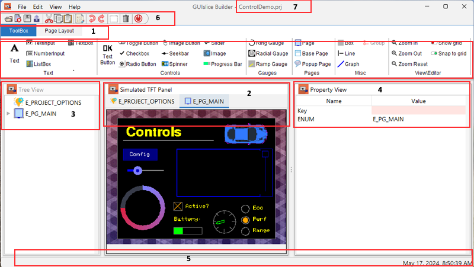
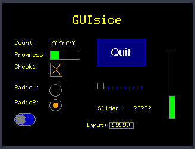
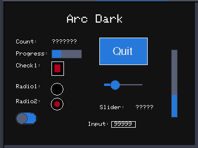
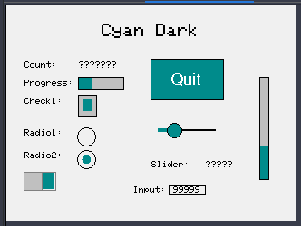
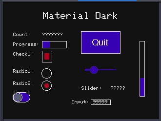
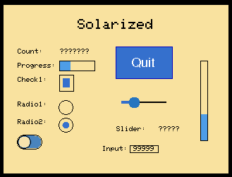

<center>
    <H1>
        GUIslice Builder
    </H1>
    <H2>
        User Guide
    </H2>
    <H3>
        Ver: 0.17.b33
    </H3>
</center>


**Publication date and software version**

Published June 2024. Based on GUIslice API Library 0.17.1.6

**Copyright**

This document is Copyright © 2018-2024 by Paul Conti. You may distribute or modify it under the terms of the MIT License.  https://opensource.org/licenses/MIT

GUIslice Copyright (c) Calvin Hass 2016-2021

Copyright Notices for third party libraries are included in Appendixes C and D.
All trademarks within this guide belong to their legitimate owners.

---------
<div style="page-break-after: always;"></div>

# 1.0  Introduction

GUIslice library is a lightweight platform-independent GUI designed for embedded displays.  While it can support other systems it started with support for  use with Raspberry Pi and Arduino.  It's written and supported by Calvin Hass.  You can download the library and example files from github.  See the wiki pages for more details.

GUIslice Wiki: <https://github.com/ImpulseAdventure/GUIslice/wiki>

It's a nice package but the embedded design choice to eliminate dynamic memory allocation does mean additional care must be taken in the user code to manage the data structures.

The GUIslice Builder creates a cross-platform desktop application that automates the boilerplate code generation and tracking of the UI pieces. For example, the Builder helps manage:
- Defines, enums, UI storage declarations
- Coordinates and dimensions of UI elements can be visually created
- Colors and fonts can also be modelled within the Builder

The net result is that the Builder allows users to layout their UI visually and enables boilerplate GUI code to be generated quickly with a drag-and-drop desktop application and save the user from some of the bookkeeping and potential errors that might otherwise come up.

It generate a skeleton file for your Graphics Library, either 'project.ino' for Arduino IDE, or main.cpp for PlatformIO, or 'project.c' for Linux.
A 'project_GSLC.h' header file will also be created for Arduino IDE and PlatformIO IDE projects but generally, you won't need to view or edit this file.

Graphics packages are defined inside builder_fonts.json file since your chosen package mostly affects 
font handling. Refer to Appendex B Font File Format for more details.

Currently we ship with support for these Graphic Packages.
- Adafruit_GFX
- M5Stack 
- ILI9341_t3
- TFT_eSPI
- UTFT
- Linux SDL1, SDL2 and TSLIB 

You switch to these using the E_PROJECT_OPTIONS's property view. You can set the default value for new projects inside User Preferences General Tab.  This is available by selecting Edit menu and then Options.
<p>
The Builder supports the Arduino IDE and PlatformIO IDE. You may choose this inside General Tab mentioned above or on 
a per project basis using the E_PROJECT_OPTIONS tab that appears next to the E_PG_MAIN tab. 
For more details about PlatformIO support see Chapter 6 - PlatformIO Configuration.
</p>

<P>
Both the User Preference General Tab and E_PROJECT_OPTIONS Tab allow Users to select a Color Scheme for their projects. 
See 5.4 GUIslice API Themes for your choices.
</p>

<p>
Note it is also possible to add your own fonts by simply dropping them into the correct Builder's font folder. 
However, Smooth fonts (*.vlw") and Linux fonts would also require you to edit builder_fonts.json file. 
See section 5.6 Fonts and Appendix B Font File Format for more details.
</p>

Some MicroControllers like Arduino support UI Elements that are Flash based versions that reduce RAM requirements. See section 4.0 for details.

It should be noted that the Builder makes no attempt to support all GUIslice API calls or UI Elements. Simply a rich enough set to do useful work.  

---------------
<div style="page-break-after: always;"></div>

An important design goal was to allow for incremental (round-trip) revisions between user code updates and Builder visual element adjustments.

You will notice in the generated C code various tags inserted by the builder such as:

```
//<Save_References !Start!>
//<Save_References !End!>
```

As long as you refrain from adding or modifying code between these auto-generated tags you can continue to add additional elements to your project and not lose any other edits you make.   

The only exception is the button callbacks:
```
//<Button Enums !Start!>
//<Button Enums !End!> 
```
Here the builder will attempt to intelligently edit the callbacks to allow you to add or subtract options to your buttons like:
- Jump Page ENUM
- Popup Page Enum
- Hide Popup Page?
See Section 4.19 Text Button for details of your button options and Appendix E Case Statement Generation for detailed examples of callback edits. 

Remember, if you need to use any unsupported API calls or UI elements just keep them outside of the tags. This would be one reason why you would need to edit the 'project_GSLC.h' file so you can increase the storage for any unsupported UI elements.

The Code Templates the Builder uses are exposed inside GUIsliceBuilder/templates. The two files are arduino.t and linux.t.  Some documentation is included in Appendix D in case you need to make edits.


---------------
<div style="page-break-after: always;"></div>

# 2.0  Getting Started

See the Builder's wiki for installation instructions:

Install: <https://github.com/ImpulseAdventure/GUIslice/wiki/GUIslice-Builder>

##  2.1 Builder Screen Layout



1. Tabs for Ribbon and Page Layout.  Ribbon is where you select the UI Elements to drop on the TFT Simulation.  Page Layout tab has icon buttons for aligning UI Elements on a page.

2. TFT Simulation is where you create your UI.

3. Treeview displays all elements you have selected in z-order of display.

4. Property View allows you to view and change various properties of the selected UI Element.

5. Status Bar will give confirmation messages, like your project has been saved.

6. Taskbar has the globally available buttons.

7. Displays the current project name.

-----------
<div style="page-break-after: always;"></div>
## 2.2 Setting Screen parameters

### 2.2.1 User Preferences

You must setup the builder for your target platform, screen's width and height; if its different than the default. You have two places where you can make changes.  

Your User Preferences for All Projects are accessed by the menubar `Select edit->options`:


You can set your target platform, your display's width and height, and point the project directory to where you will be storing output files.   The directory must already exist. For Arduino users I suggest pointing to your sketchbook folder.


Any changes to your User Preferences will be used as defaults for any new projects you create.

The builder is initially setup for Adafruit's TFT 2.8 Display.  It's display is 320px wide and 240px height.  

See Section 5.2 General Preferences for details of the various settings.


-----------
<div style="page-break-after: always;"></div>

### 2.2.2 Project Tab

You may also override your User Preferences on a per project basis by selecting the Project Tab or selecting E_PROJECT_OPTIONS in the TreeView. Any changes made here apply only to your currently open project and will be stored with your project UI Elements.


See 5.1 Project Options for details of the various settings.

-----------------------------------------------
<div style="page-break-after: always;"></div>

## 2.3 Creating your UI

Now that you have your builder setup you can start creating your UI.  

Now start by picking your first UI piece on the Toolbox. I suggest you first turn on the GRID using Ctrl-L. I also suggest not starting with a box that takes up your whole screen or the grid lines will be useless.  Besides setting the background color has the same effect without interfering with UI design.  If you want a preview of the UI without grid lines simply use Cntl-L again or the Page Layout tab's Grid control to toggle the grid on/off.

Say you start with a Text Button. Using your mouse select this Text Button by moving 
the mouse pointer over the Text Button and then press down left mouse button.
Keeping the left mouse button held down you can now drag the new button onto your TFT Panel canvas.
Move your mouse to approximately where you want it placed and release the left button.
Your new text button will now drop on your canvas.

If you now wish to move your new button to a new position simply move your mouse pointer over the
button and once again press and hold the left mouse button. You will notice your cursor will now look like this.


You may now drag the Button to a new location. You can refer to section 3.4 Layout Band for using the various alignment controls for further alignment. 

For finer control over moving selected objects you can use the arrow keys pressing Alt-up arrow, Alt-down arrow, Alt-left arrow and Alt-right arrow to move one pixel at a time.

Additionally, one futher refinement is when you drag with holding the ALT button, 
you can drag in one axis (only vertical or only horizontal).

In addition, If Snap to Grid is enabled your drag will cause the UI Widget to snap to the closest line
(vertical or horizontal).

The mouse selecting rules for the TFT Simulation:

- Left-click on an object deselects any existing selection and selects the object.
- Control Left-click on an object toggles its selection without affecting the selection of any other objects.
- Shift Left-click on an object selects it without deselecting any other objects.
- Right-click on a "Text" or "Label" property will bring up a mini-popup that lets you choose either to clear the text field or invoke the CharacterMap Dialog.
- Using the Rectangle Selection Tool  on the Page Layout tab will allow you to create a rubber band by pressing down the left mouse button and keeping it down while you move the band over the a group of objects and will select them all. For Example:


-----------------------------------------------
<div style="page-break-after: always;"></div>

You will also notice that as you move your mouse cursor over your text button that when you pass over one of the red handles
your cursor will change to one of these arrows. 


This indicates you can resize your button in the direction indicated by the arrow.

For example, resizing to the east like so:


Off to the right of the TFT Simulation screen you will see all of the properties for this element.  
Anything with a rose color is something you can't edit.  When you were dragging your button you might have noticed the x and y coordinates changing dynamically.  Then when you released the mouse a slight jump occurred snapping  the UI Button to the grid's snapTo points.  Instead of dragging the Text Button around you could also have  simply typed in the new x and y positions within the properties table. Modifying the x or y coordinates directly will also override the Grid's SnapTo and its Margin setting.

One thing you should consider as you add UI elements is changing the ENUM names for Button and any other element.  It will make your life a lot easier if they have meaningful names.  

For example, this new Text Button might be your QUIT button.  

So change the ENUM from its default to E_ELEM_BTNQUIT, while also changing Text to Quit.  

Also, any element you plan on directly accessing at runtime should have a meaningful element reference name.  Like in example ex04_bld_ctrls where the text counter's reference is named m_pElemCount.  By the way the 'm_' signifies a global variable and the lowercase 'p' means a pointer.

-----------------------------------------------
<div style="page-break-after: always;"></div>

# 3.0 Using UI

## 3.1 Main Parts

## Taskbar 

 This will open an existing project.

 Saves current project button.

 Undo will recover from any recent changes to your project.

 Redo will allow a replay of your previous undo(s).

 Delete allows removal of a element.  You can only select a page for deletion by selecting it inside the treeview or on the page tabs. You must, however, have removed all elements from the page before attempting a deletion.  Furthermore you are never allowed to delete the first or main page.

 Rectangular Selection creates a rubber band that you can drag over UI elements to select them.  You start by pressing and holding the left mouse button then dragging the rubber band over yourUI Elements.  Once you release the left mouse button the transaction ends.

 Copy Properties to other UI Elements

 Copy will copy selected UI Elements to the clipboard.

 Cut will copy selected UI Elements to the clipboard and delete them from the current page.

 Paste will copy UI Elements from the clipboard to the current page.  You may use that Page tabs to move to a new page. The copied Elements will be slightly offset from the original copied positions.  This is to avoid placing them directly on top of the original Elements.

 Export the generate code skeleton for the current project.

 Exit the builder.

-----------------------------------------------
<div style="page-break-after: always;"></div>

## Toolbox Tab 

This is broken into bands Text, Controls, Gauges, Misc and View.

For Bands Text,Controls, Gauges and Misc See Section 4.0 for details of each UI Element.

### View Band


The Zoom In button will enlarge the size of the TFT Simulation.

The Zoom Out button will reduce your view of the TFT Simulation.  Note: You can't make it smaller than your Target Platform's Screen Dimensions.

The Zoom Reset restores your view back to its original size.

The Show Grid button allows you to turn on/off the grid. Ctrl-L can also turn toggel this On/Off.

The Snap to Grid toggles ON/Off.
When enabled it will adjust a UI Widget position to align to the line (vertical or horizontal) that is closest.
If Snap to Grid enabled, then by holding the CTRL button you can temporarily disable grid snapping.


-----------------------------------------------
<div style="page-break-after: always;"></div>

## Page Layout Tab ]

Contains Layout Band

### Layout Band


### Align Top 
The easiest way I can think of to show how to use the alignment buttons is with a couple of checkboxes.  Go ahead and create two boxes it doesn't matter where they end up on the TFT Simulation.


Now click the Align Top button.


This gives you:


If you click it a second time the elements move to the top margin (set as a default of 10).  You can change the size of margins in the General tab. You can click the UNDO button to get back to the original position and test the other alignment buttons.


-----------------------------------------------
<div style="page-break-after: always;"></div>

### Align Bottom 
Before:


Now click the Align Bottom button.


This gives you:


If you click it a second time the elements move to the bottom margin.

-----------------------------------------------
<div style="page-break-after: always;"></div>

### Align Center 

You can only center one element at a time.


Now click the Align Center button.


This gives you:


-----------------------------------------------
<div style="page-break-after: always;"></div>

### Align Left 

Before:


Now click the Align Left button.


This gives you:


If you click it a second time the elements move to the left margin.

-----------------------------------------------
<div style="page-break-after: always;"></div>

### Align Right 

Before:


Now click the Align Right button.


This gives you:


If you click it a second time the elements move to the right margin.

-----------------------------------------------
<div style="page-break-after: always;"></div>

### Align Horizontal Spacing 

Before:


Now click the Align Horizontal Spacing button.


With:


This gives you:


-----------------------------------------------
<div style="page-break-after: always;"></div>

### Align Vertical Spacing 

Before:


Now click the Align Vertical Spacing button.


With:


This gives you:


-----------------------------------------------
<div style="page-break-after: always;"></div>

### Align Width 

Before:


Now click the Align Width button.


This gives you:


-----------------------------------------------
<div style="page-break-after: always;"></div>

### Align Height 

Before:


Now click the Align Height button.


This gives you:


-----------------------------------------------
<div style="page-break-after: always;"></div>

### Scale 

Scale each element acccording to the supplied ratios this will change each element's width, height, x, and y positions.

GLCD Fonts (BuiltIn) will be ignored since there is too much distance between them for scaling (8,16,24,32,40).
However for other fonts an attempt is made to find a font that can scale to about the correct ratio or sometimes 
even an exact match. Nevertheless, Users may need to manually change fonts. 

WARNING! If you are shrinking the screen size and you already have elements placed on page(s) you should not leave Project Options until you go to Tab Page Layout and use the Scale command.
Otherwise, you may crash and burn showing pages since elements are likely to be placed beyond the screen size.

-----------------------------------------------
<div style="page-break-after: always;"></div>

## 3.2 Z-Order

Images in GUIslice are placed one on top of the other.  Drawing begins from the first UI element created to the last.  This is referred to as Z-Order. This generally doesn't cause any issues but there are times you will need to change this Z-Order to avoid obstructing components.

For example, say you laid out most of you UI and then add a big box element on top of them like so:


Now the solution to this issue is to select the Box element in the Treeview and drag it up to the top just under the Page element.  Now you will see this:


-----------------------------------------------
<div style="page-break-after: always;"></div>

# 4.0 UI Elements
This section outlines the various properties you can set and their usage for each type of element. Images are discussed in section 5.4. During run-time any properties shown in a rose color are read-only.

Most of the UI elements also support a Flash version to minimize RAM usage.  These UI Elements will have a 'Use Flash API?' property you can set equal to 'true'.  

## 4.1 Common Properties
These are the basic common properties for all elements with the exception of Page.
| NAME       | VALUE                                                     |
|------------|-----------------------------------------------------------|
| Key        | Used Internally as an index key                           |
| Enum       | Used by GUIslice API as a identifier. The Builder         |
|            | will create one for you but you should modify it to       |
|            | be meaningful for your program.                           |
| X          | element X, Y Coordinates                                  |
| Y          | You can edit X,Y in place for precise positioning.        |
| Width      | element width in pixels                                   |
| Height     | element height in pixels                                  |
| ElementRef | Allows runtime access to this element, if set,            |
|            | and like Enum should be set to something meaningful.      |

NOTE: Width and Height are system set to default values when placed on the TFT Simulation.

When you first create a UI Element you will be shown its set of Default Colors.
GUIslice API has a different set of colors for each UI Element but you can override them and set to your preferences.

-----------------------------------------------
<div style="page-break-after: always;"></div>

## 4.2 BOX 
See example ex02_bld_btn_txt for a simple example.  A more advanced example using draw and tick callbacks is ex06_bld_callback.
If 'Touch Enabled' = true a button callback will generated to detect users clicking on the box element.
```
// Common Button callback
bool CbBtnCommon(void* pvGui,void *pvElemRef,gslc_teTouch eTouch,int16_t nX,int16_t nY)
{
  gslc_tsElemRef* pElemRef = (gslc_tsElemRef*)(pvElemRef);
  gslc_tsElem* pElem = pElemRef->pElem;

  if ( eTouch == GSLC_TOUCH_UP_IN ) {
    // From the element's ID we can determine which button was pressed.
    switch (pElem->nId) {
//<Button Enums !Start!>
      case E_ELEM_BOX1:
        //TODO- Replace with button handling code
        break;
```

If the Draw Function is set to true a callback for drawing will be auto-generated for you and will look like:
```
bool CbDrawScanner(void* pvGui,void* pvElemRef,gslc_teRedrawType eRedraw)
{
  ...
  //TODO - Add your drawing graphic primitives
  ...
  return true;
}
```
 You will need to add your custom drawing code in place of the TODO statement. For a timer interrupt enable the Tick Function.  Here a Tick callback will be generated that looks like:
 ```
bool CbTickScanner(void* pvGui,void* pvScope)
{
  ...
  //TODO add your custom code here 
  ...
  return true;
}
 ```

| NAME                | VALUE                                             |
|---------------------|---------------------------------------------------|
| Key                 | Box$1                                             |
| ENUM                | E_ELEM_BOX1                                       |

-----------------------------------------------
<div style="page-break-after: always;"></div>

| NAME                | VALUE                                             |
|---------------------|---------------------------------------------------|
| X                   |                                                   |
| Y                   |                                                   |
| Width               | 300                                               |
| Height              | 150                                               |
| ElementRef          |                                                   |
| Corners Rounded?    | false                                             |
| Touch Enabled?      | false                                             |
| Draw Function       | false, Set true Creates a CbDrawScanner callback  |
| Tick Function       | false, Set true Creates a CbTickScanner callback  |
| Use Flash API?      | false. set to true if you need to save ram        |

-----------------------------------------------
<div style="page-break-after: always;"></div>

## 4.3 Checkbox 

You may have the Builder generated a callback by setting 'Callback Enabled?=true'. Then you will be notified when users mark or unmark checkboxes.  It will look like:
```
bool CbCheckbox(void* pvGui, void* pvElemRef, int16_t nSelId, bool bState)
{
  ...
    switch (pElem->nId) {
     //<Checkbox Enums !Start!>
     case E_ELEM_CHECK1:
      Serial.print("Callback: Check[ID="); Serial.print(pElem->nId); Serial.print("] state=");
      if(bChecked)
        Serial.println("true");
      else
        Serial.println("false");
      break;
  ...
  return 1;
}
```
See example ex04_bld_ctrls. 

| NAME                | VALUE                                             |
|---------------------|---------------------------------------------------|
| Key                 | CheckBox$1                                        |
| ENUM                | E_ELEM_CHECK1                                     |
| X                   |                                                   |
| Y                   |                                                   |
| Width               | 20                                                |
| Height              | 20                                                |
| ElementRef          |                                                   |
| Checked?            | false, Set true initial state as ‘checked’        |
| Check Mark Style    | GSLCX_CHECKBOX_STYLE_X (default)                  |
|                     | GSLCX_CHECKBOX_STYLE_BOX                          |
|                     | GSLCX_CHECKBOX_STYLE_ROUND                        |
| Check Mark Color    | Color.ORANGE Determines the color of check mark   |
| Callback Enabled?   | false                                             |
| Use Flash API?      | false. set to true if you need to save ram        |

-----------------------------------------------
<div style="page-break-after: always;"></div>

## 4.4 Graph 

See example ex11_bld_graph.

| NAME                | VALUE                                             |
|---------------------|---------------------------------------------------|
| Key                 | Graph$1                                           |
| ENUM                | E_ELEM_GRAPH1                                     |
| X                   |                                                   |
| Y                   |                                                   |
| Width               | 180                                               |
| Height              | 120                                               |
| ElementRef          | m_pElemGraph1                                     |
| Font                | BuiltIn->5x8pt7b - Font to use for graph area     |
| Maximum Points      | 0 Maximum number of points in buffer              |
| Graph Style         | GSLCX_GRAPH_STYLE_DOT - Dot, Line or Fill.        |
| Color of Graph      | Color.ORANGE Set color of graph dots or fill.     |

-----------------------------------------------
<div style="page-break-after: always;"></div>

## 4.5 Line 

See examples ex07_bld_slider and ex24_bld_tabs for using lines as dividers.

| NAME                | VALUE                                             |
|---------------------|---------------------------------------------------|
| Key                 | Line$1                                            |
| ENUM                | E_DRAW_LINE1                                      |
| X Start Point       |                                                   |
| Y Start Point       |                                                   |
| Line Length         | 50                                                |
| Vertical?           | false                                             |
| Fill Color          | GSLC_COL_GRAY_LT2                                 |

-----------------------------------------------
<div style="page-break-after: always;"></div>

## 4.6 Image 

See example ex06_bld_callback.  Also ex32_bld_spinner for usage of a background image.

| NAME                | VALUE                                             |
|---------------------|---------------------------------------------------|
| Key                 | Image$1                                           |
| ENUM                | E_ELEM_IMAGE1                                     |
| X                   |                                                   |
| Y                   |                                                   |
| Width               |                                                   |
| Height              |                                                   |
| ElementRef          |                                                   |
| Image               | (ex: logo1_24.bmp)                                |
| Image defines       | (ex: IMG_LOGO1_24)                                |
| Image Extern        | used only for RAM based images                    |
| Image Memory        | gslc_GetImageFromSD((const char*)                 |
|                     | gslc_GetImageFromFile(                            |
|                     | gslc_GetImageFromProg((const unsigned char*)      |
|                     | gslc_GetImageFromRam((unsigned char*)             |
| Image Format        | GSLC_IMGREF_FMT_BMP24                             |
|                     | GSLC_IMGREF_FMT_BMP16                             |
|                     | GSLC_IMGREF_FMT_JPG                               |
|                     | GSLC_IMGREF_FMT_RAW                               |
| Transparent?        | false, if true, support transparency provided     |
| Touch Enabled?      | false, If true a button callback will be created  |
| Frame Enabled?      | false                                             |
| Frame Color         | Frame color with this color                       |

-----------------------------------------------
<div style="page-break-after: always;"></div>

## 4.7 Image Button 

See examples ex03_bld_btn_img and ex28_bld_btn_img_flash. For full details on your options see section 4.19 Text Button and Appendix E.
The button callback will look like:
```
// Common Button callback
bool CbBtnCommon(void* pvGui,void *pvElemRef,gslc_teTouch eTouch,int16_t nX,int16_t nY)
{
  gslc_tsElemRef* pElemRef = (gslc_tsElemRef*)(pvElemRef);
  gslc_tsElem* pElem = pElemRef->pElem;

  if ( eTouch == GSLC_TOUCH_UP_IN ) {
    // From the element's ID we can determine which button was pressed.
    switch (pElem->nId) {
//<Button Enums !Start!>
      case E_ELEM_IBTN1:
        //TODO- Replace with button handling code
        break;
```

| NAME                | VALUE                                             |
|---------------------|---------------------------------------------------|
| Key                 | ImageButton$1                                     |
| ENUM                | E_ELEM_IBTN1                                      |
| X                   |                                                   |
| Y                   |                                                   |
| Width               |                                                   |
| Height              |                                                   |
| ElementRef          |                                                   |
| Image               | (ex: exit_n24.bmp)                                |
| Image defines       | (ex: IMG_EXIT_N24)                                |
| Image Extern        |                                                   |
| Image Memory        | (ex: gslc_GetImageFromSD((const char*)            |

-----------------------------------------------
<div style="page-break-after: always;"></div>

| NAME                  | VALUE                                             |
|-----------------------|---------------------------------------------------|
| Image When Selected   | (ex: exit_g24.bmp)                                |
| Image Select defines  | (ex: IMG_BTN_EXIT_G24_SEL)                        |
| Image Select Extern   |                                                   |
| Image Select Memory   |                                                   |
| Image Format          | GSLC_IMGREF_FMT_BMP24                             |
| Transparent?          | false                                             |
| Custom Code (optional)| Press button [...] to enter code (See section     |
|                       |   4.19 Text Button for Custom Code details)       |
| Jump Page Enum        | PAGE ENUM used for gslc_SetPageCur  call          |
| Popup Page ENUM       | PAGE ENUM used for gslc_PopupShow call            |
| Hide Popup Page?      | false, set=true->gslc_PopupHide() current page    |
| Frame Enabled?        | false                                             |
| Frame Color           | Frame color with this color                       |

-----------------------------------------------
<div style="page-break-after: always;"></div>

## 4.8 Listbox 

Displays a set of items (string values) and allows the user to select an item. See examples ex30_bld_listbox for a multi-column list and ex31_bld_listbox for a scrolling list of rows.
| NAME                |  VALUE                                            |
|---------------------|---------------------------------------------------|
| Key                 | ListBox$1                                         |
| ENUM                | E_ELEM_LISTBOX1                                   |
| X                   |                                                   |
| Y                   |                                                   |
| Width               | 200                                               |
| Height              | 100                                               |
| ElementRef          | m_pElemListbox1                                   |
| Font                | BuiltIn(1x)->5x8pt7b                              |
| List of Items       | Press button [...] to enter list.                 |
| Storage Size        | 0 Auto set to correct size using the entered list |
| Selected Item       | 0                                                 |
| Items per Row       | 1                                                 |
| Display Rows        | 5                                                 |
| Item Gap            | 0                                                 |
| Text Margin Width   | 5                                                 |
| Text Margin Height  | 0                                                 |
| Text Alignment      | GSLC_ALIGN_MID_LEFT                               |
-----------------------------------------------
<div style="page-break-after: always;"></div>

| NAME                |  VALUE                                            |
|---------------------|---------------------------------------------------|
| Frame Color         | Color.BLUE                                        |
| Fill Color          | Color.BLACK                                       |
| Selected Color      | Color.BLACK                                       |
| Add Scrollbar?      | true, false no scrollbar                          |
| Scrollbar Width	    | 20                                                |
| Scrollbar Thumb Size|	5                                                 |
| Scrollbar ENUM      | E_LISTSCROLL1                                     |
| Scrollbar EREF      | m_pListSlider1                                    |
| Scrollbar Max Value | 100                                               |
| Frame Enabled?      | true                                              |
| Text Color          | Color.WHITE                                       |

-----------------------------------------------
<div style="page-break-after: always;"></div>
## 4.9 Progress Bar 

Draws a progress bar element that represents a proportion value (nVal) between nMin and nMax. See examples ex04_bld_ctrls, ex05_bld_pages, ex06_bld_callback, ex24_bld_tabs, ex25_bld_popup, and ex32_bld_spinner.

| NAME                  | VALUE                                          |
|-----------------------|------------------------------------------------|
| Key                   | ProgressBar$1                                  |
| ENUM                  | E_ELEM_PROGRESS1                               |
| X                     |                                                |
| Y                     |                                                |
| Width                 | 50                                             |
| Height                | 10                                             |
| ElementRef            | m_pElemProgress1                               |
| Vertical?             | false, true its vertical bar                   |
| Minimum Value         | 0                                              |
| Maximum Value         | 100                                            |
| Starting Value        | 0                                              |
| Gauge Indicator Color | Color.GREEN                                    |
| Use Flash API?        | false. set to true if you need to save ram     |

-----------------------------------------------
<div style="page-break-after: always;"></div>

## 4.10 Radial Gauge 
 A circular gauge that can be used to show direction or other rotational values. 
  - Tick marks can be optionally drawn around the gauge.
  - Size, color and fill of the needle can be configured.
See example ex09_bld_radial.

| NAME                  | VALUE                                          |
|-----------------------|------------------------------------------------|
| Key                   | RadialGauge$1                                  |
| ENUM                  | E_ELEM_RADIALGAUGE1                            |
| X                     |                                                |
| Y                     |                                                |
| Width                 | 80                                             |
| Height                | 80                                             |
| ElementRef            | m_pElemRadial1                                 |
| Minimum Value         | 0                                              |
| Maximum Value         | 100                                            |
| Starting Value        | 0                                              |
| Rotation Clockwise?   | true                                           |
| Tick Divisions	      | Default 8                                      |
| Tick Size	            | Default 5                                      |
| Tick Color	          | Default GRAY                                   |
| Indicator Length	    | Default 20                                     |
| Indicator Tipe Size   | Default 3                                      |
| Indicator File?	      | Default false                                  |
| Gauge Indicator Color | Color.GREEN                                    |

-----------------------------------------------
<div style="page-break-after: always;"></div>

## 4.11 Radio Button 

You may have the Builder generated a callback by setting 'Callback Enabled?=true'. Then you will be notified when users mark or unmark radio buttons.  It will look like:
```
bool CbCheckbox(void* pvGui, void* pvElemRef, int16_t nSelId, bool bState)
{
  ...
    switch (pElem->nId) {
     //<Checkbox Enums !Start!>
     case E_ELEM_RADIO1:
      // For the radio buttons, determine which ID is currently selected (nSelId)
      // - Note that this may not always be the same as the element that
      //   issued the callback (pElem->nId)
      // - A return value of GSLC_ID_NONE indicates that no radio buttons
      //   in the group are currently selected
      if (nSelId == GSLC_ID_NONE) {
        Serial.println("Callback: Radio[ID=NONE] selected");
      } else {
        Serial.print("Callback: Radio[ID="); Serial.print(nSelId); Serial.println(")] selected");
      }
      break;
  ...
```
If you select multiple radio buttons you can use the 'Group' Control Tool  to assign a unique GROUPID. The GUIslice API will then only allow one of the buttons to be checked. See example ex04_bld_ctrls. 
| NAME                | VALUE                                             |
|---------------------|---------------------------------------------------|
| Key                 | RadioButton$1                                     |
| ENUM                | E_ELEM_RADIO1                                     |
| X                   |                                                   |
| Y                   |                                                   |
| Width               | 20                                                |
| Height              | 20                                                |
| ElementRef          |                                                   |
| Checked?            | false, Set true initial state as ‘checked’        |
| Check Mark Style    | GSLCX_CHECKBOX_STYLE_ROUND (default)              |
|                     | GSLCX_CHECKBOX_STYLE_BOX                          |
|                     | GSLCX_CHECKBOX_STYLE_X                            |
| Check Mark Color    | Color.ORANGE Determines the color of check mark   |
| Callback Enabled?   | false                                             |
| Use Flash API?      | false. set to true if you need to save ram        |
| Group ID            | GSLC_GROUP_ID_NONE                                |

-----------------------------------------------
<div style="page-break-after: always;"></div>

## 4.12 Ramp Gauge 

A gradient ramp (green-yellow-red) visual control similar to certain linear tachometers. See example ex09_bld_radial. 

| NAME                  | VALUE                                          |
|-----------------------|------------------------------------------------|
| Key                   | RadialGauge$1                                  |
| ENUM                  | E_ELEM_RAMPGAUGE1                              |
| X                     |                                                |
| Y                     |                                                |
| Width                 | 100                                            |
| Height                | 80                                             |
| ElementRef            | m_pElemRamp1                                   |
| Minimum Value         | 0                                              |
| Maximum Value         | 100                                            |
| Starting Value        | 0                                              |
| Tick Divisions	      | Default 8                                      |
| Tick Size	            | Default 5                                      |
| Tick Color	          | Default GRAY                                   |
| Indicator Length	    | Default 20                                     |
| Indicator Tipe Size   | Default 3                                      |
| Indicator File?	      | Default false                                  |
| Fill Color            | Color.BLACK                                    |

-----------------------------------------------
<div style="page-break-after: always;"></div>

## 4.13 RingGauge 

RingGauge creates display element similar to a donut-chart.
 - The element has an outer and inner radius to create a ring appearance.
 - The ring has an angular range defined by 'Angular Range°', which means 
   that the ring can be configured to cover a full circle or just a portion 
   of a circle.
 - 'Starting Angle°' defines the starting angle and direction of fill.
 - When drawing the ring within the angular range, it is composed of
   an active region (the angular region from the start to the current
   position value) and an inactive region (from the current value to the
   end of the angular range). The inactive region can be hidden (by
   setting it to the fill color).
 - A text value can be drawn in the center of the ring, typically to
   show the current value. 
See example ex42_bld_ring.

| NAME                 | VALUE                                           |
|----------------------|-------------------------------------------------|
| Key                  | RingGauge$1                                     |
| ENUM                 | E_ELEM_RINGGAUGE1                               |
| X                    |                                                 |
| Y                    |                                                 |
| Width                | 100                                             |
| Height               | 100                                             |
| ElementRef           | m_pElemXRingGauge1                              |
| Font                 | BuiltIn(1x)->5x8pt7b                            |
| Field Size           | 10                                              |
| Starting Angle°      | 0                                               |
| Angular Range°       | 360                                             |
| Clockwise Direction? | true                                            |
-----------------------------------------------
<div style="page-break-after: always;"></div>

| NAME                 | VALUE                                           |
|----------------------|-------------------------------------------------|
| Minimum Value        | 0                                               |
| Maximum Value        | 100                                             |
| Starting Value       | 0                                               |
| Number of Segments   | 72                                              |
| Line Thickness       | 10                                              |
| Use Gradient Colors? | false                                           |
| Flat Color           | Color.RED                                       |
| Gradient Start Color | Color.RED                                       |
| Gradient End Color   | Color.BLUE                                      |
| Inactive Color       | GSLC_COL_GRAY_DK2                               |
| Text Color           | Color.YELLOW                                    |
| Fill Color           | Color.BLACK                                     |

-----------------------------------------------
<div style="page-break-after: always;"></div>

## 4.14 Seekbar 

The Seekbar is a modern Slider Control modelled after the Android version. It works the same as the Slider in Section 4.15 but with a different visual appearence.  They're interchangable.

See example ex47_ard_seekbar for the visual options and look over the examples for the Slider.
| NAME                | VALUE                                                 |
|---------------------|-------------------------------------------------------|
| Key                 | Seekbar$1                                             |
| ENUM                | E_ELEM_SEEKBAR1                                       |
| X                   |                                                       |
| Y                   |                                                       |
| Width               | 80                                                    |
| Height              | 30                                                    |
| ElementRef          | m_pElemSeekbar1                                       |
| Minimum Value       | 0                                                     |
| Maximum Value       | 100                                                   |
| Starting Value      | 0                                                     |
| Thumb Size          | 8                                                     |
| Thumb Color         | GSLC_COL_BLUE_DK2                                     |
| Add Trim?           | true                                                  |
| Trim Color          | GSLC_COL_BLUE_LT4                                     |
| Add Frame to Thumb? | false                                                 |
| Thumb Frame Color   | GSLC_COL_GRAY                                         |
| Progress Bar Width  | 4                                                     |
| Progress Bar Color  | GSLC_COL_BLUE                                         |
| Remaining Bar Width | 2                                                     |
| Remaining Bar Color | GSLC_COL_GRAY                                         |
| Vertical?           | false                                                 |
-----------------------------------------------
<div style="page-break-after: always;"></div>


| NAME                |  VALUE                                                |
|---------------------|-------------------------------------------------------|
| Tick Divisions      | 0                                                     |
| Tick Size           | 10                                                    |
| Tick Color          | GSLC_COL_GRAY                                         |
| Use Flash API?      | false. set to true if you need to save ram.           |

-----------------------------------------------
<div style="page-break-after: always;"></div>

## 4.15 Slider 

The Slider allows the user to select a value by sliding the knob within the bounded value. The slider can show tick marks. When the Slider's callback is tied to a Listbox or Textbox it provides a scrollable view of the contents of these elements.
See examples ex04_bld_ctrls, ex07_bld_slider, ex09_bld_radial, ex10_bld_textbox, ex31_bld_listbox, and ex42_bld_ring.

The Builder will generate a callback for when users move the thumb control. This will allow you to retrieve its position. It looks like:
```
bool CbSlidePos(void* pvGui,void* pvElemRef,int16_t nPos)
{
  ...
  switch (pElem->nId) {
//<Slider Enums !Start!>
    case E_SLIDER_R:
      // Fetch the slider position
      m_nPosR = gslc_ElemXSliderGetPos(pGui,m_pElemSlider1);
      //TODO- Replace with slider handling code
      break;
   ...
  return 1;
}
```

| NAME           | VALUE                                                 |
|----------------|-------------------------------------------------------|
| Key            | Slider$1                                              |
| ENUM           | E_ELEM_SLIDER1                                        |
| X              |                                                       |
| Y              |                                                       |
| Width          | 80                                                    |
| Height         | 20                                                    |
| ElementRef     | m_pElemSlider1                                        |
| Minimum Value  | 0                                                     |
| Maximum Value  | 100                                                   |
| Starting Value | 0                                                     |
| Thumb Size     | 5                                                     |
| Vertical?      | false                                                 |
-----------------------------------------------
<div style="page-break-after: always;"></div>


| NAME                |  VALUE                                            |
|---------------------|---------------------------------------------------|
| Tick Divisions      | 10                                                |
| Tick Size           | 5                                                 |
| Tick Color          | Color.BLUE                                        |
| Trim Style?         | false                                             |
| Trim Color          | Color.BLUE                                        |
| Frame Color         | Color.GRAY                                        |
| Fill Color          | Color.BLACK                                       |
| Selected Color      | Color.BLACK                                       |

-----------------------------------------------
<div style="page-break-after: always;"></div>

## 4.16 Spinner 
A Spinner consists of
 - a numeric counter text field
 - increment and decrement button.
See example ex32_bld_spinner.  A callback will be generated so you can retrieve the counter value when it changes. The callback looks like:
```
bool CbSpinner(void* pvGui, void *pvElemRef, int16_t nState, void* pvData)
{
  ...
  if (nState == XSPINNER_CB_STATE_UPDATE) {
    // From the element's ID we can determine which input field is ready.
    switch (pElem->nId) {
//<Spinner Enums !Start!>
      case E_ELEM_COMP1:
        //TODO- Add Spinner handling code
        // using gslc_ElemXSpinnerGetCounter(&m_gui, &m_sXSpinner1);
        break;
  ...
}
```

So you can plug in your custom handling code in place of the TODO comment.

| NAME           | VALUE                                                 |
|----------------|-------------------------------------------------------|
| Key            | Spinner$1                                             |
| ENUM           | E_ELEM_SPINNER1                                       |
| X              |                                                       |
| Y              |                                                       |
| Width          | 64                                                    |
| Height         | 17                                                    |
| ElementRef     | m_pElemSpinner1                                       |
| Font           | BuiltIn(1x)->5x8pt7b                                  |
| Minimum Value  | 0                                                     |
| Maximum Value  | 99                                                    |
| Starting Value | 0                                                     |
-----------------------------------------------
<div style="page-break-after: always;"></div>


| NAME           | VALUE                                                 |
|----------------|-------------------------------------------------------|
| Increment by   | 1                                                     |
| Button Size    | 20                                                    |
| Increment Label| Up Arrow. Right-click to invoke CharacterMap Dialog   |
| Decrement Label| Down Arrow.                                           |


You must have the following set inside your GUIslice/config/ard_xxxx.h file to use this control.
```
#define GSLC_FEATURE_COMPOUND    1
```

-----------------------------------------------
<div style="page-break-after: always;"></div>

## 4.17 Text 

Most of the builder examples use text fields as labels while some use them to display runtime counts.  See ex04_bld_ctrls for display of a runtime counter example.

| NAME                  | VALUE                                          |
|-----------------------|------------------------------------------------|
| Key                   | Text$1 unique key assigned for internal use    |
| ENUM                  | E_ELEM_TEXT1 system assigned enum.             |
| Width                 | 60 Width and Height will adjust themselves     |                                        |
| Height                | 12 based upon the text entered                 |
| ElementRef            | Allows runtime access to this element if set   |
| Font                  | Name of your chosen font                       |
| Text                  | The text to display. Right click this field    |
|                       | will bring up a popup that can either clear the|
|                       | field or invoke CharacterMap dialog.           |
| UTF-8?                | Only ascii characters unless checked.          |
|                       | NOTE: Only Target Platform Linux supports UTF-8|
| External Storage Size | Setting to 0 makes text read-only.             |
| Text Alignment        | GSLC_ALIGN_MID_LEFT (can be RIGHT or CENTERED) |                          |
| Fill Enabled?         | true                                           |
| Frame Enabled?        | false                                          |
| Use Flash API?        | false. set to true if you need to save ram     |

-----------------------------------------------
<div style="page-break-after: always;"></div>

## 4.18 Text Box 

A Textbox is a multi-line area that displays scrolling text. It can be tied to a Slider Element to allow a user to control scrolling.
Optionally, it can handle embedded color codes for text. 
See example ex10_bld_textbox.

| NAME                | VALUE                                             |
|---------------------|---------------------------------------------------|
| Key                 | TextBox$1                                         |
| ENUM                | E_ELEM_TEXTBOX1                                   |
| X                   |                                                   |
| Y                   |                                                   |
| Width               | 201                                               |
| Height              | 63                                                |
| ElementRef          | m_pElemTextbox1                                   |
| Font                | BuiltIn(1x)->5x8pt7b                              |
| Wrap Text           | false, Set=true, if text is to wrap across lines  |                                             |
| Display Rows        | 6                                                 |
| Characters per Row  | 28                                                |
| Add Scrollbar?      | true                                              |
| Scrollbar Width	    | 20                                                |
| Scrollbar Thumb Size|	5                                                 |
| Scrollbar ENUM      | E_TEXTSCROLL1                                     |
| Scrollbar EREF      | m_pTextSlider1                                    |
| Scrollbar Max Valu  | 100                                               |
| Text Color          | Color.YELLOW                                      |
| Frame Color         | Color.GRAY                                        |
| Fill Color          | Color.BLACK                                       |
| Selected Color      | Color.BLACK                                       |

NOTE: Text rows and columns are only an approximation.  Embedding colors will require extra space. See the GUIslice API for further details.

You must have the following set inside your GUIslice_config_<ard,linux>.h file to use embed colors:
```
#define GSLC_FEATURE_XTEXTBOX_EMBED    1
```

-----------------------------------------------
<div style="page-break-after: always;"></div>

## 4.19 Text Button 

Most of the Builder examples use Text Buttons even if only for the Quit button. 
The Builder will generate most of the code for some of the more simple cases.

Options available

 - Add your own custom code
 - If you just want the button to jump to a new page set the 'Jump Page ENUM' equal to the target Page ENUM, eex05_bld_pages.
 - To start a Popup Dialog Page set 'Popup Page ENUM' to the Page ENUM that you desire, ex25_bld_popup.
 - To return from a Popup Dialog set 'Hide Popup Page?' = true.
 - To save SRAM on an Arduino you can use the flash version by setting 'Use Flash?' = true.

The normal button callback will look like:
```
// Common Button callback
bool CbBtnCommon(void* pvGui,void *pvElemRef,gslc_teTouch eTouch,int16_t nX,int16_t nY)
{
  gslc_tsElemRef* pElemRef = (gslc_tsElemRef*)(pvElemRef);
  gslc_tsElem* pElem = pElemRef->pElem;

  if ( eTouch == GSLC_TOUCH_UP_IN ) {
    // From the element's ID we can determine which button was pressed.
    switch (pElem->nId) {
//<Button Enums !Start!>
      case E_ELEM_BTN1:
        //TODO- Replace with button handling code
        break;
```

You can add your own cusom code. Say, you want to backtrack page jumps easily.
Create a subroutine inside your *.ino file called setNewPage.
```
// ------------------------------------------------
// Program Globals
// ------------------------------------------------
int m_lastPage;

void setNewPage(int pageId)
{
  m_lastPage = gslc_GetPageCur(&m_gui);
  gslc_SetPageCur(&m_gui,pageId);
}
```
Then inside any button callback that you create that is a jump to another page (say E_PG_EXTRA) 
instead of using `Jump Page ENUM` property you use the `Custom Code` property and insert: 
```
setNewPage(E_PG_EXTRA);
```
The generated code will be:
```
//<Button Enums !Start!>
      case E_ELEM_BTN1:
        setNewPage(E_PG_EXTRA); 
        
        break;
```
Now for any button that wants to return from whence it came use the custom code option by adding:
```
setNewPage(m_lastPage);
```
Note that when entering code inside the dialog box you can drag code lines up or down or use 
the arrow buttons on the bottom of the dialog.  You can also double click on any line to edit it.
The code lines will automatically have 8 spaces added to the beginning of them during code generation 
to avoid you needing to deal with indentation inside the case statement.

While using the `Jump Page ENUM` callback instead; The Auto-Generated code will look like:
```
//<Button Enums !Start!>
      case E_ELEM_BTN1:
        //TODO- Check the code to see what else you may need to add
        gslc_SetPageCur(&m_gui,E_PG_EXTRA);
        break;
```
Using `Popup Page Enum` property generates:
```
//<Button Enums !Start!>
      case E_ELEM_BTN1:
        //TODO- Check the code to see what else you may need to add
        gslc_PopupShow(&m_gui, E_PG_POPUP, true);
        break;
```

And the return from a Popup uses `Hide Popup Page?`:
```
//<Button Enums !Start!>
      case E_ELEM_BTN1:
        //TODO- Check the code to see what else you may need to add
        gslc_PopupHide(&m_gui);
        break;
```
A fuller explanation of when the Builder will create, delete or modify a case statement will be found in Appendix E.

-----------------------------------------------
<div style="page-break-after: always;"></div>


| NAME                  | VALUE                                          |
|-----------------------|------------------------------------------------|
| Key                   | TextButton$1                                   |
| ENUM                  | E_ELEM_BTN1                                    |
| X                     |                                                |
| Y                     |                                                |
| Width                 | 80                                             |
| Height                | 40                                             |
| ElementRef            |                                                |
| Font                  | BuiltIn(1x)->5x8pt7b                           |
| Label                 | The text to display. Right click this field    |
|                       | will bring up a popup that can either clear the|
|                       | field or invoke CharacterMap dialog.           |
| UTF-8?                | Only ascii characters unless checked.          |
|                       | NOTE: Only Target Platform Linux supports UTF-8|
| Corners Rounded?      | false                                          |
| Fill Enabled?         | false                                          |
| Frame Enabled?        | false                                          |
| External Storage Size | Setting to 0 makes text label read-only.       |
| Text Alignment        | GSLC_ALIGN_MID_MID                             |
-----------------------------------------------
<div style="page-break-after: always;"></div>

| NAME                  | VALUE                                          |
|-----------------------|------------------------------------------------|
| Custom Code (optional)| Press button [...] to enter code               |
| Jump Page ENUM        | PAGE ENUM used for gslc_SetPageCur  call       |
| Popup Page ENUM       | PAGE ENUM used for gslc_PopupShow call         |
| Hide Popup Page?      | false, set=true->gslc_PopupHide() current page |
| Use Flash API?        | false                                          |
| Text Color            | Color.WHITE                                    |
| Frame Color           | GSLC_COL_BLUE_DK2                              |
| Fill Color            | GSLC_COL_BLUE_DK4                              |
| Selected Color        | GSLC_COL_BLUE_DK1                              |

-----------------------------------------------
<div style="page-break-after: always;"></div>

## 4.20 Toggle Button 

A simple On/Off button modelled after the Android Toggle button. The callback is the same as the Text and Image buttons.

See example ex46_ard_togglebtn.

| NAME                  | VALUE                                          |
|-----------------------|------------------------------------------------|
| Key                   | ToggleButton$1                                 |
| X                     |                                                |
| Y                     |                                                |
| Width                 | 35                                             |
| Height                | 20                                             |
| ElementRef            | m_pElemToggle1                                 |
| Checked?              | false                                          |
| Thumb Color           | GSLC_COL_GRAY                                  |
| On State Color        | GSLC_COL_BLUE_DK1                              |
| Off State Color       | GSLC_COL_GRAY_LT3                              |
| Circular?             | true                                           |
| Use Flash API?        | false                                          |
| Frame Enabled?        | true                                           |
| Frame Color           | GSLC_COL_GRAY                                  |

-----------------------------------------------
<div style="page-break-after: always;"></div>

## 4.21 Numeric Input 

When a user presses on this UI Element a Popup Numeric Keypad will appear to take input.
A callback is generated by the Builder for this field and will look like:
```
bool CbKeypad(void* pvGui, void *pvElemRef, int16_t nState, void* pvData)
{
  gslc_tsElemRef* pElemRef = (gslc_tsElemRef*)(pvElemRef);
  gslc_tsElem* pElem = pElemRef->pElem;
  gslc_tsGui* pGui = (gslc_tsGui*)pvGui;

  // From the element's ID we can determine which element is ready.
  if (pElem->nId == E_ELEM_KEYPAD) {
    int16_t nTargetElemId = gslc_ElemXKeyPadDataTargetIdGet(pGui, pvData);
    if (nState == XKEYPAD_CB_STATE_DONE) {
      // User clicked on Enter to leave popup
      // - If we have a popup active, pass the return value directly to
      //   the corresponding value field
      switch (nTargetElemId) {
//<Keypad Enums !Start!>
        case E_ELEM_NUMINPUT1:
          //TODO- Update input handling code
          // using gslc_ElemXKeyPadDataValGet(pGui, pvData)
          gslc_PopupHide(&m_gui);
        break;
```
See ex26_bld_calc for an example of usage.

| NAME                  | VALUE                                            |
|-----------------------|--------------------------------------------------|
| Key                   | NumberInput$1                                    |
| ENUM                  | E_ELEM_NUMINPUT1                                 |
| X                     |                                                  |
| Y                     |                                                  |
| Width                 | 40                                               |
| Height                | 12                                               |
| ElementRef            | m_pElemVal1                                      |
| Font                  | BuiltIn(1x)->5x8pt7b                             |
| UTF-8?                | Only ascii characters unless checked.            |
|                       | NOTE: Only Target Platform Linux supports UTF-8  |
-----------------------------------------------
<div style="page-break-after: always;"></div>

| NAME                  | VALUE                                            |
|-----------------------|--------------------------------------------------|
| Field Size            | 6                                                |
| Text Alignment        | GSLC_ALIGN_MID_LEFT                              |
| Fill Enabled?         | true                                             |
| Use Flash API?        | false set to true if you need to save ram        |
| Text Color            | Color.YELLOW                                     |
| Frame Color           | Color.GRAY                                       |
| Fill Color            | Color.BLACK                                      |
| Selected Color        | Color.BLACK                                      |

-----------------------------------------------
<div style="page-break-after: always;"></div>

## 4.22 Text Input 

When a user presses on this UI Element a Popup Text-Only Keypad will appear to take input.
A callback is generated by the Builder for this field and will look like:
```
bool CbKeypad(void* pvGui, void *pvElemRef, int16_t nState, void* pvData)
{
  gslc_tsElemRef* pElemRef = (gslc_tsElemRef*)(pvElemRef);
  gslc_tsElem* pElem = pElemRef->pElem;
  gslc_tsGui* pGui = (gslc_tsGui*)pvGui;

  // From the element's ID we can determine which element is ready.
  if (pElem->nId == E_ELEM_KEYPAD) {
    int16_t nTargetElemId = gslc_ElemXKeyPadDataTargetIdGet(pGui, pvData);
    if (nState == XKEYPAD_CB_STATE_DONE) {
      // User clicked on Enter to leave popup
      // - If we have a popup active, pass the return value directly to
      //   the corresponding value field
      switch (nTargetElemId) {
//<Keypad Enums !Start!>
        case E_ELEM_TEXTINPUT1:
          //TODO- Update input handling code
          // using gslc_ElemXKeyPadDataValGet(pGui, pvData)
          gslc_ElemSetTxtStr(pGui, m_pElemInTxt1, gslc_ElemXKeyPadDataValGet(pGui, pvData));
          gslc_PopupHide(&m_gui);
        break;
```
See ex26_bld_alpha for an example.

| NAME                  | VALUE                                            |
|-----------------------|--------------------------------------------------|
| Key                   | TextInput$1                                      |
| ENUM                  | E_ELEM_TEXTINPUT1                                |
| X                     |                                                  |
| Y                     |                                                  |
| Width                 | 65                                               |
| Height                | 10                                               |
| ElementRef            | m_pElemInTxt1                                    |
| Font                  | BuiltIn(1x)->5x8pt7b                             |
| Text                  | The text to display. Right click this field      |
|                       | will bring up a popup that can either clear the  |
|                       | field or invoke CharacterMap dialog.             |
-----------------------------------------------
<div style="page-break-after: always;"></div>

| NAME                  | VALUE                                            |
|-----------------------|--------------------------------------------------|
| UTF-8?                | Only ascii characters unless checked.            |
|                       | NOTE: Only Target Platform Linux supports UTF-8  |
| Field Size            | 10                                               |
| Text Alignment        | GSLC_ALIGN_MID_LEFT                              |
| Fill Enabled?         | true                                             |
| Use Flash API?        | false set to true if you need to save ram        |
| Text Color            | Color.YELLOW                                     |
| Frame Color           | Color.GRAY                                       |
| Fill Color            | Color.BLACK                                      |
| Selected Color        | Color.BLACK                                      |

-----------------------------------------------
<div style="page-break-after: always;"></div>

## 4.23 Page 

A Page is simply a full screen menu.  You may have as many as you want given enough memory.

## 4.24 Base Page 

You can have optionally one base page.  This is where you place any elements you want to show on all menus. Say a status line on the bottom of the display.

## 4.25 Popup Page 

A popup page is one that will overlay the current page still showing whatever is not covered up by the popup. The keypad is an example. Use as many popup pages as needed. 


-----------------------------------------------
<div style="page-break-after: always;"></div>

# 5.0 Customizing

There are a few ways of customizing your experience with the builder. You can modify your UI preferences by the editing your Project Options Property View.  

Some of the UI Elements also have a tab in the menubar `Edit->Options` dialog allowing you to set size, color, font, and some other options depending upon the element in question.

## 5.1 Project Options 
When you first create a new project these values are filled in with values from the General Preferences tab (Section 5.2) available by edit->options menu item.

| NAME                               | VALUE                                                     |
|------------------------------------|-----------------------------------------------------------|
| Key                                | Project$1                                                 |
| ENUM                               | E_PROJECT_OPTIONS                                         |
| Target Platform                    | arduino,m5stack,teensy,tft_espi,linux                     |
| Project's Extra Fonts              | List of optional Fonts that can be used by custom code    |
| TFT Screen Width                   | 320                                                       |
| TFT Screen Height                  | 240                                                       |
| Background Color                   | Black is default                                          |
| Use Background Image?              | default is false                                          |                                                    |
| Target Platform Image Directory    | / (Value prepended to image file name to create path)     |
| Background Image File              | Ex: back1_24.bmp Name of Bitmap file or blank             |
| Background Image defines           | Ex: IMG_BKGND Auto-generated name for image `#define`     |
| Background Image Memory            | gslc_GetImageFromSD((const char*)                         |
|                                    | gslc_GetImageFromFile(                                    |
|                                    | gslc_GetImageFromProg((const unsigned char*)              |
|                                    | gslc_GetImageFromRam((unsigned char*)                     |
| Background Image Format            | GSLC_IMGREF_FMT_BMP24                                     |
|                                    | GSLC_IMGREF_FMT_BMP16                                     |
|                                    | GSLC_IMGREF_FMT_RAW                                       |
-----------------------------------------------
<div style="page-break-after: always;"></div>

| NAME                               | VALUE                                                     |
|------------------------------------|-----------------------------------------------------------|
| Screen Margins                     | 10 pixels top, bottom, right and left                     |
| Horizontal Spacing between elements| 20 Used by alignment commands as the default value        |
| Vertical Spacing between elements  | 20 Used by alignment commands as the default value        |
| MAX_STR                            | 100                                                       |
| Screen Rotation [0-3 or -1 default]| -1 Otherwise, forces gslc_GuiRotate() call with this value|                               |

-----------------------------------------------
<div style="page-break-after: always;"></div>

### 5.1.1 General Preferences
| NAME                               | VALUE                                                     |
|------------------------------------|-----------------------------------------------------------|
| Themes                             | FlatLaf or Java Built-In Themes like: Windows or Metal    |
| Target Platform                    | arduino,arduino minimum, linux                            |
| TFT Screen Width                   | 320                                                       |
| TFT Screen Height                  | 240                                                       |
| Project Directory                  | c:\users\[username]\documents\arduino                     |
| Target Platform Image Directory    | /                                                         |
| Background Color                   | Black is default                                          |
| Image Transparency Color           | For transparent images GSLC_COL_MAGENTA (r=255,g=0,b=255) |
| Screen Margins                     | 10 pixels top, bottom, right and left                     |
| Horizontal Spacing between elements| 20 Used by alignment commands as the default value        |
| Vertical Spacing between elements  | 20 Used by alignment commands as the default value        |
| MAX_STR                            | 100                             |
| Screen Rotation [0-3 or -1 default]| -1 Otherwise, forces gslc_GuiRotate() call with this value|                               |
| Backward Compatibility Mode?       | false is default. If true Builder will not create _GSLC.h |
| Preserve Button Callbacks?         | If true callback code is only changed if model changed    |
|                                    | Otherwise button callbacks deleted each code generation.  |

The FlatLaf project provides the support for non built-in themes: 
<https://github.com/JFormDesigner/FlatLaf>
The full Copyright is included in Appendix C.

-----------------------------------------------
<div style="page-break-after: always;"></div>

### 5.1.2 Grid Preferences
| NAME                  | VALUE                                          |
|-----------------------|------------------------------------------------|
| Grid SnapTo           | true                                           |
| Grid Minor Width      | 10                                             |
| Grid Minor Height     | 10                                             |
| Grid Major Width      | 50                                             |
| Grid Major Height     | 50                                             |
| Grid Minor Color      | Color.BLACK                                    |
| Grid Major Color      | Color.BLACK                                    |
| Grid Background Color | Color.WHITE                                    |

-----------------------------------------------
<div style="page-break-after: always;"></div>

### 5.1.3 KeyPadAlpha

You can customize your keypad's position, X and Y.  Change it's font, button sizes, use rounded corners, and modify the gap between buttons.

| NAME                      | VALUE                |
|---------------------------|----------------------|
| Key                       | KeyPadAlpha          |
| ENUM                      | E_POP_KEYPAD_ALPHA   |
| X                         | 65                   |
| Y                         | 80                   |
| ElementRef                | m_pElemKeyPadAlpha   |
| Font                      | BuiltIn(1x)->5x8pt7b |
| Corners Rounded?          | false                |
| Use Default Button Sizes? | true                 |
| Button Width              | 12                   |
| Button Height             | 25                   |
| Button Gap X              | 0                    |
| Button Gap Y              | 0                    |

-----------------------------------------------
<div style="page-break-after: always;"></div>

### 5.1.4 KeyPadNum

The numeric keypad besides supporting the same features as the alpabetic keypad can also support integer 
only input by setting `Enable Floating Point? = false`, 
and only allowing positive numbers by setting `Enable Minus Sign? = false`.

| NAME                      | VALUE                |
|---------------------------|----------------------|
| Key                       | KeyPadNum            |
| ENUM                      | E_POP_KEYPAD_NUM     |
| X                         | 65                   |
| Y                         | 80                   |
| ElementRef                | m_pElemKeyPadNum     |
| Font                      | BuiltIn(1x)->5x8pt7b |
| Corners Rounded?          | false                |
| Enable Floating Point?    | true                 |
| Enable Minus Sign?        | true                 |
| Use Default Button Sizes? | true                 |
| Button Width              | 25                   |
| Button Height             | 25                   |
| Button Gap X              | 0                    |
| Button Gap Y              | 0                    |


-----------------------------------------------
<div style="page-break-after: always;"></div>

## 5.2 UI Element Customizing

A few elements allow you to change their default properties on a global basis.  Going into the Options tabbed dialog there are tabs for Box, Text, TextButton, Checkbox, and RadioButton.
If you modify any properties on these tabs when you drop the modified elements onto the TFT Simulation the values will be set according to your new settings.  The property values will also be set on any further projects you create or edit.  They will not modify any elements previously used in your projects.

## 5.3 Program skeleton

One of the directories created and populated by the builder is called templates.

Files are created here:

- **ino2.t** Template for Arduino IDE `*.ino` and PlatformIO IDE `main.cpp`
- **hdr.t** Template for `*_GSLC.h` 
- **c.t** Linux Template
- **graphics.t** Non Linux code blocks
- **linux.t** linux code blocks
- **guislice_colors.csv** mapping of GUIslice color names to RGB colors, like GSLC_COL_BLUE to (0,0,255)
- **builder_fonts.json**
- **ino.t** Template used when in General preferences a user has set `Backward Compatibility Mode? = true`
to avoid a `*_GSLC.h` being created.

See Appendix B for format of the json font file.

The files **ino2.t**, **hdr.t**, **ino.t** and **c.t** are the skeleton programs for the supported platforms. You can edit them to include your name, copyright, and whatever else you need.  Just be careful of the code generation tags.  If you delete or modify them the builder will fail to work correctly. 

-----------------------------------------------
<div style="page-break-after: always;"></div>

## 5.4 GUIslice API Themes

Users can now select a Color Scheme for their GUIslice API UI Elements.

<p>
The Color Theme is selected inside User Preference General Tab for all new projects and E_PROJECT_OPTIONS Tab for a particular project
Use the `GUIslice API Theme` property combobox pull-down to make your selection.

You may choose between GUIslice, Arc Dark, Cyan Light, Material Dark, or Solarized themes.
</p>







-----------------------------------------------
<div style="page-break-after: always;"></div>

<p>
The Themes are defined in the file templates/guislice_themes.json which you may edit using a text editor. You can make
changes or add new themes to this file. An example below for Cyan Light **Box **element is:
</p>
```
		{
		"themeName": "Cyan Light",
		"uiElements": 
		[{
				"uiElemName": "Page",
				"fill_col": "0xf2f2f2"   // light gray (242,242,242)
			},
			{
				"uiElemName": "Box",
				"corners_rounded": true,
				"frame_en": true,
				"fill_en": true,
				"glow_en": false,
				"frame_col": "0x000000", // black (0,0,0)
				"glow_col": "0xeef0f4",  // light gray (238,240,244)
				"fill_col": "0xeef0f4"   // light gray (238,240,244)
			},
```


## 5.5 Images 

Many UI's, if not most, will require images and icons.  You can place them inside the directories GUIsliceBuilder/arduino_res or linux_res depending upon your target platform. You can, of course, create your own folder.  The arduino_res and linux_res simply exist to provide you with some samples. Once you travel to another folder to find your images the system will remember your last accessed folder and always return to it.   

The only formats currently supported by the GUIslice API library are:
```
- GSLC_IMGREF_FMT_BMP16 
- GSLC_IMGREF_FMT_BMP24
- GSLC_IMGREF_FMT_JPG 
- GSLC_IMGREF_FMT_RAW
```

The GUIslice C Library only supports what the chosen driver implements on the Target Platform. Standard Arduino only supports
 BMP24 files either from SD card or embedded C files and Mono (RAW) BMP bitmaps in C files. The arduino TFT_eSPI supports BMP24 Bitmaps loaded from SD card
 or as an embedded C File and JPG loaded from SPIFFS file system on a ESP8366 or ESP32. Linux on a RaspberryPI using SDL 
 supports BMP16 Bitmaps from the file system and may support others. 

Since drivers come and go the Builder isn't going to do much checking. So do your research and choose wisely.

Now displaying images on the TFT Simulation is one issue, finding them on the target platform is another.  The builder defaults to root '/' on the SD card for Arduino appended to the image's location.  You can change the target's image directory from '/' for arduino by modifying: 

```
edit->options->General->Target's Platform Image Directory
```
The code generator will append whatever string you include so be sure to add folder separators.  The default value is "/".

-----------------------------------------------
<div style="page-break-after: always;"></div>

## 5.6 Adding Fonts

The font implementation is somewhat challenging. 
 
The builder uses one file inside GUIsliceBuilder/templates to define available fonts with their GUIslice API font parameters: 

- **builder_fonts.json**

The builder can now actually run the target graphics package fonts at the actual size as they will appear on your Target TFT Display Screen.
For this support the actual font C Headers and C files are stored inside the Builder's fonts folder, organized by driver. 

A partial Example:
```
  | GUIsliceBuilder
   |- fonts
     |- gfx 
       |- FreeMono
         |- BOLD
         |- BOLD_ITALIC
         |- ITALIC
         |- PLAIN
     |- glcd
     |- ili9341_t3
       |- Arial
         |- BOLD
         |- PLAIN
     |- m5stack
       |- gfx 
         |- FreeMono
           |- BOLD
           |- BOLD_ITALIC
           |- ITALIC
           |- PLAIN
     |- ttf (Place linux true type font files here and add the names to builder_fonts.json)
     |- utft
		   |- BigFont.c
			 |- SmallFont.c
			 |- SevenSegNumFont.c
     |- vlw smooth fonts created by Processing IDE for TFT_eSPI driver
```  

The Builder ships with FreeFonts, Google's Dosis and Noto(tm) fonts pre-built for Adafruit's GFX format.  You can use them by 
copying the headers files from GUIsliceBuilder/fonts/gfx to either libraries Adafruit_GFX/Fonts or TFT_eSPI/Fonts/GFXFF 
depending upon your target platform.

You may add additional Adafruit compatible fonts, Teensy ILI9341_T3 fonts or UTFT fonts by copying them into the Builder's font folder, GUIsliceBuilder/fonts 
under the driver folder.  GFX and T3 font support require you to create a folder that can be used by the Builder as the Font's Family name ie: 'FreeMono'. 
Under this new folder you must create Font Style sub-folders, any combination of BOLD, BOLD_ITALIC, ITALIC, or PLAIN depending upon what fonts you have decided to add.

For Teensy fonts don't forget to copy both the Headers and C files. 

The Builder also supports UTFT fonts that you download from [UTFT Fonts](http://www.rinkydinkelectronics.com/r_fonts.php). 

You do not need to edit the builder_fonts.json file for these new Adafruit GFX, UTFT or T3 fonts, just drop them into the correct existing folders or create new folders and restart the Builder.

You **DON'T** **need** to also copy them to a folder your C++ IDE can find them in!** 

The builder is aware of fonts that come standard with your target garphics package and if a font doesn't come with it the Builder will copy the correct files
to you project folder. If you change fonts between code generation it will also cleanup and remove un-referenced font files it had previously copied.

For example, Adafruit ships Free fonts but only in 9,12,18 and 24 sizes. If you chose say FreeSans size 14 the builder will copy 
FreeSans14pt7b.h to your project sketch folder and if it becomes un-referenced in your project it will be deleted during a new code generation.

While `*.vlw` smoothfonts do need edits to the builder_fonts.json file to add them. Google's Noto Bold is already 
supported so you can use its entries as a guide.  Note that you don't place the actual *.vlw fonts in the 
Builders folders. You place the *.ttf file that you used as input to Processing IDE that created your *.vlw 
fonts. The Builder currently can't read the *.vlw files only the TrueType fonts. You will however notice a sub folder 
called data where the NotoBold vlw files have been placed as a convenience so you don't need to generate them, 
just copy to your Arduino project `data` folder and upload them to your SPIFFS file system. 

As an example, say you need to support a chinese font called "wqyMicroHei.ttf" and the size 16. You first copy this font to GUIsliceBuilder/fonts/vlw.

You follow Appendix G for instructions to create your size 16 vlw font, "wqyMicroHei16.vlw". This file is the one you copy to your project's subfolder named data. This then needs to be uploaded to your MicroController.

Then you edit the GUIsliceBuilder/templates/builder_fonts.json file as so:
```
        {
          "categoryName": "FONT_VLW",
          "fonts": [
            {
              "familyName": "wqyMicroHei.vlw",
              "displayName": "wqyMicroHei16V",
              "defineFile": "wqyMicroHei16",
              "eFontRefType": "GSLC_FONTREF_FNAME",
              "pvFontRef": "WQYMICROHEI16_VLW",
              "nFontSz": "16",
              "logicalName": "wqyMicroHei.ttf",
              "logicalSize": "16",
              "logicalStyle": "Bold",
              "fontRefMode": "GSLC_FONTREF_MODE_1"
            },
            {
              "familyName": "NotoSansBold.vlw",
              "displayName": "NotoSansBold16V",
```

If you need to use a font that doesn't fall into the above categories then you will need to tell the Builder to simulate it, "categoryName": "FONT_SIM".
This is fairly easy to do but can be a bit fussy. There isn't much error handling so be careful with edits.
You will need to study Appendix B to be successful. If you need help or advice simply post to the Builder Github respository's issues section.
 
If an error is detected processing builder_fonts.json it will be reported inside GUIsliceBuilder/logs/builder.log or a crash *.txt file.
You should get a line number and most likely a cryptic message. For example: saying a name was expected. Look for extra or missing commas ',', brackets ']' or curly braces '}'.

The builder_fonts.json file format is documented in Appendix B.

If you edit this file you must restart the Builder it will then use the new font file.

-----------------------------------------------
<div style="page-break-after: always;"></div>

# 6.0 PlatformIO Configuration

<p>
Users selecting PlatformIO IDE may either choose one of the pre-configued options provided by GUIsliceBuilder or
provide their own platformio.ini file. 
</p>

<p>
GUIslice API distribution has inside its GUIslice folder a sample
platformio.ini that you can use as a starting point for edits.  Once you have completed them you simply copy it to
the Builder's template folder and it will be copied over to your PlatformIO/Projects/appname folder with each code generation. 
</p>

<p>
The Builder does provide pre-configured options inside PlatformIO_Config. If the Builder doesn't find a platformio.ini file
inside its templates folder these options will be presented to you in your Project Options Tab within 
the `PlatformIO default_envs` property. 
The Builder will use your choice to create a platformio.ini dynamically for you and copy this to your 
PlatformIO/Projects/appname folder.  Each of your GUIslice projects may have a different enviroment in this manner. 
So one project might be for an Arduino Mega while another might be a esp32.
</p>

<p>
If you need to edit any files found in PlatformIO_Config I suggest you first copy it to templates/PlatformIO_Custom folder first.
In this way when you later update GUIsliceBuilder to a newer version your configuration files won't be overwritten.
</p>

-----------------------------------------------
<div style="page-break-after: always;"></div>

-----------------------------------------------
<div style="page-break-after: always;"></div>

# Appendix A - Acknowledgements

All Copyright Notices are included in Appendix C

## JRibbonBar Project

The GUIsliceBuilder's Ribbon code is provided by the JRibbonBar project written by Csekme Krisztián, Software Engineer at CalTec.

- **RibbonMenu-1.0.6.jar**

The JRibbonBar project is on GitHub:
<https://github.com/csekme/JRibbonMenu>

## FlatLaf Project

The Non-Built IN Java Themes are supported by the FlatLaf project. The jar file is:

- **flatlaf-1.0-rc1.jar**

The FlatLaf project is on GitHub: 
<https://github.com/JFormDesigner/FlatLaf>

## Google JSON Support

reading of our json files is provided by Google's GSON project.

- **gson-2.8.6.jar**

## Apache Logging

Tracing of our runtime is provided by the apache library.

- **log4j-api-2.8.jar**
- **log4j-core-2.8.jar** 

## bobbylight/RSyntaxTextArea provides Code editing support
<https://github.com/bobbylight/RSyntaxTextArea>

## Icon Attribution

Virtually all icon's used by the Builder were created by Paul Conti. However, a small set have been made by other people.

The "Project" (Light Bulb with gears) icon  used in the TreeView was created by
<div>Icons made by <a href="https://www.flaticon.com/authors/ddara" title="dDara">dDara</a> from <a href="https://www.flaticon.com/" title="Flaticon">www.flaticon.com</a></div>

The "Copy Properties" (exam) icon  was created by
<div>Icons made by <a href="https://www.flaticon.com/authors/zlatko-najdenovski" title="Zlatko Najdenovski">Zlatko Najdenovski</a> from <a href="https://www.flaticon.com/" title="Flaticon">www.flaticon.com</a></div>

The "Page" (Tablet)  and "Image" (Camera)  and "Widget" (Puzzle) icons  were provided by:

https://github.com/icons8/flat-color-icons

The "Scale"  
<div><a href="https://www.flaticon.com/free-icons/photoshop" title="photoshop icons">Photoshop icons created by Freepik - Flaticon</a></div>


-----------------------------------------------
<div style="page-break-after: always;"></div>

# Appendix B - Font File Format

You can add or remove fonts from builder_font.json to support any font that exists on your target platform.  Even add your own platform.

The file is in JSON Format - See RFC 8259. We use Google's GSON to read this file and it is a superset of the json standard.  The most useful of which is that it will take C style comments and ignore them.

The JSON objects that are in this file starts with allFonts which is an array of graphicPackage objects that itself contains an array of categories.  Each cataegory contains a set of font definitions.
```
allFonts
  |- graphicPackage
    |- categories
      |-fonts
        -font definition
        -font definition
    |- categories
      |-fonts
        -font definition
        -font definition
  |- graphicPackage
    |- categories
      |-fonts
```
Please note that object and fields names must match the case shown inside our json file or they will be ignored!

graphicPackage names are mostly used to identify font handling for code generation.
The current list of graphicPackage supported are:
- Adafruit_GFX
- M5Stack
- ILI9341_t3 (Teensy)
- TFT_eSPI
- UTFT
- Linux

Within the graphicPackage object you may have optionally a set of warning messages to output during code generation. This can be useful if you accidently choose an incorrect GUIslice configuration file inside GUIslice_config.h.
For example is say you chose platform Adafruit_GFX but you used a TFT_eSPI driver these warning messages would give you a compile time error.
```
#if defined(DRV_DISP_TFT_ESPI)
  #error Project tab->Target Platform should be tft_espi
#endif 
```
You simply add them to the warnings array of graphicPackage object like so:
```
{
  "allFonts": [
    {
      "graphicPackage": "Adafruit_GFX",
      "warnings": [
         "#if defined(DRV_DISP_TFT_ESPI)",
         "  #error Project tab->Target Platform should be tft_espi",
         "#endif" 
      ],
```
You may also supply a "dpi": field if you are simulating a font. Usually this is set to 72 but Adafruit uses 141. The Builder doesn't need this field for the supported Native fonts.

Example:
```
      "Adafruit_GFX": "Linux",
      "dpi": "72",
      "categories": [
```

The Categories supported are:
- FONT_GFX which are Adafruit's GFX compatible fonts.
- FONT_GLCD which are Adafruit's classic built-in fonts
- FONT_T3 which are Teensy's ili9341_t3 fonts
- FONT_SIM which are any fonts that the Builder needs to simulate using Java's built-in fonts which limits you to using "logicalName": "Monospaced" or "SansSerif" or "Serif". It limits you to 255 characters in your character set maximum.
- FONT_TTF which are TrueType fonts used by Linux
- FONT_UTFT which are for the UTFT driver supplied by [UTFT Library](http://www.rinkydinkelectronics.com/library.php?id=51)
- FONT_VLW which are smoothfonts supported by TFT_eSPI driver. 

The FONT_GFX, FONT_GLCD, FONT_UTFT and FONT_T3 fonts are supported as native fonts. That is the Builder 
actually reads and parses the C `*.h` headers and/or C `*c` files that define the font.  It uses that information 
and bitmaps to render the fonts in the TFT Simulation area.  
  
The graphicPackage object supports adding extra include files.

Just like coding in C or C++ keep your curly braces `{}` and brackets `[]` balanced and keep note of your commas placements. 
JSON doesn't give much in the way of error checking feedback.

The Fonts object holds an array of font definitions. Most of these Fields are required by GUIslice API 
to use Fonts and therefore we use the same names so you can match them to the required fields. The rest allow 
the Builder to either give you helpful information within the Font Chooser Dialog or to simply be able to 
display the font within your UI Elements on the TFT Simulation Panel.


-----------------------------------------------
<div style="page-break-after: always;"></div>

The fields are:

 -  **fontName** - No Default
    refers to the font family, ex: Dosis SansSerif, FreeFont Sans, Noto Mono, etc...
 -  **displayName** - No Default
    refers to the actual font on the target platform, Ex: 'FreeSans12pt7b'.
 - **externName** - Default: "NULL"
    Ex: UTFT package it points to the font storage name "BigFont". Code Generation will then create `extern uint8_t BigFont[];`.
 - **includeFile** - Default: "NULL"
    Ex: "FreeSansBold12pt7b.h". This name will have category object parameter includePath added to it during code generation.  
		Ex: categoryName=FONT_GFX has "includePath": "Fonts/" giving: `#include "Fonts/FreeSansBold12pt7b.h;`.
 -  **defineFile** - Default: "NULL"
    On linux platform it points to the font in linux filesystem, Ex: '/usr/share/fonts/truetype/droid/DroidSans.ttf'
 -  **headerName** - Default: "NULL"
    Optional. Simple name	of header. Ex: "BigFont.h". Note that BigFont file contains multiple font sizes and entries must be made for each font.
 -  **srcName** - Default: "NULL"
    c source file name, Ex: "BigFont.c". Note that BigFont file contains multiple font sizes and entries must be made for each font. 		
 -  **eFontRefType** - Default: GSLC_FONTREF_PTR
    GUIslice API parameter Font reference type (eg. filename "GSLC_FONTREF_FNAME" or pointer "GSLC_FONTREF_PTR")
 -  **pvFontRef** - No Default
    GUIslice API parameter Reference pointer to identify the font. 
    Example: Adafruit FreeFonts would be GSLC_FONTREF_PTR it's "&display name" like "&FreeMono9pt7b" which must be a 
    pointer value to the font bitmap array. TFT_eSPI Smooth Fonts stored in Flash would also be defined this way.
    In the case of SDL mode or TFT_eSPI Smooth Fonts, it is a filepath to the font file.
 -  **nFontSz** - Default: 1
    GUIslice API parameter Typeface size to use. For Arduino built-in fonts a number from 1 to 5, 
    Most fonts will set this to 1, while in SDL mode its actual logical size of font.
 -  **logicalFont** - Default: NULL
    Used only when font type is FONT_SIM. It's the name java needs to use when accessing this font.
    Java ships with five platform independent fonts: Dialog, DialogInput, SansSerif, Serif, and Monospaced. 
    It doesn't have to be a Java builtin font but must be whatever name the operating system uses.
 -  **logicalFontSize** - No Default
    The size of the Font.
 - **logicalFontStyle** - No Default
    The font style, PLAIN, BOLD, ITALIC, BOLD_ITALIC
 - **fontRefMode** - Default: GSLC_FONTREF_MODE_DEFAULT
    This is for drivers that need special handling within GUIslice API. 

If the default value of a font field is satisfactory for your font you can simply skip the field.

-----------------------------------------------
<div style="page-break-after: always;"></div>

### Further details concerning fontRefMode
In many graphics libraries styled after the Adafruit-GFX APIs, all it takes to select a font within the graphics library is a call to setFont() with a pointer to the GFX font structure.

However, certain graphics libraries have provided support for additional font types and modes of operation. In order to enable these additional features, GUIslice has created a mode selector called FontRefMode. The FontRefMode signals to GUIslice what special font APIs should be called within the graphics library.

Configuring a font for use in GUIslice generally only requires a single call to gslc_FontSet(). If the graphics library supports additional font types or modes, gslc_FontSetMode() can be called, which takes as a parameter enabling one to select a different FontRefMode.

By default, most graphics libraries use the FontRefMode GSLC_FONTREF_MODE_DEFAULT. Additional font modes are defined (eg. GSLC_FONTREF_MODE_1, GSLC_FONTREF_MODE_2 and GSLC_FONTREF_MODE_3), with the definition of each specific to the particular graphics library in use.

For example:

* The RA8876 display driver uses FONTREF_MODE_DEFAULT to select the internal ROM fonts, whereas other modes are used to select fonts from external ROM chips.
* The RA8875_SUMO display driver uses FONTREF_MODE_DEFAULT to select the Adafruit-GFX fonts, whereas GSLC_FONTREF_MODE_1 is used to select an ILI9341_t3_font.
* The ILI9341_t3 display driver uses FONTREF_MODE_DEFAULT to select the Adafruit-GFX fonts, whereas GSLC_FONTREF_MODE_1 is used to select an ILI9341_t3_font.
* Arabic Fonts require using TFT_eSPI SMOOTH_FONTS (.VLW extension) and this in turn needs eFontRefType = GSLC_FONTREF_FNAME and fontRefMode = GSLC_FONTREF_MODE_1.

-----------------------------------------------
<div style="page-break-after: always;"></div>

# Appendix C - CopyRight Notices

## Apache Logging, FlatLaf project, Google's gson, and JRibbonBar CopyRights are based upon Apache License version 2.0.

                                 Apache License
                           Version 2.0, January 2004
                        http://www.apache.org/licenses/

   TERMS AND CONDITIONS FOR USE, REPRODUCTION, AND DISTRIBUTION

   1. Definitions.

      "License" shall mean the terms and conditions for use, reproduction,
      and distribution as defined by Sections 1 through 9 of this document.

      "Licensor" shall mean the copyright owner or entity authorized by
      the copyright owner that is granting the License.

      "Legal Entity" shall mean the union of the acting entity and all
      other entities that control, are controlled by, or are under common
      control with that entity. For the purposes of this definition,
      "control" means (i) the power, direct or indirect, to cause the
      direction or management of such entity, whether by contract or
      otherwise, or (ii) ownership of fifty percent (50%) or more of the
      outstanding shares, or (iii) beneficial ownership of such entity.

      "You" (or "Your") shall mean an individual or Legal Entity
      exercising permissions granted by this License.

      "Source" form shall mean the preferred form for making modifications,
      including but not limited to software source code, documentation
      source, and configuration files.

      "Object" form shall mean any form resulting from mechanical
      transformation or translation of a Source form, including but
      not limited to compiled object code, generated documentation,
      and conversions to other media types.

-----------------------------------------------
<div style="page-break-after: always;"></div>

      "Work" shall mean the work of authorship, whether in Source or
      Object form, made available under the License, as indicated by a
      copyright notice that is included in or attached to the work
      (an example is provided in the Appendix below).
    
      "Derivative Works" shall mean any work, whether in Source or Object
      form, that is based on (or derived from) the Work and for which the
      editorial revisions, annotations, elaborations, or other modifications
      represent, as a whole, an original work of authorship. For the purposes
      of this License, Derivative Works shall not include works that remain
      separable from, or merely link (or bind by name) to the interfaces of,
      the Work and Derivative Works thereof.
    
      "Contribution" shall mean any work of authorship, including
      the original version of the Work and any modifications or additions
      to that Work or Derivative Works thereof, that is intentionally
      submitted to Licensor for inclusion in the Work by the copyright owner
      or by an individual or Legal Entity authorized to submit on behalf of
      the copyright owner. For the purposes of this definition, "submitted"
      means any form of electronic, verbal, or written communication sent
      to the Licensor or its representatives, including but not limited to
      communication on electronic mailing lists, source code control systems,
      and issue tracking systems that are managed by, or on behalf of, the
      Licensor for the purpose of discussing and improving the Work, but
      excluding communication that is conspicuously marked or otherwise
      designated in writing by the copyright owner as "Not a Contribution."
    
      "Contributor" shall mean Licensor and any individual or Legal Entity
      on behalf of whom a Contribution has been received by Licensor and
      subsequently incorporated within the Work.

   2. Grant of Copyright License. Subject to the terms and conditions of
      this License, each Contributor hereby grants to You a perpetual,
      worldwide, non-exclusive, no-charge, royalty-free, irrevocable
      copyright license to reproduce, prepare Derivative Works of,
      publicly display, publicly perform, sublicense, and distribute the
      Work and such Derivative Works in Source or Object form.

   3. Grant of Patent License. Subject to the terms and conditions of
      this License, each Contributor hereby grants to You a perpetual,
      worldwide, non-exclusive, no-charge, royalty-free, irrevocable
      (except as stated in this section) patent license to make, have made,
      use, offer to sell, sell, import, and otherwise transfer the Work,
      where such license applies only to those patent claims licensable
      by such Contributor that are necessarily infringed by their
      Contribution(s) alone or by combination of their Contribution(s)
      with the Work to which such Contribution(s) was submitted. If You
      institute patent litigation against any entity (including a
      cross-claim or counterclaim in a lawsuit) alleging that the Work
      or a Contribution incorporated within the Work constitutes direct
      or contributory patent infringement, then any patent licenses
      granted to You under this License for that Work shall terminate
      as of the date such litigation is filed.

-----------------------------------------------
<div style="page-break-after: always;"></div>

   4. Redistribution. You may reproduce and distribute copies of the
      Work or Derivative Works thereof in any medium, with or without
      modifications, and in Source or Object form, provided that You
      meet the following conditions:

      (a) You must give any other recipients of the Work or
      ​    Derivative Works a copy of this License; and

      (b) You must cause any modified files to carry prominent notices
      ​    stating that You changed the files; and

      (c) You must retain, in the Source form of any Derivative Works
      ​    that You distribute, all copyright, patent, trademark, and
      ​    attribution notices from the Source form of the Work,
      ​    excluding those notices that do not pertain to any part of
      ​    the Derivative Works; and

      (d) If the Work includes a "NOTICE" text file as part of its
      ​    distribution, then any Derivative Works that You distribute must
      ​    include a readable copy of the attribution notices contained
      ​    within such NOTICE file, excluding those notices that do not
      ​    pertain to any part of the Derivative Works, in at least one
      ​    of the following places: within a NOTICE text file distributed
      ​    as part of the Derivative Works; within the Source form or
      ​    documentation, if provided along with the Derivative Works; or,
      ​    within a display generated by the Derivative Works, if and
      ​    wherever such third-party notices normally appear. The contents
      ​    of the NOTICE file are for informational purposes only and
      ​    do not modify the License. You may add Your own attribution
      ​    notices within Derivative Works that You distribute, alongside
      ​    or as an addendum to the NOTICE text from the Work, provided
      ​    that such additional attribution notices cannot be construed
      ​    as modifying the License.

      You may add Your own copyright statement to Your modifications and
      may provide additional or different license terms and conditions
      for use, reproduction, or distribution of Your modifications, or
      for any such Derivative Works as a whole, provided Your use,
      reproduction, and distribution of the Work otherwise complies with
      the conditions stated in this License.

   5. Submission of Contributions. Unless You explicitly state otherwise,
      any Contribution intentionally submitted for inclusion in the Work
      by You to the Licensor shall be under the terms and conditions of
      this License, without any additional terms or conditions.
      Notwithstanding the above, nothing herein shall supersede or modify
      the terms of any separate license agreement you may have executed
      with Licensor regarding such Contributions.

   6. Trademarks. This License does not grant permission to use the trade
      names, trademarks, service marks, or product names of the Licensor,
      except as required for reasonable and customary use in describing the
      origin of the Work and reproducing the content of the NOTICE file.

-----------------------------------------------
<div style="page-break-after: always;"></div>

   7. Disclaimer of Warranty. Unless required by applicable law or
      agreed to in writing, Licensor provides the Work (and each
      Contributor provides its Contributions) on an "AS IS" BASIS,
      WITHOUT WARRANTIES OR CONDITIONS OF ANY KIND, either express or
      implied, including, without limitation, any warranties or conditions
      of TITLE, NON-INFRINGEMENT, MERCHANTABILITY, or FITNESS FOR A
      PARTICULAR PURPOSE. You are solely responsible for determining the
      appropriateness of using or redistributing the Work and assume any
      risks associated with Your exercise of permissions under this License.

   8. Limitation of Liability. In no event and under no legal theory,
      whether in tort (including negligence), contract, or otherwise,
      unless required by applicable law (such as deliberate and grossly
      negligent acts) or agreed to in writing, shall any Contributor be
      liable to You for damages, including any direct, indirect, special,
      incidental, or consequential damages of any character arising as a
      result of this License or out of the use or inability to use the
      Work (including but not limited to damages for loss of goodwill,
      work stoppage, computer failure or malfunction, or any and all
      other commercial damages or losses), even if such Contributor
      has been advised of the possibility of such damages.

   9. Accepting Warranty or Additional Liability. While redistributing
      the Work or Derivative Works thereof, You may choose to offer,
      and charge a fee for, acceptance of support, warranty, indemnity,
      or other liability obligations and/or rights consistent with this
      License. However, in accepting such obligations, You may act only
      on Your own behalf and on Your sole responsibility, not on behalf
      of any other Contributor, and only if You agree to indemnify,
      defend, and hold each Contributor harmless for any liability
      incurred by, or claims asserted against, such Contributor by reason
      of your accepting any such warranty or additional liability.

   END OF TERMS AND CONDITIONS

   APPENDIX: How to apply the Apache License to your work.

      To apply the Apache License to your work, attach the following
      boilerplate notice, with the fields enclosed by brackets "[]"
      replaced with your own identifying information. (Don't include
      the brackets!)  The text should be enclosed in the appropriate
      comment syntax for the file format. We also recommend that a
      file or class name and description of purpose be included on the
      same "printed page" as the copyright notice for easier
      identification within third-party archives.

   Copyright [yyyy] [name of copyright owner]

   Licensed under the Apache License, Version 2.0 (the "License");
   you may not use this file except in compliance with the License.
   You may obtain a copy of the License at

       http://www.apache.org/licenses/LICENSE-2.0

   Unless required by applicable law or agreed to in writing, software
   distributed under the License is distributed on an "AS IS" BASIS,
   WITHOUT WARRANTIES OR CONDITIONS OF ANY KIND, either express or implied.
   See the License for the specific language governing permissions and
   limitations under the License.

-----------------------------------------------
<div style="page-break-after: always;"></div>

## bobbylight/RSyntaxTextArea Copyright

Licensed under the BSD 3-Clause "New" or "Revised" License

Copyright (c) 2021, Robert Futrell
All rights reserved.

Redistribution and use in source and binary forms, with or without
modification, are permitted provided that the following conditions are met:

* Redistributions of source code must retain the above copyright
  notice, this list of conditions and the following disclaimer.
* Redistributions in binary form must reproduce the above copyright
  notice, this list of conditions and the following disclaimer in the
  documentation and/or other materials provided with the distribution.
* Neither the name of the author nor the names of its contributors may
  be used to endorse or promote products derived from this software
  without specific prior written permission.

THIS SOFTWARE IS PROVIDED BY THE COPYRIGHT HOLDERS AND CONTRIBUTORS "AS IS" AND
ANY EXPRESS OR IMPLIED WARRANTIES, INCLUDING, BUT NOT LIMITED TO, THE IMPLIED
WARRANTIES OF MERCHANTABILITY AND FITNESS FOR A PARTICULAR PURPOSE ARE
DISCLAIMED. IN NO EVENT SHALL THE COPYRIGHT HOLDER BE LIABLE FOR ANY
DIRECT, INDIRECT, INCIDENTAL, SPECIAL, EXEMPLARY, OR CONSEQUENTIAL DAMAGES
(INCLUDING, BUT NOT LIMITED TO, PROCUREMENT OF SUBSTITUTE GOODS OR SERVICES;
LOSS OF USE, DATA, OR PROFITS; OR BUSINESS INTERRUPTION) HOWEVER CAUSED AND
ON ANY THEORY OF LIABILITY, WHETHER IN CONTRACT, STRICT LIABILITY, OR TORT
(INCLUDING NEGLIGENCE OR OTHERWISE) ARISING IN ANY WAY OUT OF THE USE OF THIS
SOFTWARE, EVEN IF ADVISED OF THE POSSIBILITY OF SUCH DAMAGE.

-----------------------------------------------
<div style="page-break-after: always;"></div>


# Appendix D - Theme Support

**FlatLaf** is a modern **open-source** cross-platform Look and Feel for Java
Swing desktop applications.

It looks almost flat (no shadows or gradients), clean, simple and elegant.
FlatLaf comes with **Light**, **Dark**, **IntelliJ** and **Darcula** themes,
scales on **HiDPI** displays and runs on Java 8 or newer.

The look is heavily inspired by **Darcula** and **IntelliJ** themes from
IntelliJ IDEA 2019.2+ and uses almost the same colors and icons.

FlatLaf can use 3rd party themes created for IntelliJ Platform.

The Builder will look inside the folder GUIsliceBuilder/templates/intellijthemes
and scan for any files that end with ".theme.json".

You can add you own themes simply by loading into the intellijthemes folder.  The Builder will make them avaible upon the next startup.

-----------------------------------------------
<div style="page-break-after: always;"></div>

# Appendix E - Case Statement Generation

The Builder supports a richer set of functions for Button callbacks like Jump to Page, Show Popup page and Hide Popup Page and since users can set these values on/off in many different editing sessions the Builder attempts to do a more intelligent update for the Button callbacks. 

The rules here apply only to the Button callbacks.  All other callbacks simply look for existing case statement with ENUM and if it finds it within your *.ino file the code is left unchanged. If a UI Element is deleted the code generator will remove it's case statement.

**WARNING!**

You must not place switch or additional break statements inside your callbacks.  The code generator will crash.
Instead simply create a subroutine that has your more complex logic and call that from inside your callback.


**Example** **One**

You create a simple button in the Builder with no Jump, Popup, or Hide Page like the Quit button used in the examples and do a code generation.
```
      case E_ELEM_BTN_QUIT:
        //TODO- Check the code to see what else you may need to add
        break;
```
What if you delete this button?

The case statement will be removed.

What if you rename the Button's ENUM, say from E_ELEM_BTN_QUIT to E_QUIT? 

It will detect that E_ELEM_BTN_QUIT is no longer in your project so it will Delete it.
It will then find what it believes is a new button and create a new case statement.

Unfortunately the Code Generator doesn't have any semantic information to identify
a relationship of E_QUIT to E_ELEM_BTN_QUIT so this is the best it can do.

**Example** **Two**

Once again we start with Example's One simple button and now we edit the case statement:
```
      case E_ELEM_BTN_QUIT:
        // Output a message when the button is pressed
        Serial.println("Quit button pressed");
        // Set a variable flag that we can use elsewhere        
        m_bQuit = true;
        break;
```
You go back into the builder and set “Jump Page ENUM = E_PG2_MainMenu".

Here it will simply place the gslc_SetPageCur call before the break and leave everything else alone.

```
      case E_ELEM_BTN_QUIT:
        // Output a message when the button is pressed
        Serial.println("Quit button pressed");
        // Set a variable flag that we can use elsewhere        
        m_bQuit = true;
        gslc_SetPageCur(&m_gui,E_PG2_MainMenu);
        break;
```
Time passes and you now want a jump to E_PG4_Schedule instead so you edit the E_ELEM_BTN_QUIT Jump Page ENUM property and replace E_PG2_MainMenu with E_PG4_Schedule.

During a new code generation the Builder checks the existing case statement and sees E_PG2_MainMenu so it deletes just the gslc_SetPageCur statement and replaces it with the new value.
```
      case E_ELEM_BTN_QUIT:
        Serial.println("E_ELEM_BTN_QUIT touched");
        // Set a variable flag that we can use elsewhere        
        m_bQuit = true;
        gslc_SetPageCur(&m_gui,E_PG4_Schedule);
        break;
```
**Example** **Three**

Now what if instead you made so many edits to this case statement you don’t want the Builder to look at it any more.
```
case E_IMGBTN_SETTINGS:
   if (!isGrinding)
   {
     SetMode(CliveNormal);
     setNewPage(E_PG_SETTINGS);
     BluetoothStartSettings();
     UpdateSettingsText();
     hideSetPositionPanel();
     needSensorRepaint = false;
   }
   break;
```
Just clear out "Jump Page ENUM = " and the Builder will leave it alone.

**Example** **Four**

I love cutting and pasting code any way to maximize my work?

Seriously though, lets say these rules are just too hard for you to work with or you really do love to cut and paste code. Yes, there is an option for you. On the User Preferences "General" tab there is an option "Preserve Button Callbacks?". Just set this to false and the Builder will start fresh for Button callbacks during code generation wiping out all code inside the Builder's "//<Button Enums" tags.

-----------------------------------------------
<div style="page-break-after: always;"></div>

# Appendix F - Code Templates

There are two platform specific templates for code generation inside GUIsliceBuilder/templates. They are "arduino.t" for Arduino and compatibles and "linux.t" for RaspberryPI.

The templates are used for creating the various sections of your application. They start with a name enclosed with angle brackets `<>` and end with a `<STOP>`.

In between is the actual code to be output.  Now most code will require properties from the specific UI Element you created for your User Interface.  These properties are not referred by the user exposed names since they may change or get translated some day to another language.  Instead, we use meta-ids which are documented below inside a meta-id table mapping. 

The Java UI Element Models use these meta-ids to replace macros within the code blocks with actual property values.

The macros are identified by starting with a `$<` and ending with a bracket `>`.  In between is the meta-id to be replaced.

Now there are some common properties to all UI Elements like ENUM meta-id "COM-002", and X + Y Positions meta-ids "COM-003", "COM-004".

While many UI Elements have at least some properties unique to them; Like the Progress Bar which has a property "is Vertical?" meta-is "BAR-100". Of course, without looking at source code you are not likely to identify or make use of such things.  

Nevertheless, they may be cases where simple edits will allow you some degree of customization.  Say you have replaced Adafruit's GFX fonts and you don't want code to generated with 
`#include <Adafruit_GFX.h>`. You find the code segment:
```
<FONT_ADAFRUIT>
#if defined(DRV_DISP_TFT_ESPI)
  #error Builder config "Edit->Options->General->Target Platform" should be "arduino TFT_eSPI"
#endif 
#include <Adafruit_GFX.h>
// Note that these files are located within the Adafruit-GFX library folder:
<STOP>
```
and you can edit it so no mention of GFX is made like so:
```
<FONT_ADAFRUIT>
#if defined(DRV_DISP_TFT_ESPI)
  #error Builder config "Edit->Options->General->Target Platform" should be "arduino TFT_eSPI"
#endif 
<STOP>
```
There are some cases where meta-id is not used and a few places where templates are also not used in code generation. This is due mostly to older beta code and my general lazyness and lack of motivation. 

The most current and complete list of Ids is inside the source code 

`builder/src/main/java/resources/templates/meta_ids.csv`

-----------------------------------------------
<div style="page-break-after: always;"></div>

# Appendix G - Creating VLW Fonts

Begin by downloading the Processing IDE from
[Download Processing](https://processing.org/download/)

Open Processing IDE and select tools->create_font


Select your font from the installed fonts and also the font size:


-----------------------------------------------
<div style="page-break-after: always;"></div>

Optionally you can make your font use less memeory by selecting character selector and picking your unicode code blocks for specific characters:


You may repeat this process as often as required. 

Once you have converted all the fonts and sizes needed you need then open your sketch to find these new fonts:


Your new fonts will be inside the data sub folder. Copy them to your project's data folder.


