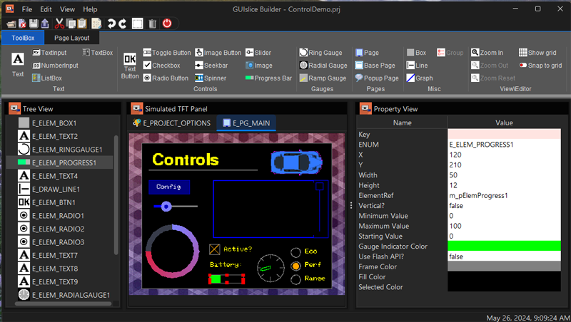
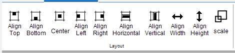

<center>
    <H1>
        GUIslice Builder
    </H1>
    <H2>
        User Guide
    </H2>
    <H3>
        Ver: 0.13.b021
    </H3>
</center>





**Publication date and software version**

Published March, 2020. Based on GUIslice API Library 0.13.0

**Copyright**

This document is Copyright © 2020,2019,2018 by Paul Conti. You may distribute or modify it under the terms of the MIT License.  https://opensource.org/licenses/MIT

GUIslice Copyright (c) Calvin Hass 2016-2020

All trademarks within this guide belong to their legitimate owners.

---------
<div style="page-break-after: always;"></div>

# 1.0  Introduction

GUIslice library is a lightweight platform-independent GUI designed for embedded displays.  While it can support other systems it started with support for  use with Raspberry Pi and Arduino.  It's written and supported by Calvin Hass.  You can download the library and example files from github.  See the wiki pages for more details.

GUIslice Wiki: <https://github.com/ImpulseAdventure/GUIslice/wiki>

It's a nice package but the embedded design choice to eliminate dynamic memory allocation does mean additional care must be taken in the user code to manage the data structures.

The GUIslice Builder creates a cross-platform desktop application that automates some of the boilerplate code generation and tracking of the UI pieces. For example, the Builder helps manage:
- Defines, enums, UI storage declarations
- Coordinates and dimensions of UI elements can be visually created
- Colors and fonts can also be modelled within the Builder

The net result is that the Builder allows users to layout their UI visually and enables boilerplate GUI code to be generated quickly with a drag-and-drop desktop application and save the user from some of the bookkeeping and potential errors that might otherwise come up.

It generate a skeleton file for the target platform, either 'project.ino' for Arduino, or 'project.c' for linux.
A 'project_GSLC.h' header file will also be created for Arduino projects but generally, you won't need to view or edit this file.

One additional target platform variation that is supported is the Arduino API with TFT_eSPI driver. This will simply replace Adafruit_GFX.h with TFT_eSPI.h.
Thus your three Target Platforms available in the General Tab of User Preferences are:
- arduino
- arduino TFT_eSPI
- linux

Within the Arduino platform some UI Elements support Flash based versions that reduce RAM requirements. See section 4.0 for details.

It should be noted that the Builder makes no attempt to support all GUIslice API calls or UI Elements. Simply a rich enough set to do useful work.  

Remember, if you need to use any unsupported API calls or UI elements just keep them outside of the tags. This would be one reason why you would need to edit the 'project_GSLC.h' file so you can increase the storage for any unsupported UI elements.

---------------
<div style="page-break-after: always;"></div>

An important design goal was to allow for incremental (round-trip) revisions between user code updates and Builder visual element adjustments.

You will notice in the generated C code various tags inserted by the builder such as:

```
//<Save_References !Start!>
//<Save_References !End!>
```

As long as you refrain from adding or modifying code between these auto-generated tags you can continue to add additional elements to your project and not lose any other edits you make.   The only exception is the button callbacks where the builder will test for existing ENUMs and not delete any code.

The code you add between Enum tags will be kept safe unless you delete or rename a button's ENUM. 

//<Button Enums !Start!>

//<Button Enums !End!> 

However, if you ask for code injection for a Button, say with a 'Jump to Page?=true', Show 'Popup Page?=true', or 'Hide Popup Page?=true'; The Builder will examine any existing [project name].ino case statements to see if the required GUIslice API calls are present. 

If not, the case statement will be deleted and recreated.  

If the GUIslice API calls are present for 'Jump' or 'Show Popup' the call will be checked for the PAGE-ENUM name to see if your code matches what is currently in the 'Jump/Popup Page Enum' property. Assuming it matches no code changes will occur, otherwise the case statement will be deleted and recreated.

The Builder will also delete case statements for any ENUM's not in use by your project. 

---------------
<div style="page-break-after: always;"></div>

# 2.0  Getting Started

See the Builder's wiki for installation instructions:

Install: <https://github.com/ImpulseAdventure/GUIslice/wiki/GUIslice-Builder>

##  2.1 Builder Screen Layout


1. Tabs for Toolbox and Page Layout.  Toolbox is where you select the UI Elements to drop on the TFT Simulation.  Page Layout tab has icon buttons for aligning UI Elements on a page.

2. TFT Simulation is where you create your UI.

3. Treeview displays all elements you have selected in z-order of display.

4. Property List allows you to view and change various properties of the selected UI Element.

5. Status Bar will give confirmation messages, like your project has been saved.

6. Taskbar has the globally available buttons.

7. Displays the current project name.

-----------
<div style="page-break-after: always;"></div>

## 2.2 Setting Screen parameters

You must setup the builder for your target screen's width and height; if its different than the default.  

To change the high and width of your display, and maybe the Target Platform.
Select edit->options


Then set your target platform, your display's width and height, and point the project directory to where you will be storing output files.   The directory must already exist. For Arduino users I suggest pointing to your sketchbook folder.


The builder is initially setup for Adafruit's TFT 2.8 Display.  It's display is 320px wide and 240px height with a DPI of about 144.   (I know the docs say 141 but I go with what works). I have tested the DPI of 144 on various screens up to 3.5 inches and my default of 144 seems to work just fine. 
See Appendex A for details on changing this value (It's setting is just below height and width on the General Tab). It's purpose is to allow the builder to show users the fonts correctly scaled in the TFT Simulation and to correctly size the text bounding rectangle.

Why may this be needed, because fonts are defined in points with 72 points per inch. DPI for TFT screens however are not a standard size. The Builder needs to simulate your TFT Display and try and show fonts as close as possible to the way they will look on your Display. So when I ask Java to create font I'll take your profile's DPI and use it to calculate a scale factor like so:
```
    /* AdaFruits's 2.8 screen is about DPI of 141. 
     * Fonts are in Points with 72 points per inch so DPI / 72 is our scaling factor.
     */
    double scaleFactor = (double)dpi / 72.0d;
    int size = (int) ((double)Integer.parseInt(logicalSize) * scaleFactor);
    scaledSize = String.valueOf(size);
    this.font = FontFactory.createFont(logicalName, scaledSize, logicalStyle);
```  

-----------------------------------------------
<div style="page-break-after: always;"></div>

## 2.3 Creating your UI

Now that you have your builder setup you can start creating your UI.  

Before beginning lets go over over the mouse selecting rules for the TFT Simulation:

- A Left-click on an object deselects any existing selection and selects the object.
- A Control Left-click on an object toggles its selection without affecting the selection of any other objects.
- A Shift Left-click on an object selects it without deselecting any other objects.
- Using the Rectangle Selection Tool  on the Page Layout tab will allow you to create a rubber band by pressing down the left mouse button and keeping it down while you move the band over the a group of objects and will select them all. For Example:


Now start by picking your first UI piece on the Toolbox. I suggest you first turn on the GRID using Ctrl-L. I also suggest not starting with a box that takes up your whole screen or the grid lines will be useless.  Besides setting the background color has the same effect without interfering with UI design.  If you want a preview of the UI without grid lines simply use Cntl-L again or the Page Layout tab's Grid control to toggle the grid on/off.

Say you start with a Text Button, you will notice its been randomly placed on the canvas. Using your mouse select this Text Button by moving the mouse pointer over the Text Button and clicking the left key. It will now have a dashed red rectangle around it to indicate its been selected.  Now press and hold the mouse left key and drag the Button approximately where you want it. You can refer to section 3.4 Layout Band for using the various alignment controls for further alignment.   

Off to the right of the TFT Simulation screen you will see all of the properties for this element.  
Anything with a rose color is something you can't edit.  When you were dragging your button you might have noticed the x and y coordinates changing dynamically.  Then when you released the mouse a slight jump occurred snapping  the UI Button to the grid's snapTo points.  Instead of dragging the Text Button around you could also have  simply typed in the new x and y positions within the properties table. Modifying the x or y coordinates directly will also override the Grid's SnapTo and its Margin setting.

One thing you should consider as you add UI elements is changing the ENUM names for Button and any other element.  It will make your life a lot easier if they have meaningful names.  For example, this new Text Button might be your QUIT button.  So change the ENUM from its default to E_ELEM_BTNQUIT, while also changing Text to Quit.  Also, any element you plan on directly accessing at runtime should have a meaningful element reference name. Like in example ex04_bld_ctrls where the text counter's reference is named m_pElemCount. By the way the 'm_' signifies a global variable. 

-----------------------------------------------
<div style="page-break-after: always;"></div>

# 3.0 Using UI

## 3.1 Main Parts

## 3.1.1 Taskbar 


 This will open an existing project.

 Saves current project button.

 Undo will recover from any recent changes to your project.

 Redo will allow a replay of your previous undo(s).

 Delete allows removal of a element.  You can only select a page for deletion by selecting it inside the treeview or on the page tabs. You must, however, have removed all elements from the page before attempting a deletion.  Furthermore you are never allowed to delete the first or main page.

 Export the generate code skeleton for the current project.

 Exit the builder.

-----------------------------------------------
<div style="page-break-after: always;"></div>

## 3.1.2 Toolbox Tab 

See Section 4.0 for complete details.

## 3.1.3 Page Layout Tab ]

This is broken into three bands View, Layout, and Edit.

## 3.2 View Band


The Grid button allows you to turn on/off the grid. 

The Zoom In button will enlarge the size of the TFT Simulation.

The Zoom Out button will reduce your view of the TFT Simulation.  Note: You can't make it smaller than your Target Platform's Screen Dimensions.

## 3.3 Edit Band


Copy will copy selected UI Elements to the clipboard.

Cut will copy selected UI Elements to the clipboard and delete them from the current page.

Paste will copy UI Elements from the clipboard to the current page.  You may use that Page tabs to move to a new page. The copied Elements will be slightly offset from the original copied positions.  This is to avoid placing them directly on top of the original Elements.

-----------------------------------------------
<div style="page-break-after: always;"></div>

## 3.4 Layout Band



## 3.4.1 Align Top 
The easiest way I can think of to show how to use the alignment buttons is with a couple of checkboxes.  Go ahead and create two boxes it doesn't matter where they end up on the TFT Simulation.


Now press the Align Top button.


This gives you:


If you press it a second time the elements move to the top margin (set as a default of 5).  You can change the size of margins in the General tab. You can press the UNDO button to get back to the original position and test the other alignment buttons.


-----------------------------------------------
<div style="page-break-after: always;"></div>

## 3.4.2 Align Bottom 
Before:


Now press the Align Bottom button.


This gives you:


If you press it a second time the elements move to the bottom margin.

-----------------------------------------------
<div style="page-break-after: always;"></div>

## 3.4.3 Align Center 

You can only center one element at a time.


Now press the Align Center button.


This gives you:


-----------------------------------------------
<div style="page-break-after: always;"></div>

## 3.4.4 Align Left 

Before:


Now press the Align Left button.


This gives you:


If you press it a second time the elements move to the left margin.

-----------------------------------------------
<div style="page-break-after: always;"></div>

## 3.4.5 Align Right 

Before:


Now press the Align Right button.


This gives you:


If you press it a second time the elements move to the right margin.

-----------------------------------------------
<div style="page-break-after: always;"></div>

## 3.4.6 Align Horizontal Spacing 

Before:


Now press the Align Horizontal Spacing button.


With:


This gives you:


-----------------------------------------------
<div style="page-break-after: always;"></div>

## 3.4.7 Align Vertical Spacing 

Before:


Now press the Align Vertical Spacing button.


With:


This gives you:


-----------------------------------------------
<div style="page-break-after: always;"></div>

## 3.4.8 Align Width 

Before:


Now press the Align Width button.


This gives you:


-----------------------------------------------
<div style="page-break-after: always;"></div>

## 3.4.9 Align Height 

Before:


Now press the Align Height button.


This gives you:


-----------------------------------------------
<div style="page-break-after: always;"></div>

## 3.4.10 Rectangular Selection 

Pressing the Rectangular Selection button changes your cursor to a cross and allows you to create a rubber band that you can drag over UI elements to select them.  You start by pressing and holding the left mouse button then dragging the rubber band over yourUI Elements.  Once you release the left mouse button the transaction ends.


-----------------------------------------------
<div style="page-break-after: always;"></div>

## 3.5 Z-Order

Images in GUIslice are placed one on top of the other.  Drawing begins from the first UI element created to the last.  This is referred to as Z-Order. This generally doesn't cause any issues but there are times you will need to change this Z-Order to avoid obstructing components.

For example, say you laid out most of you UI and then add a big box element on top of them like so:


Now the solution to this issue is to select the Box element in the Treeview and drag it up to the top just under the Page element.  Now you will see this:


-----------------------------------------------
<div style="page-break-after: always;"></div>

# 4.0 UI Elements
This section outlines the various properties you can set and their usage for each type of element. Images are discussed in section 5.4. During run-time any properties shown in a rose color are read-only.

Some of the UI elements also support a Flash version to minimize SRAM usage on a Arduino platform.  These UI Elements will have a 'Use Flash?' property you can set equal to 'true'.  

## 4.1 Common Properties
These are the basic common properties for all elements with the exception of Page.
| NAME       | VALUE                                                     |
|------------|-----------------------------------------------------------|
| Key        | Used Internally as an index key                           |
| Enum       | Used by GUIslice API as a identifier. The Builder         |
|            | will create one for you but you should modify it to       |
|            | be meaningful for your program.                           |
| X          | element X, Y Coordinates                                  |
| Y          | You can edit X,Y in place for precise positioning.        |
| Width      | element width in pixels                                   |
| Height     | element height in pixels                                  |
| ElementRef | Allows runtime access to this element, if set,            |
|            | and like Enum should be set to something meaningful.      |

NOTE: Width and Height are system set to default values when placed on the TFT Simulation.

Most also have the Default colors option along with a set new colors you can set.

| NAME                | VALUE                                            |
|---------------------|--------------------------------------------------|
| Use Default Colors? | true, Use the default color scheme               |
| Text Color          | Override Text color with this color              |
| Frame Color         | Override Frame color with this color             |
| Fill Color          | Override Fill color with this color              |
| Selected Color      | Override Selected color with this color          |

-----------------------------------------------
<div style="page-break-after: always;"></div>

## 4.2 BOX 
See example ex02_bld_btn_txt for a simple example.  A more advanced example using draw and tick callbacks is ex06_bld_callback.
If 'Touch Enabled' = true a button callback will generated to detect users clicking on the box element.
```
// Common Button callback
bool CbBtnCommon(void* pvGui,void *pvElemRef,gslc_teTouch eTouch,int16_t nX,int16_t nY)
{
  gslc_tsElemRef* pElemRef = (gslc_tsElemRef*)(pvElemRef);
  gslc_tsElem* pElem = pElemRef->pElem;

  if ( eTouch == GSLC_TOUCH_UP_IN ) {
    // From the element's ID we can determine which button was pressed.
    switch (pElem->nId) {
//<Button Enums !Start!>
      case E_ELEM_BOX1:
        //TODO- Replace with button handling code
        break;
```

If the Draw Function is set to true a callback for drawing will be auto-generated for you and will look like:
```
bool CbDrawScanner(void* pvGui,void* pvElemRef,gslc_teRedrawType eRedraw)
{
  ...
  //TODO - Add your drawing graphic primitives
  ...
  return true;
}
```
 You will need to add your custom drawing code in place of the TODO statement. For a timer interrupt enable the Tick Function.  Here a Tick callback will be generated that looks like:
 ```
bool CbTickScanner(void* pvGui,void* pvScope)
{
  ...
  //TODO add your custom code here 
  ...
  return true;
}
 ```

| NAME                | VALUE                                             |
|---------------------|---------------------------------------------------|
| Key                 | Box$1                                             |
| ENUM                | E_ELEM_BOX1                                       |

-----------------------------------------------
<div style="page-break-after: always;"></div>

| NAME                | VALUE                                             |
|---------------------|---------------------------------------------------|
| X                   |                                                   |
| Y                   |                                                   |
| Width               | 300                                               |
| Height              | 150                                               |
| ElementRef          |                                                   |
| Corners Rounded?    | false                                             |
| Touch Enabled?      | false                                             |
| Draw Function       | false, Set true Creates a CbDrawScanner callback  |
| Tick Function       | false, Set true Creates a CbTickScanner callback  |
| Use Flash API?      | false       |

-----------------------------------------------
<div style="page-break-after: always;"></div>

## 4.3 Checkbox 

You may have the Builder generated a callback by setting 'Callback Enabled?=true'. Then you will be notified when users mark or unmark checkboxes.  It will look like:
```
bool CbCheckbox(void* pvGui, void* pvElemRef, int16_t nSelId, bool bState)
{
  ...
    switch (pElem->nId) {
     //<Checkbox Enums !Start!>
     case E_ELEM_CHECK1:
      //TODO- Replace with your handling code
      break;
  ...
  return 1;
}
```
See example ex04_bld_ctrls. 

| NAME                | VALUE                                             |
|---------------------|---------------------------------------------------|
| Key                 | CheckBox$1                                        |
| ENUM                | E_ELEM_CHECK1                                     |
| X                   |                                                   |
| Y                   |                                                   |
| Width               | 20                                                |
| Height              | 20                                                |
| ElementRef          |                                                   |
| Checked?            | false, Set true initial state as ‘checked’        |
| Callback Enabled?   | false                                             |
| Check Mark Color    | Color.ORANGE Determines the color of check mark   |
| Use Flash API?      | false                                             |
| Use Default Colors? | true                                              |

-----------------------------------------------
<div style="page-break-after: always;"></div>

## 4.4 Graph 

See example ex11_bld_graph.

| NAME                | VALUE                                             |
|---------------------|---------------------------------------------------|
| Key                 | Graph$1                                           |
| ENUM                | E_ELEM_GRAPH1                                     |
| X                   |                                                   |
| Y                   |                                                   |
| Width               | 180                                               |
| Height              | 120                                               |
| ElementRef          | m_pElemGraph1                                     |
| Font                | BuiltIn->5x8pt7b - Font to use for graph area     |
| Maximum Points      | 0 Maximum number of points in buffer              |
| Graph Style         | GSLCX_GRAPH_STYLE_DOT - Dot, Line or Fill.        |
| Color of Graph      | Color.ORANGE Set color of graph dots or fill.     |
| Use Default Colors? | true                            |

-----------------------------------------------
<div style="page-break-after: always;"></div>

## 4.5 Line 

See examples ex07_bld_slider and ex24_bld_tabs for using lines as dividers.

| NAME                | VALUE                                             |
|---------------------|---------------------------------------------------|
| Key                 | Line$1                                            |
| ENUM                | E_DRAW_LINE1                                      |
| X Start Point       |                                                   |
| Y Start Point       |                                                   |
| Line Length         | 50                                                |
| Vertical?           | false                                             |
| Fill Color          | GSLC_COL_GRAY_LT2                                 |

-----------------------------------------------
<div style="page-break-after: always;"></div>

## 4.6 Image 

See example ex06_bld_callback.  Also ex32_bld_spinner for usage of a background image.

| NAME                | VALUE                                             |
|---------------------|---------------------------------------------------|
| Key                 | Image$1                                           |
| ENUM                | E_ELEM_IMAGE1                                     |
| X                   |                                                   |
| Y                   |                                                   |
| Width               |                                                   |
| Height              |                                                   |
| ElementRef          |                                                   |
| Image               | (ex: logo1_24.bmp)                                |
| Image defines       | (ex: IMG_LOGO1_24)                                |
| Image Extern        | used only for RAM based images                    |
| Image Memory        | gslc_GetImageFromSD((const char*)                 |
|                     | gslc_GetImageFromFile(                            |
|                     | gslc_GetImageFromProg((const unsigned char*)      |
|                     | gslc_GetImageFromRam((unsigned char*)             |
| Image Format        | GSLC_IMGREF_FMT_BMP24                             |
|                     | GSLC_IMGREF_FMT_BMP16                             |
|                     | GSLC_IMGREF_FMT_RAW                               |
| Transparent?        | false, if true, support transparency provided     |
| Touch Enabled?      | false, If true a button callback will be created  |
| Frame Enabled?      | false                                             |
| Frame Color         | Frame color with this color                       |

-----------------------------------------------
<div style="page-break-after: always;"></div>

## 4.7 Image Button 

See examples ex03_bld_btn_img and ex28_bld_btn_img_flash. For full details on your options see section 4.17 Text Button.
The button callback will look like:
```
// Common Button callback
bool CbBtnCommon(void* pvGui,void *pvElemRef,gslc_teTouch eTouch,int16_t nX,int16_t nY)
{
  gslc_tsElemRef* pElemRef = (gslc_tsElemRef*)(pvElemRef);
  gslc_tsElem* pElem = pElemRef->pElem;

  if ( eTouch == GSLC_TOUCH_UP_IN ) {
    // From the element's ID we can determine which button was pressed.
    switch (pElem->nId) {
//<Button Enums !Start!>
      case E_ELEM_IBTN1:
        //TODO- Replace with button handling code
        break;
```

| NAME                | VALUE                                             |
|---------------------|---------------------------------------------------|
| Key                 | ImageButton$1                                     |
| ENUM                | E_ELEM_IBTN1                                      |
| X                   |                                                   |
| Y                   |                                                   |
| Width               |                                                   |
| Height              |                                                   |
| ElementRef          |                                                   |
| Image               | (ex: exit_n24.bmp)                                |
| Image defines       | (ex: IMG_EXIT_N24)                                |
| Image Extern        |                                                   |
| Image Memory        | (ex: gslc_GetImageFromSD((const char*)            |

-----------------------------------------------
<div style="page-break-after: always;"></div>

| NAME                | VALUE                                             |
|---------------------|---------------------------------------------------|
| Image When Selected | (ex: exit_g24.bmp)                                |
| Image Select defines| (ex: IMG_BTN_EXIT_G24_SEL)                        |
| Image Select Extern |                                                   |
| Image Select Memory |                                                   |
| Image Format        | GSLC_IMGREF_FMT_BMP24                             |
| Transparent?        | false                                             |
| Jump to Page?       | false, If true, gslc_SetPageCur(PAGE) created     |
| Show Popup Page?    | false, If true, gslc_PopupShow(PAGE) created      |
| Jump/Popup Page Enum| PAGE enum inside gslc_SetPageCur or gslc_PopupShow|
| Hide Popup Page?    | false, If true gslc_PopupHide current page issued |
| Frame Enabled?      | false                                             |
| Frame Color         | Frame color with this color                       |

-----------------------------------------------
<div style="page-break-after: always;"></div>

## 4.8 Listbox 

Displays a set of items (string values) and allows the user to select an item. See examples ex30_bld_listbox for a multi-column list and ex31_bld_listbox for a scrolling list of rows.

| NAME                |  VALUE                                            |
|---------------------|---------------------------------------------------|
| Key                 | ListBox$1                                         |
| ENUM                | E_ELEM_LISTBOX1                                   |
| X                   |                                                   |
| Y                   |                                                   |
| Width               | 200                                               |
| Height              | 100                                               |
| ElementRef          | m_pElemListbox1                                   |
| Font                | BuiltIn(1x)->5x8pt7b                              |
| List of Items       | Press button [...] to enter list.                 |
| Storage Size        | 0 Auto set to correct size using the entered list |
| Selected Item       | 0                                                 |
| Items per Row       | 1                                                 |
| Display Rows        | 5                                                 |
| Item Gap            | 0                                                 |
| Text Margin Width   | 5                                                 |
| Text Margin Height  | 0                                                 |
| Text Alignment      | GSLC_ALIGN_MID_LEFT                               |
| Add Scrollbar?      | true, false no scrollbar                          |
| Scrollbar ENUM      | E_LISTSCROLL1                                     |
| Scrollbar EREF      | m_pListSlider1                                    |
| Scrollbar Max Value | 100                                               |
| Frame Enabled?      | true                                              |
| Text Color          | Color.WHITE                                       |
-----------------------------------------------
<div style="page-break-after: always;"></div>


| NAME                |  VALUE                                            |
|---------------------|---------------------------------------------------|
| Frame Color         | Color.BLUE                                        |
| Fill Color          | Color.BLACK                                       |
| Selected Color      | Color.BLACK                                       |

-----------------------------------------------
<div style="page-break-after: always;"></div>
## 4.9 Progress Bar 

Draws a progress bar element that represents a proportion value (nVal) between nMin and nMax. See examples ex04_bld_ctrls, ex05_bld_pages, ex06_bld_callback, ex24_bld_tabs, ex25_bld_popup, and ex32_bld_spinner.

| NAME                  | VALUE                                          |
|-----------------------|------------------------------------------------|
| Key                   | ProgressBar$1                                  |
| ENUM                  | E_ELEM_PROGRESS1                               |
| X                     |                                                |
| Y                     |                                                |
| Width                 | 50                                             |
| Height                | 10                                             |
| ElementRef            | m_pElemProgress1                               |
| Vertical?             | false, true its vertical bar                   |
| Minimum Value         | 0                                              |
| Maximum Value         | 100                                            |
| Starting Value        | 0                                              |
| Gauge Indicator Color | Color.GREEN                                    |
| Use Flash API?        | false                                          |
| Use Default Colors?   | true                                           |

-----------------------------------------------
<div style="page-break-after: always;"></div>

## 4.10 Radial Gauge 
 A circular gauge that can be used to show direction or other rotational values. 
  - Tick marks can be optionally drawn around the gauge.
  - Size, color and fill of the needle can be configured.
See example ex09_bld_radial.

| NAME                  | VALUE                                          |
|-----------------------|------------------------------------------------|
| Key                   | RadialGauge$1                                  |
| ENUM                  | E_ELEM_RADIALGAUGE1                            |
| X                     |                                                |
| Y                     |                                                |
| Width                 | 80                                             |
| Height                | 80                                             |
| ElementRef            | m_pElemRadial1                                 |
| Minimum Value         | 0                                              |
| Maximum Value         | 100                                            |
| Starting Value        | 0                                              |
| Rotation Clockwise?   | true                                           |
| Tick Divisions	      | Default 8                                      |
| Tick Size	            | Default 5                                      |
| Tick Color	          | Default GRAY                                   |
| Indicator Length	    | Default 20                                     |
| Indicator Tipe Size   | Default 3                                      |
| Indicator File?	      | Default false                                  |
| Gauge Indicator Color | Color.GREEN                                    |
| Use Default Colors?   | true                                           |

-----------------------------------------------
<div style="page-break-after: always;"></div>

## 4.11 Radio Button 

You may have the Builder generated a callback by setting 'Callback Enabled?=true'. Then you will be notified when users mark or unmark radio buttons.  It will look like:
```
bool CbCheckbox(void* pvGui, void* pvElemRef, int16_t nSelId, bool bState)
{
  ...
    switch (pElem->nId) {
     //<Checkbox Enums !Start!>
     case E_ELEM_CHECK1:
      //TODO- Replace with your handling code
      break;
  ...
  return 1;
}
```
If you select multiple radio buttons (not checkboxes) you can use the 'Group' Control Tool  to assign a unique GROUPID. The GUIslice API will then only allow one of the buttons to be checked.
See example ex04_bld_ctrls. 

| NAME                | VALUE                                             |
|---------------------|---------------------------------------------------|
| Key                 | CheckBox$1                                        |
| ENUM                | E_ELEM_CHECK1                                     |
| X                   |                                                   |
| Y                   |                                                   |
| Width               | 20                                                |
| Height              | 20                                                |
| ElementRef          |                                                   |
| Checked?            | false, Set true initial state as ‘checked’        |
| Callback Enabled?   | false                                             |
| Check Mark Color    | Color.ORANGE Determines the color of check mark   |
| Use Flash API?      | false                                             |
| Use Default Colors? | true                                              |
| Group ID            | GSLC_GROUP_ID_NONE                                |

-----------------------------------------------
<div style="page-break-after: always;"></div>

## 4.12 Ramp Gauge 

A gradient ramp (green-yellow-red) visual control similar to certain linear tachometers. See example ex09_bld_radial. 

| NAME                  | VALUE                                          |
|-----------------------|------------------------------------------------|
| Key                   | RadialGauge$1                                  |
| ENUM                  | E_ELEM_RAMPGAUGE1                              |
| X                     |                                                |
| Y                     |                                                |
| Width                 | 100                                            |
| Height                | 80                                             |
| ElementRef            | m_pElemRamp1                                   |
| Minimum Value         | 0                                              |
| Maximum Value         | 100                                            |
| Starting Value        | 0                                              |
| Tick Divisions	      | Default 8                                      |
| Tick Size	            | Default 5                                      |
| Tick Color	          | Default GRAY                                   |
| Indicator Length	    | Default 20                                     |
| Indicator Tipe Size   | Default 3                                      |
| Indicator File?	      | Default false                                  |
| Fill Color            | Color.BLACK                                    |

-----------------------------------------------
<div style="page-break-after: always;"></div>

## 4.13 RingGauge 

RingGauge creates display element similar to a donut-chart.
 - The element has an outer and inner radius to create a ring appearance.
 - The ring has an angular range defined by 'Angular Range°', which means 
   that the ring can be configured to cover a full circle or just a portion 
   of a circle.
 - 'Starting Angle°' defines the starting angle and direction of fill.
 - When drawing the ring within the angular range, it is composed of
   an active region (the angular region from the start to the current
   position value) and an inactive region (from the current value to the
   end of the angular range). The inactive region can be hidden (by
   setting it to the fill color).
 - A text value can be drawn in the center of the ring, typically to
   show the current value. 
See example ex42_bld_ring.

| NAME                 | VALUE                                           |
|----------------------|-------------------------------------------------|
| Key                  | RingGauge$1                                     |
| ENUM                 | E_ELEM_RINGGAUGE1                               |
| X                    |                                                 |
| Y                    |                                                 |
| Width                | 100                                             |
| Height               | 100                                             |
| ElementRef           | m_pElemXRingGauge1                              |
| Font                 | BuiltIn(1x)->5x8pt7b                            |
| Field Size           | 10                                              |
| Starting Angle°      | 0                                               |
| Angular Range°       | 360                                             |
| Clockwise Direction? | true                                            |
-----------------------------------------------
<div style="page-break-after: always;"></div>

| NAME                 | VALUE                                           |
|----------------------|-------------------------------------------------|
| Minimum Value        | 0                                               |
| Maximum Value        | 100                                             |
| Starting Value       | 0                                               |
| Number of Segments   | 72                                              |
| Line Thickness       | 10                                              |
| Use Gradient Colors? | false                                           |
| Flat Color           | Color.RED                                       |
| Gradient Start Color | Color.RED                                       |
| Gradient End Color   | Color.BLUE                                      |
| Inactive Color       | GSLC_COL_GRAY_DK2                               |
| Text Color           | Color.YELLOW                                    |
| Fill Color           | Color.BLACK                                     |

-----------------------------------------------
<div style="page-break-after: always;"></div>

## 4.14 Slider 

The Slider allows the user to select a value by sliding the knob within the bounded value. The slider can show tick marks. When the Slider's callback is tied to a Listbox or Textbox it provides a scrollable view of the contents of these elements.
See examples ex04_bld_ctrls, ex07_bld_slider, ex09_bld_radial, ex10_bld_textbox, ex31_bld_listbox, and ex42_bld_ring.

The Builder will generate a callback for when users move the thumb control. This will allow you to retrieve its position. It looks like:
```
bool CbSlidePos(void* pvGui,void* pvElemRef,int16_t nPos)
{
  ...
  switch (pElem->nId) {
//<Slider Enums !Start!>
    case E_SLIDER_R:
      // Fetch the slider position
      m_nPosR = gslc_ElemXSliderGetPos(pGui,m_pElemSlider1);
      //TODO- Replace with slider handling code
      break;
   ...
  return 1;
}
```

Again substitute your custom handling code for the TODO. 

| NAME           | VALUE                                                 |
|----------------|-------------------------------------------------------|
| Key            | Slider$1                                              |
| ENUM           | E_ELEM_SLIDER1                                        |
| X              |                                                       |
| Y              |                                                       |
| Width          | 80                                                    |
| Height         | 20                                                    |
| ElementRef     | m_pElemSlider1                                        |
| Minimum Value  | 0                                                     |
| Maximum Value  | 100                                                   |
| Starting Value | 0                                                     |
| Thumb Size     | 5                                                     |
| Vertical?      | false                                                 |
-----------------------------------------------
<div style="page-break-after: always;"></div>


| NAME                |  VALUE                                            |
|---------------------|---------------------------------------------------|
| Tick Divisions | 10                                                    |
| Tick Size      | 5                                                     |
| Tick Color     | Color.BLUE                                            |
| Trim Style?    | false                                                 |
| Trim Color     | Color.BLUE                                            |
| Frame Color    | Color.GRAY                                            |
| Fill Color     | Color.BLACK                                           |
| Selected Color | Color.BLACK                                           |

-----------------------------------------------
<div style="page-break-after: always;"></div>

## 4.15 Spinner 
A Spinner consists of
 - a numeric counter text field
 - increment and decrement button.
See example ex32_bld_spinner.  A callback will be generated so you can retrieve the counter value when it changes. The callback looks like:
```
bool CbSpinner(void* pvGui, void *pvElemRef, int16_t nState, void* pvData)
{
  ...
  if (nState == XSPINNER_CB_STATE_UPDATE) {
    // From the element's ID we can determine which input field is ready.
    switch (pElem->nId) {
//<Spinner Enums !Start!>
      case E_ELEM_COMP1:
        //TODO- Add Spinner handling code
        // using gslc_ElemXSpinnerGetCounter(&m_gui, &m_sXSpinner1);
        gslc_ElemSetTxtStr(&m_gui,m_pElemComp1,acTxtNum);
        break;
  ...
}
```

So you can plug in your custom handling code in place of the TODO comment.

| NAME           | VALUE                                                 |
|----------------|-------------------------------------------------------|
| Key            | Spinner$1                                             |
| ENUM           | E_ELEM_SPINNER1                                       |
| X              |                                                       |
| Y              |                                                       |
| Width          | 64                                                    |
| Height         | 17                                                    |
| ElementRef     | m_pElemSpinner1                                       |
| Font           | BuiltIn(1x)->5x8pt7b                                  |
| Minimum Value  | 0                                                     |
| Maximum Value  | 99                                                    |
| Starting Value | 0                                                     |
-----------------------------------------------
<div style="page-break-after: always;"></div>


| NAME           | VALUE                                                 |
|----------------|-------------------------------------------------------|
| Increment by   | 1                                                     |
| Button Size    | 20                                                    |

You must have the following set inside your GUIslice/config/ard_xxxx.h file to use this control.
```
#define GSLC_FEATURE_COMPOUND    1
```

-----------------------------------------------
<div style="page-break-after: always;"></div>

## 4.16 Text 

Most of the builder examples use text fields as labels while some use them to display runtime counts.  See ex04_bld_ctrls for display of a runtime counter example.

| NAME                  | VALUE                                          |
|-----------------------|------------------------------------------------|
| Key                   | Text$1 unique key assigned for internal use    |
| ENUM                  | E_ELEM_TEXT1 system assigned enum.             |
| Width                 | 60 Width and Height will adjust themselves     |                                        |
| Height                | 12 based upon the text entered                 |
| ElementRef            | Allows runtime access to this element if set   |
| Font                  | Name of your chosen font                       |
| Text                  | The text to display                            |
| UTF-8?                | Only 7 bit ascii characters unless checked.    |
|                       | NOTE: AdaFruit's GFX does not support UTF-8    |
| External Storage Size | 0 unless runtime access needed                 |
| Text Alignment        | GSLC_ALIGN_MID_LEFT (can be RIGHT or CENTERED) |                          |
| Fill Enabled?         | true                                           |
| Frame Enabled?        | false                                          |
| Use Flash API?        | false set to true if you need to save storage  |

-----------------------------------------------
<div style="page-break-after: always;"></div>

## 4.17 Text Box 

A Textbox is a multi-line area that displays scrolling text. It can be tied to a Slider Element to allow a user to control scrolling.
Optionally, it can handle embedded color codes for text. 
See example ex10_bld_textbox.

| NAME               | VALUE                                             |
|--------------------|---------------------------------------------------|
| Key                | TextBox$1                                         |
| ENUM               | E_ELEM_TEXTBOX1                                   |
| X                  |                                                   |
| Y                  |                                                   |
| Width              | 201                                               |
| Height             | 63                                                |
| ElementRef         | m_pElemTextbox1                                   |
| Font               | BuiltIn(1x)->5x8pt7b                              |
| Wrap Text          | false, Set=true, if text is to wrap across lines  |                                             |
| Display Rows       | 6                                                 |
| Characters per Row | 28                                                |
| Add Scrollbar?     | true                                              |
| Scrollbar ENUM     | E_TEXTSCROLL1                                     |
| Scrollbar EREF     | m_pTextSlider1                                    |
| Scrollbar Max Valu | 100                                               |
| Text Color         | Color.YELLOW                                      |
| Frame Color        | Color.GRAY                                        |
| Fill Color         | Color.BLACK                                       |
| Selected Color     | Color.BLACK                                       |

NOTE: Text rows and columns are only an approximation.  Embedding colors will require extra space. See the GUIslice API for further details.

You must have the following set inside your GUIslice_config_<ard,linux>.h file to use embed colors:
```
#define GSLC_FEATURE_XTEXTBOX_EMBED    1
```

-----------------------------------------------
<div style="page-break-after: always;"></div>

## 4.18 Text Button 

Most of the Builder examples use Text Buttons even if only for the Quit button. 
The Builder will generate most of the code for some of the more simple cases.

Options available

 - If you just want the button to jump to a new page set the 'Jump to Page?' = true and then also set 'Jump/Popup Page Enum' to the page ENUM that you desire, eex05_bld_pages.
 - To start a Popup Dialog Page set 'Show Popup Page?' = true and then also set 'Jump/Popup Page Enum' to the page ENUM that you desire, ex25_bld_popup.
 - To return from a Popup Dialog set 'Hide Popup Page?' = true.
 - To save SRAM on an Arduino you can use the flash version by setting 'Use Flash?' = true.

The normal button callback will look like:
```
// Common Button callback
bool CbBtnCommon(void* pvGui,void *pvElemRef,gslc_teTouch eTouch,int16_t nX,int16_t nY)
{
  gslc_tsElemRef* pElemRef = (gslc_tsElemRef*)(pvElemRef);
  gslc_tsElem* pElem = pElemRef->pElem;

  if ( eTouch == GSLC_TOUCH_UP_IN ) {
    // From the element's ID we can determine which button was pressed.
    switch (pElem->nId) {
//<Button Enums !Start!>
      case E_ELEM_BTN1:
        //TODO- Replace with button handling code
        break;
```

While the Jump to Page callback will look like:
```
//<Button Enums !Start!>
      case E_ELEM_BTN1:
        //TODO- Check the code to see what else you may need to add
        gslc_SetPageCur(&m_gui,E_PG_EXTRA);
        break;
```
 The Popup Dialog:
```
//<Button Enums !Start!>
      case E_ELEM_BTN1:
        //TODO- Check the code to see what else you may need to add
        gslc_PopupShow(&m_gui, E_PG_POPUP, true);
        break;
```

-----------------------------------------------
<div style="page-break-after: always;"></div>

And the return from a Popup
```
//<Button Enums !Start!>
      case E_ELEM_BTN1:
        //TODO- Check the code to see what else you may need to add
        gslc_PopupHide(&m_gui);
        break;
```

| NAME                  | VALUE                                          |
|-----------------------|------------------------------------------------|
| Key                   | TextButton$1                                   |
| ENUM                  | E_ELEM_BTN1                                    |
| X                     |                                                |
| Y                     |                                                |
| Width                 | 80                                             |
| Height                | 40                                             |
| ElementRef            |                                                |
| Font                  | BuiltIn(1x)->5x8pt7b                           |
| Label                 |                                                |
| UTF-8?                | false                                          |
| Corners Rounded?      | false                                          |
| Fill Enabled?         | false                                          |
| Frame Enabled?        | false                                          |
| External Storage Size | 0                                              |
| Text Alignment        | GSLC_ALIGN_MID_MID                             |
-----------------------------------------------
<div style="page-break-after: always;"></div>

| NAME                  | VALUE                                          |
|-----------------------|------------------------------------------------|
| Jump to Page?         | false, set=true ->gslc_SetPageCur(PAGE) created|
| Show Popup Page?      | false, set=true ->gslc_PopupShow(PAGE) created |
| Jump/Popup Page Enum  | PG enum used gslc_SetPageCur or gslc_PopupShow |
| Hide Popup Page?      | false, set=true->gslc_PopupHide() current page |
| Use Flash API?        | false                                          |
| Use Default Colors?   | true                                           |
| Text Color            | Color.WHITE                                    |
| Frame Color           | GSLC_COL_BLUE_DK2                              |
| Fill Color            | GSLC_COL_BLUE_DK4                              |
| Selected Color        | GSLC_COL_BLUE_DK1                              |

-----------------------------------------------
<div style="page-break-after: always;"></div>

## 4.19 Numeric Input 

When a user presses on this UI Element a Popup Numeric Keypad will appear to take input.
A callback is generated by the Builder for this field and will look like:
```
bool CbKeypad(void* pvGui, void *pvElemRef, int16_t nState, void* pvData)
{
  gslc_tsElemRef* pElemRef = (gslc_tsElemRef*)(pvElemRef);
  gslc_tsElem* pElem = pElemRef->pElem;
  gslc_tsGui* pGui = (gslc_tsGui*)pvGui;

  // From the element's ID we can determine which element is ready.
  if (pElem->nId == E_ELEM_KEYPAD) {
    int16_t nTargetElemId = gslc_ElemXKeyPadDataTargetIdGet(pGui, pvData);
    if (nState == XKEYPAD_CB_STATE_DONE) {
      // User clicked on Enter to leave popup
      // - If we have a popup active, pass the return value directly to
      //   the corresponding value field
      switch (nTargetElemId) {
//<Keypad Enums !Start!>
        case E_ELEM_NUMINPUT1:
          //TODO- Update input handling code
          // using gslc_ElemXKeyPadDataValGet(pGui, pvData)
          gslc_PopupHide(&m_gui);
        break;
```
See ex26_bld_calc for an example of usage.

| NAME                  | VALUE                                            |
|-----------------------|--------------------------------------------------|
| Key                   | NumberInput$1                                    |
| ENUM                  | E_ELEM_NUMINPUT1                                 |
| X                     |                                                  |
| Y                     |                                                  |
| Width                 | 40                                               |
| Height                | 12                                               |
| ElementRef            | m_pElemVal1                                      |
| Font                  | BuiltIn(1x)->5x8pt7b                             |
| UTF-8?                | false                                            |
| Field Size            | 6                                                |
| Text Alignment        | GSLC_ALIGN_MID_LEFT                              |
-----------------------------------------------
<div style="page-break-after: always;"></div>

| NAME                  | VALUE                                          |
|-----------------------|------------------------------------------------|
| Fill Enabled?         | true                                             |
| Use Default Colors?   | true                                             |
| Text Color            | Color.YELLOW                                     |
| Frame Color           | Color.GRAY                                       |
| Fill Color            | Color.BLACK                                      |
| Selected Color        | Color.BLACK                                      |

-----------------------------------------------
<div style="page-break-after: always;"></div>

## 4.20 Text Input 

When a user presses on this UI Element a Popup Text-Only Keypad will appear to take input.
A callback is generated by the Builder for this field and will look like:
```
bool CbKeypad(void* pvGui, void *pvElemRef, int16_t nState, void* pvData)
{
  gslc_tsElemRef* pElemRef = (gslc_tsElemRef*)(pvElemRef);
  gslc_tsElem* pElem = pElemRef->pElem;
  gslc_tsGui* pGui = (gslc_tsGui*)pvGui;

  // From the element's ID we can determine which element is ready.
  if (pElem->nId == E_ELEM_KEYPAD) {
    int16_t nTargetElemId = gslc_ElemXKeyPadDataTargetIdGet(pGui, pvData);
    if (nState == XKEYPAD_CB_STATE_DONE) {
      // User clicked on Enter to leave popup
      // - If we have a popup active, pass the return value directly to
      //   the corresponding value field
      switch (nTargetElemId) {
//<Keypad Enums !Start!>
        case E_ELEM_TEXTINPUT1:
          //TODO- Update input handling code
          // using gslc_ElemXKeyPadDataValGet(pGui, pvData)
          gslc_ElemSetTxtStr(pGui, m_pElemInTxt1, gslc_ElemXKeyPadDataValGet(pGui, pvData));
          gslc_PopupHide(&m_gui);
        break;
```
See ex26_bld_alpha for an example.

| NAME                  | VALUE                                            |
|-----------------------|--------------------------------------------------|
| Key                   | TextInput$1                                      |
| ENUM                  | E_ELEM_TEXTINPUT1                                |
| X                     |                                                  |
| Y                     |                                                  |
| Width                 | 65                                               |
| Height                | 10                                               |
| ElementRef            | m_pElemInTxt1                                    |
| Font                  | BuiltIn(1x)->5x8pt7b                             |
| UTF-8?                | false                                            |
-----------------------------------------------
<div style="page-break-after: always;"></div>

| NAME                  | VALUE                                          |
|-----------------------|------------------------------------------------|
| Field Size            | 10                                               |
| Text Alignment        | GSLC_ALIGN_MID_LEFT                              |
| Fill Enabled?         | true                                             |
| Use Default Colors?   | true                                             |
| Text Color            | Color.YELLOW                                     |
| Frame Color           | Color.GRAY                                       |
| Fill Color            | Color.BLACK                                      |
| Selected Color        | Color.BLACK                                      |

-----------------------------------------------
<div style="page-break-after: always;"></div>

## 4.21 Page 

Add a new Page layer. This is the container for elements.  You create one page per display screen. 

## 4.22 Base Page 

Add a page for the base layer in the page stack. This is an optional container for global elements. You create one base page per application. 

## 4.23 Popup Page 

Add a new Popup Page for the overlay layer in the page stack. This is the container for elements you want on a popup dialog. Use as many popup pages as needed. 

-----------------------------------------------
<div style="page-break-after: always;"></div>

# 5.0 Customizing

There are a few ways of customizing your experience with the builder.   
You can modify your UI preferences  by the edit->options menu item. Most of the UI Widgets also have a tab in the Options dialog allowing you to set size, color, font, and some other options depending upon the element in question.

## 5.1 General Preferences
| NAME                               | VALUE                                                     |
|------------------------------------|-----------------------------------------------------------|
| Theme                              | Windows,Metal,Nimbus,Classic Windows                      |
| Target Platform                    | arduino,arduino minimum, linux                            |
| TFT Screen Width                   | 320                                                       |
| TFT Screen Height                  | 240                                                       |
| TFT Screen DPI                     | 144                                                       |
| Project Directory                  | Project                                                   |
| Target's Image Directory           | Directory on target platform where you have stored images |
| Background Color                   | Gray                                                      |
| Image Transparency Color           | For transparent images GSLC_COL_MAGENTA (r=255,g=0,b=255) |
| Screen Margins                     | 10 pixels top, bottom, right and left                     |
| Horizontal Spacing between elements| Used by alignment commands as the default value           |
| Vertical Spacing between elements  | Used by alignment commands as the default value           |
| MAX_STR                            | Used inside C program for maximum storage of strings      |
| Screen Rotation [0-3]              | -1 is default. If needed, forces gslc_GuiRotate() call.   |

-----------------------------------------------
<div style="page-break-after: always;"></div>

## 5.2 Grid Preferences
| NAME                  | VALUE                                          |
|-----------------------|------------------------------------------------|
| Grid                  | false=OFF, set=true for ON                     |
| Grid SnapTo           | true                                           |
| Grid Minor Width      | 10                                             |
| Grid Minor Height     | 10                                             |
| Grid Major Width      | 50                                             |
| Grid Major Height     | 50                                             |
| Grid Minor Color      | Color.BLACK                                    |
| Grid Major Color      | Color.BLACK                                    |
| Grid Background Color | Color.WHITE                                    |

-----------------------------------------------
<div style="page-break-after: always;"></div>

## 5.3 UI Element Customizing

A few elements allow you to change their default properties on a global basis.  Going into the Options tabbed dialog there are tabs for Box, Text, TextButton, Checkbox, and RadioButton.
If you modify any properties on these tabs when you drop the modified elements onto the TFT Simulation the values will be set according to your new settings.  The property values will also be set on any further projects you create or edit.  They will not modify any elements previously used in your projects.

## 5.4 Program skeleton

One of the directories created and populated by the builder is called templates.

Files are created here:

- ino.t Arduino Template
- c.t Linux Template
- default_colors.csv
- arduinofonts.csv
- linuxfonts.csv
- freefonts.csv You can delete arduinofonts.csv and rename this file to arduinofonts.csv if you have GNU's Freefonts installed on your system.
- droidfonts.csv You can delete linuxfonts.csv and rename this file to linuxfonts.csv if you have Driod fonts installed on your system.
- \*.ods are the source speadsheets for the each csv file in case you need to perform edits. I strongly suggest you use a spreadsheet program for edits and export the resulting csv files.

See Appendix B for format of the font files.

The files ino.t and c.t are the skeleton programs for the supported platforms.  You can edit them to include your name, copyright, and whtaever else you need.  Just be careful of the code generation tags.  If you delete or modify them the builder will fail to work correctly. 

-----------------------------------------------
<div style="page-break-after: always;"></div>

## 5.5 default_colors.cvs

This file lists the mapping of colors in RGB format to the GUIslice API names.  For example, rgb (0,0,0) is GSLC_COL_BLACK.  The top 7 rows are the default values the library uses, although these are spread about in the code base.  If you don't like the default color scheme you can use the builder to override them on an individual element basis.  Inside the Properties View will be "Use Default Colors?=true". You simply click the property value to change it to false and you can then edit the Frame, Fill, and Select colors.

## 5.6 Images

Many UI's, if not most, will require images and icons.  You can place them inside the directories GUIsliceBuilder/arduino_res or linux_res depending upon your target platform. You can, of course, create your own folder.  The arduino_res and linux_res simply exist to provide you with some samples. Once you travel to another folder to find your images the system will remember your last accessed folder and always return to it.   

The only formats currently supported by the GUIslice API library are:
```
- GSLC_IMGREF_FMT_BMP16 
- GSLC_IMGREF_FMT_BMP24
- GSLC_IMGREF_FMT_RAW
```

The C Library only supports these BMP files so don't try any others.  The builder will not check!

Now displaying images on the TFT Simulation is one issue, finding them on the target platform is another.  The builder defaults to root '/' on the SD card for Arduino appended to the image's location.  You can change the target's image directory from '/' for arduino by modifying: 

edit->options->General->Target's Platform Image Directory

The code generator will append whatever string you include so be sure to add folder separators.

-----------------------------------------------
<div style="page-break-after: always;"></div>

## 5.7 Fonts

The font implementation is somewhat challenging.  The builder can't actually run the target platform fonts at the actual size since the DPI's won't match.  So the builder has to scale them for use.  The scaling can't be perfect since the scaling might require decimal sizes like, 6.24dp which must be converted to an integer, either 6 or 7.  Stll the builder will give a pretty good approximation as long as users give a little space between text and elements.  If the text appears way off Appendix A gives a sample project that will allow discovery of a better DPI using trail and error.

Appearance is yet another issue.  The builder will default to using Java's built-in fonts to simulate the target fonts.  If you are only interested in generating code this should be fine.  However, if you want an accurate display you need to install the fonts that will be used on the builders machine.  

For example, say the target platform is arduino and you are using AdaFruit's copy of GNU Free Fonts you can download them to your PC running the Builder from:

- http://ftp.gnu.org/gnu/freefont/freefont-ttf-20120503.zip
- http://ftp.gnu.org/gnu/freefont/freefont-ttf-20120503.tar.gz

While for the target linux platform the Droid Fonts are available at:

- https://www.1001freefonts.com/droid-sans.font
- https://www.1001freefonts.com/droid-serif.font
- https://www.1001fonts.com/droid-sans-mono-font.html

On Windows you can install by:
1. From the Start menu, open Control Panels
2. Drag-n-drop unziped font files onto Fonts control panel
   You may get a dialog saying
    	"Windows needs your permission to continue"
   a) Click Continue
3. On any windows platform before Windows 10 you may need to turn on ClearType to avoid fuzzy fonts.  

On Linux the fonts may already be installed.  If not, GNU Free Fonts can be installed by:

apt-get install ttf-freefont

avoiding a separate step for downloading.

Once you have loaded the correct fonts you will need to inform the Builder to use them.

The builder uses two files inside GUIsliceBuilder/templates to manage fonts:

arduinofonts.csv for Arduino target platform
linuxfonts.csv for Linux target platform

Two other files are present but not used, freefonts.csv and droidfonts.csv.  Depending upon your font choices you can copy them to either arduinofonts.csv or linuxfonts.csv or to both.

When you restart the Builder it will use the new font files.

You are allowed to create your own fonts and add them to the builder.  In which case you will need to modify arduinofonts or linuxfonts csv files.  The format is documented in Appendix B.

-----------------------------------------------
<div style="page-break-after: always;"></div>

# Appendix A - Adjusting Builder's DPI

This is a trail and error process. Here I present how to write a project 'AlignText.prj' to guide you in this process.

Start by creating a new project, and add three or four text boxes of various font sizes, choosing your favorite fonts, colors and backgrounds. Place them at the X margin 10, and using the Align Vertical Spacing button space them out by 20 pixels. 

Now create a BOX the size of your display, change the colors to White for Frame, and Fill and check the 'Draw Funct' box in the Properties view. Select the Box in the Treeview and drag it just under the Page$1.
Save the project as AlignText.prj and generate code.

Now edit the AlignText.ino file and this line inside CbDrawScanner function under the 'add your drawing' comment.
```
//TODO - Add your drawing graphic primitives
drawGrid(rInside.w, rInside.h);
```
Now before the CbDrawScanner function add this new function:
```
void drawGrid(int w, int h) {
  int x, y;
  int minor = 5;
  int major = 50;
  gslc_tsColor minorCol = GSLC_COL_GRAY;
  gslc_tsColor majorCol = GSLC_COL_BLACK;
  gslc_tsColor lineCol;
  // draw X axis
  for (x=0; x<w; x+=minor) {
    if (x%major == 0) {
      lineCol = majorCol;
    } else {
      lineCol = minorCol;
    }
    gslc_DrawLine(&m_gui, x, 0, x, h, lineCol);
  }
  // draw Y axis
  for (y=0; y<h; y+=minor) {
    if (y%major==0) {
      lineCol = majorCol;
    } else {
      lineCol = minorCol;
    }
    gslc_DrawLine(&m_gui, 0, y, w, y, lineCol);
  }
}
```

-----------------------------------------------
<div style="page-break-after: always;"></div>


Once you have the program running on your target platform you should see the text lined up in a grid.

Go back to the Builder and reopen this new project.  Delete the Box element and turn on the Grid. Now compare the Builder's screen to your MCU screen. If Text shown doesn't closely match the Builder you need to adjust the DPI inside the Edit->Options->General tab. If the Builder's text is too large you need to reduce the DPI, while increasing DPI will decrease the size of displayed text. The DPI has no effect on the target platform so don't re-generate the code, just keep adjusting the Builder's DPI until its a close enough match.

You will likely get the best match in size if you install on the Builder's machine the same fonts that you will be running on your MCU. See Appendex B for more details.

-----------------------------------------------
<div style="page-break-after: always;"></div>

# Appendix B - Font csv File Format

You can add or remove fonts from arduinofonts.csv or linuxfonts.csv files to support any font that exists on your target platform.
I would suggest that if you have more than a few fonts to add you should import the csv file into a spreadsheet, do your modifications, and export a new csv file.  That is how I created these files in the first place.  I used LibreOffice Calc for my spreadsheets.

The files are in CSV Format with a column header line - See RFC 4180.  Using a '\#' character to comment out lines is an unsupported extension to this RFC.

Column Titles:

1.  DisplayName - refers to the actual font on the target platform, Ex: 'FreeSans12pt7b'.
2.  IncludeFile - on the arduino platform it points to where to find a font, ex: 'Fonts/FreeSansBold12pt7b.h' or NULL
3.  DefineFile - on linux platform it points to the font, Ex: '/usr/share/fonts/truetype/droid/DroidSans.ttf'
4.  nFontId - GUIslice API parameter ENUM ID to use when referencing this font, Ex: E_FONT_TXT
5.  eFontRefType - GUIslice API parameter Font reference type (eg. filename or pointer)
6.  pvFontRef - GUIslice API parameter Reference pointer to identify the font. In the case of SDL mode, it is a filepath to the font file. In the case of Arduino it is a pointer value to the font bitmap array (GFXFont)
7.  nFontSz - GUIslice API parameter Typeface size to use. For Arduino built-in fonts a number from 1 to 5, AdaFruit's freefonts its always a 1, while in SDL mode its actual size of font.
8.  LogicalFont - the name java needs to use when accessing this font.
9.  LogicalFontSize - the pre-scaling size to display in the builder.
10. LogicalFontStyle - the font style, plain, bold, italic, bold+italic

Java ships with five platform independent fonts: Dialog, DialogInput, SansSerif, Serif, and Monospaced.  I have chosen to use Monospaced to represent Adafruit's built-in fonts which are 5x8 and plain only.
Adafruit GFX only scales them up from 1 to N. As an example scale of 2 gives you a character 10x16.
I have supported scales of 1 to 5.  You can edit this as you desire.

One thing you should keep in mind is that non built-in fonts take up a fair amount of memory so you should limit your selection to one or two non built-in fonts if your target platform is an Arduino.  

Use '\#' to comment out any you don't want to expose or simply delete them.

WARNING! No error checking exists in the code so be very careful with any edits.

-----------------------------------------------
<div style="page-break-after: always;"></div>

# Appendix C - CopyRight Notices for third party Libraries

The GUIsliceBuilder's Ribbon code is supported the Insubstantial project written by Kirill Grouchnikov. The jar files involved are:

- flamingo-7.3.1-SNAPSHOT.jar
- trident-7.3.1-SNAPSHOT.jar
- substance-7.3.1-SNAPSHOT.jar
- laf-plugin-7.3.1-SNAPSHOT.jar
- laf-widget-7.3.1-SNAPSHOT.jar 

The CopyRight Notice is reproduced in full here:

Copyright (c) 2005-2010 Kirill Grouchnikov. All Rights Reserved.

Redistribution and use in source and binary forms, with or without 
modification, are permitted provided that the following conditions are met:

 - Redistributions of source code must retain the above copyright notice, 
   this list of conditions and the following disclaimer. 
   
 - Redistributions in binary form must reproduce the above copyright notice, 
   this list of conditions and the following disclaimer in the documentation 
   and/or other materials provided with the distribution. 
   
 - Neither the name of Flamingo Kirill Grouchnikov nor the names of 
   its contributors may be used to endorse or promote products derived 
   from this software without specific prior written permission. 
   
THIS SOFTWARE IS PROVIDED BY THE COPYRIGHT HOLDERS AND CONTRIBUTORS "AS IS" 
AND ANY EXPRESS OR IMPLIED WARRANTIES, INCLUDING, BUT NOT LIMITED TO, 
THE IMPLIED WARRANTIES OF MERCHANTABILITY AND FITNESS FOR A PARTICULAR 
PURPOSE ARE DISCLAIMED. IN NO EVENT SHALL THE COPYRIGHT OWNER OR 
CONTRIBUTORS BE LIABLE FOR ANY DIRECT, INDIRECT, INCIDENTAL, SPECIAL, 
EXEMPLARY, OR CONSEQUENTIAL DAMAGES (INCLUDING, BUT NOT LIMITED TO, 
PROCUREMENT OF SUBSTITUTE GOODS OR SERVICES; LOSS OF USE, DATA, OR PROFITS; 
OR BUSINESS INTERRUPTION) HOWEVER CAUSED AND ON ANY THEORY OF LIABILITY, 
WHETHER IN CONTRACT, STRICT LIABILITY, OR TORT (INCLUDING NEGLIGENCE 
OR OTHERWISE) ARISING IN ANY WAY OUT OF THE USE OF THIS SOFTWARE, 
EVEN IF ADVISED OF THE POSSIBILITY OF SUCH DAMAGE. 


